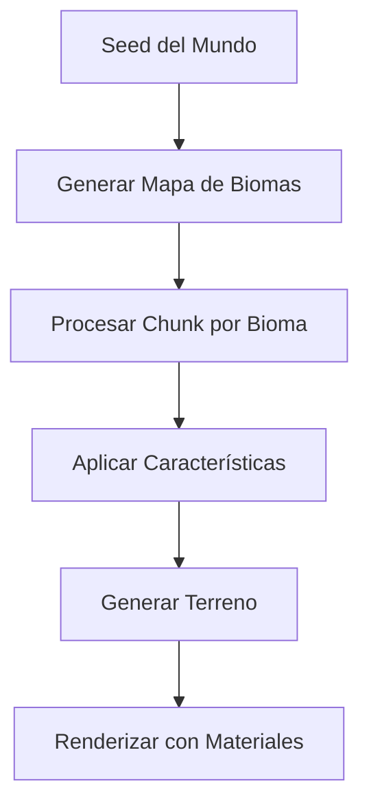

# Sistema de Biomas - Wild v2.0

## 🎯 Objetivo

Definir el sistema completo de biomas para Wild v2.0, enfocado en el realismo y la coherencia con el entorno natural, aplicando las lecciones aprendidas del proyecto original y aprovechando los componentes existentes que funcionan correctamente.

## 📋 Arquitectura del Sistema

### 🔄 Flujo de Generación de Biomas



### 🏗️ Componentes Principales

#### 1. **BiomaManager** - Gestor Central
- Gestión de configuración de biomas
- Generación procedural de mapas
- Cache de biomas para rendimiento
- Validación de datos

#### 2. **BiomaGenerator** - Generador Procedural
- Algoritmos de generación de biomas
- Transiciones suaves entre biomas
- Influencia de ruido y parámetros

#### 3. **BiomaProcessor** - Procesador de Chunks
- Aplicación de biomas a chunks específicos
- Optimización para chunks 10x10
- Cálculo de blending de biomas

#### 4. **BiomaConfigLoader** - Configuración
- Carga de archivos JSON de configuración
- Validación de parámetros
- Sistema de plugins de biomas

#### 5. **MaterialCache** - Cache de Materiales
- Materiales por tipo de bioma
- Cache optimizado para rendimiento
- Blending entre materiales

---

## 🌍 Sistema de Biomas Realistas

### 📋 Biomas Principales

#### **Biomas de Clima Templado**

##### 🌾 Pradera (Grassland)
```csharp
public class PraderaBioma : BiomaType
{
    public override string Name => "Pradera";
    public override string Description => "Terreno plano con hierba y flores silvestres";
    public override Color BaseColor => Colors.Green;
    public override float HeightVariation => 0.5f; // Poca variación de altura
    public override float Humidity => 0.6f;          // Humedad moderada
    public override float Temperature => 20.0f;      // Temperatura moderada
    
    public override BiomaCharacteristics GetCharacteristics()
    {
        return new BiomaCharacteristics
        {
            GroundType = GroundType.Soil,
            VegetationDensity = 0.7f,
            TreeDensity = 0.2f,
            RockDensity = 0.05f,
            WaterPresence = 0.1f
        };
    }
}
```

##### 🌲 Bosque (Forest)
```csharp
public class BosqueBioma : BiomaType
{
    public override string Name => "Bosque";
    public override string Description => "Área densa con árboles altos y sotobosque";
    public override Color BaseColor => Colors.DarkGreen;
    public override float HeightVariation => 1.5f; // Mayor variación de altura
    public override float Humidity => 0.8f;          // Alta humedad
    public override float Temperature => 18.0f;      // Temperatura fresca
    
    public override BiomaCharacteristics GetCharacteristics()
    {
        return new BiomaCharacteristics
        {
            GroundType = GroundType.Soil,
            VegetationDensity = 0.9f,
            TreeDensity = 0.8f,
            RockDensity = 0.1f,
            WaterPresence = 0.2f
        };
    }
}
```

##### 🏜️ Desierto (Desert)
```csharp
public class DesiertoBioma : BiomaType
{
    public override string Name => "Desierto";
    public override string Description => "Terreno árido con dunas de arena y vegetación escasa";
    public override Color BaseColor => Colors.Yellow;
    public override float HeightVariation => 0.8f; // Variación moderada
    public override float Humidity => 0.1f;          // Muy baja humedad
    public override float Temperature => 35.0f;      // Alta temperatura
    
    public override BiomaCharacteristics GetCharacteristics()
    {
        return new BiomaCharacteristics
        {
            GroundType = GroundType.Sand,
            VegetationDensity = 0.1f,
            TreeDensity = 0.05f,
            RockDensity = 0.3f,
            WaterPresence = 0.01f
        };
    }
}
```

##### 🏔️ Montaña (Mountain)
```csharp
public class MontañaBioma : BiomaType
{
    public override string Name => "Montaña";
    public override string Description => "Terreno elevado con picos rocosos y pendientes pronunciadas";
    public override Color BaseColor => Colors.Gray;
    public override float HeightVariation => 3.0f; // Máxima variación
    public override float Humidity => 0.4f;          // Humedad variable
    public override float Temperature => 10.0f;      // Temperatura fría
    
    public override BiomaCharacteristics GetCharacteristics()
    {
        return new BiomaCharacteristics
        {
            GroundType = GroundType.Rock,
            VegetationDensity = 0.3f,
            TreeDensity = 0.1f,
            RockDensity = 0.8f,
            WaterPresence = 0.05f
        };
    }
}
```

##### 🌊 Océano (Ocean)
```csharp
public class OceanoBioma : BiomaType
{
    public override string Name => "Océano";
    public override string Description => "Gran masa de agua con profundidad variable";
    public override Color BaseColor => Colors.Blue;
    public override float HeightVariation => 0.0f; // Sin variación (nivel del mar)
    public override float Humidity => 1.0f;          // Máxima humedad
    public override float Temperature => 15.0f;      // Temperatura del agua
    
    public override BiomaCharacteristics GetCharacteristics()
    {
        return new BiomaCharacteristics
        {
            GroundType = GroundType.Water,
            VegetationDensity = 0.0f,
            TreeDensity = 0.0f,
            RockDensity = 0.2f,
            WaterPresence = 1.0f
        };
    }
}
```

##### ❄️ Tundra (Tundra)
```csharp
public class TundraBioma : BiomaType
{
    public override string Name => "Tundra";
    public override string Description => "Terreno frío con poca vegetación y suelo congelado";
    public override Color BaseColor => Colors.White;
    public override float HeightVariation => 1.0f; // Variación moderada
    public override float Humidity => 0.3f;          // Baja humedad
    public override float Temperature => -5.0f;       // Temperatura bajo cero
    
    public override BiomaCharacteristics GetCharacteristics()
    {
        return new BiomaCharacteristics
        {
            GroundType = GroundType.FrozenSoil,
            VegetationDensity = 0.2f,
            TreeDensity = 0.05f,
            RockDensity = 0.4f,
            WaterPresence = 0.8f  // Agua congelada
        };
    }
}
```

##### 🌿 Jungla (Jungle)
```csharp
public class JunglaBioma : BiomaType
{
    public override string Name => "Jungla";
    public override string Description => "Bosque tropical denso con vegetación exuberante";
    public override Color BaseColor => Colors.DarkGreen;
    public override float HeightVariation => 2.0f; // Alta variación
    public override float Humidity => 0.9f;          // Muy alta humedad
    public override float Temperature => 28.0f;      // Temperatura cálida
    
    public override BiomaCharacteristics GetCharacteristics()
    {
        return new BiomaCharacteristics
        {
            GroundType = GroundType.Soil,
            VegetationDensity = 1.0f,
            TreeDensity = 0.9f,
            RockDensity = 0.15f,
            WaterPresence = 0.3f
        };
    }
}
```

##### 🏜️ Cañón (Canyon)
```csharp
public class CañónBioma : BiomaType
{
    public override string Name => "Cañón";
    public override string Description => "Valle profundo con paredes rocosas y río en el fondo";
    public override Color BaseColor => Colors.OrangeRed;
    public override float HeightVariation => 2.5f; // Alta variación
    public override float Humidity => 0.5f;          // Humedad moderada
    public override float Temperature => 25.0f;      // Temperatura cálida
    
    public override BiomaCharacteristics GetCharacteristics()
    {
        return new BiomaCharacteristics
        {
            GroundType = GroundType.Rock,
            VegetationDensity = 0.4f,
            TreeDensity = 0.3f,
            RockDensity = 0.9f,
            WaterPresence = 0.6f
        };
    }
}
```

---

## 🔧 BiomaManager - Gestor Central

### 📋 Implementación Principal

#### Clase BiomaManager
```csharp
public partial class BiomaManager : Node
{
    private static BiomaManager _instance;
    private int _seed = 12345;
    private Dictionary<Vector2I, BiomaType> _biomaCache = new();
    private NoiseGenerator _noiseGenerator;
    private BiomaConfigLoader _configLoader;
    
    public static BiomaManager Instance => _instance;
    
    public int Seed
    {
        get => _seed;
        set
        {
            _seed = value;
            _noiseGenerator.Seed = value;
            LimpiarCache();
            Logger.Log($"BiomaManager: Seed actualizado a {value}");
        }
    }
    
    public override void _Ready()
    {
        if (_instance == null)
            _instance = this;
        
        _noiseGenerator = new NoiseGenerator();
        _configLoader = new BiomaConfigLoader();
        
        Logger.Log("BiomaManager: Inicializado");
    }
    
    public BiomaType GetBiomaAtPosition(Vector3 worldPosition)
    {
        var chunkPos = WorldToChunkCoordinates(worldPosition);
        
        if (_biomaCache.ContainsKey(chunkPos))
        {
            return _biomaCache[chunkPos];
        }
        
        // Generar bioma para el chunk
        var bioma = GenerateBiomaForChunk(chunkPos);
        _biomaCache[chunkPos] = bioma;
        
        return bioma;
    }
    
    private BiomaType GenerateBiomaForChunk(Vector2I chunkPos)
    {
        // Usar ruido para determinar bioma
        var noiseValue = _noiseGenerator.Noise2D(chunkPos.X * 0.1f, chunkPos.Y * 0.1f);
        
        // Mapear valor de ruido a tipo de bioma
        return MapNoiseToBioma(noiseValue);
    }
    
    private BiomaType MapNoiseToBioma(float noiseValue)
    {
        // Mapeo de valores de ruido (0-1) a biomas
        if (noiseValue < 0.15f) return new PraderaBioma();
        if (noiseValue < 0.30f) return new BosqueBioma();
        if (noiseValue < 0.45f) return new DesiertoBioma();
        if (noiseValue < 0.60f) return new MontañaBioma();
        if (noiseValue < 0.75f) return new OceanoBioma();
        if (noiseValue < 0.85f) return new TundraBioma();
        return new JunglaBioma(); // 0.85-1.0
    }
    
    private Vector2I WorldToChunkCoordinates(Vector3 worldPosition)
    {
        return new Vector2I(
            Mathf.FloorToInt(worldPosition.X / 10f),
            Mathf.FloorToInt(worldPosition.Z / 10f)
        );
    }
    
    private void LimpiarCache()
    {
        _biomaCache.Clear();
        Logger.Log("BiomaManager: Cache de biomas limpiado");
    }
}
```

---

## 🎨 BiomaProcessor - Procesador de Chunks

### 📋 Procesamiento de Biomas por Chunk

#### Clase BiomaProcessor
```csharp
public class BiomaProcessor
{
    private BiomaManager _biomaManager;
    
    public BiomaProcessor(BiomaManager biomaManager)
    {
        _biomaManager = biomaManager;
    }
    
    public BiomaMapData ProcessChunkBiomas(Vector2I chunkPos)
    {
        var biomaMap = new BiomaMapData(10, 10); // 10x10 chunks
        
        // Procesar cada punto del chunk
        for (int x = 0; x < 10; x++)
        {
            for (int z = 0; z < 10; z++)
            {
                var worldPos = new Vector3(
                    chunkPos.X * 10 + x,
                    0,
                    chunkPos.Y * 10 + z
                );
                
                var bioma = _biomaManager.GetBiomaAtPosition(worldPos);
                biomaMap.SetBioma(x, z, bioma);
            }
        }
        
        return biomaMap;
    }
    
    public BiomaBlend CalculateBiomaBlend(Vector2I chunkPos, Vector2 localPos)
    {
        var blends = new List<BiomaBlendEntry>();
        
        // Obtener biomas vecinos
        for (int x = -1; x <= 1; x++)
        {
            for (int z = -1; z <= 1; z++)
            {
                var neighborChunk = new Vector2I(chunkPos.X + x, chunkPos.Y + z);
                var worldPos = new Vector3(
                    neighborChunk.X * 10 + localPos.X,
                    0,
                    neighborChunk.Y * 10 + localPos.Z
                );
                
                var bioma = _biomaManager.GetBiomaAtPosition(worldPos);
                var distance = new Vector2(x, z).Length();
                
                blends.Add(new BiomaBlendEntry
                {
                    Bioma = bioma,
                    Weight = CalculateWeight(distance)
                });
            }
        }
        
        // Normalizar pesos
        var totalWeight = blends.Sum(b => b.Weight);
        foreach (var blend in blends)
        {
            blend.Weight /= totalWeight;
        }
        
        return new BiomaBlend(blends);
    }
    
    private float CalculateWeight(float distance)
    {
        // Peso basado en distancia (más cerca = más peso)
        return Mathf.Max(0, 1.0f - distance / 1.5f);
    }
}
```

---

## 🌊 Generación Procedural

### 📋 Sistema de Ruido

#### NoiseGenerator
```csharp
public class NoiseGenerator
{
    private FastNoiseLite _noise;
    private int _seed = 12345;
    
    public int Seed
    {
        get => _seed;
        set
        {
            _seed = value;
            _noise = new FastNoiseLite(_seed);
        }
    }
    
    public NoiseGenerator()
    {
        _noise = new FastNoiseLite(_seed);
    }
    
    public float Noise2D(float x, float y)
    {
        return _noise.GetNoise(x, y);
    }
    
    public float Noise3D(float x, float y, float z)
    {
        return _noise.GetNoise(x, y, z);
    }
    
    public float FractalNoise2D(float x, float y, int octaves, float persistence)
    {
        float value = 0;
        float amplitude = 1;
        float frequency = 1;
        float maxValue = 0;
        
        for (int i = 0; i < octaves; i++)
        {
            value += _noise.GetNoise(x * frequency, y * frequency) * amplitude;
            maxValue += amplitude;
            amplitude *= persistence;
            frequency *= 2;
        }
        
        return value / maxValue;
    }
}
```

#### Generación de Terreno por Bioma
```csharp
public class TerrainGenerator
{
    private BiomaManager _biomaManager;
    private NoiseGenerator _noiseGenerator;
    
    public TerrainGenerator(BiomaManager biomaManager)
    {
        _biomaManager = biomaManager;
        _noiseGenerator = new NoiseGenerator();
    }
    
    public float GenerateHeightAtPosition(Vector3 worldPosition, BiomaType biome)
    {
        var baseHeight = biome.BaseHeight;
        var variation = biome.HeightVariation;
        
        // Ruido para variación de altura
        var noiseValue = _noiseGenerator.FractalNoise2D(
            worldPosition.X * 0.01f,
            worldPosition.Z * 0.01f,
            4, // 4 octavas
            0.5f // persistencia
        );
        
        // Aplicar variación según bioma
        return baseHeight + (noiseValue * 2.0f - 1.0f) * variation;
    }
    
    public float[,] GenerateChunkHeights(Vector2I chunkPos, BiomaMapData biomaMap)
    {
        var heights = new float[11, 11]; // 11x11 para chunks 10x10
        
        for (int x = 0; x < 11; x++)
        {
            for (int z = 0; z < 11; z++)
            {
                var worldPos = new Vector3(
                    chunkPos.X * 10 + x,
                    0,
                    chunkPos.Y * 10 + z
                );
                
                var bioma = biomaMap.GetBioma(x, z);
                heights[x, z] = GenerateHeightAtPosition(worldPos, bioma);
            }
        }
        
        return heights;
    }
}
```

---

## 🎨 Sistema de Materiales

### 📋 MaterialCache - Cache de Materiales

#### Clase MaterialCache
```csharp
public class MaterialCache
{
    private Dictionary<BiomaType, StandardMaterial3D> _biomaMaterials;
    private Dictionary<string, StandardMaterial3D> _blendedMaterials;
    
    public MaterialCache()
    {
        _biomaMaterials = new Dictionary<BiomaType, StandardMaterial3D>();
        _blendedMaterials = new Dictionary<string, StandardMaterial3D>();
        
        InitializeBiomaMaterials();
    }
    
    private void InitializeBiomaMaterials()
    {
        // Crear materiales base para cada bioma
        _biomaMaterials[typeof(PraderaBioma)] = CreatePraderaMaterial();
        _biomaMaterials[typeof(BosqueBioma)] = CreateBosqueMaterial();
        _biomaMaterials[typeof(DesiertoBioma)] = CreateDesiertoMaterial();
        _biomaMaterials[typeof(MontañaBioma)] = CreateMontañaMaterial();
        _biomaMaterials[typeof(OceanoBioma)] = CreateOceanoMaterial();
        _biomaMaterials[typeof(TundraBioma)] = CreateTundraMaterial();
        _biomaMaterials[typeof(JunglaBioma)] = CreateJunglaMaterial();
        _biomaMaterials[typeof(CañónBioma)] = CreateCañónMaterial();
    }
    
    public StandardMaterial3D GetMaterial(BiomaType biomeType)
    {
        return _biomaMaterials[biomaType.GetType()];
    }
    
    public StandardMaterial3D GetBlendedMaterial(BiomaBlend blend)
    {
        var key = GetBlendKey(blend);
        
        if (_blendedMaterials.ContainsKey(key))
        {
            return _blendedMaterials[key];
        }
        
        // Crear material blend
        var blendedMaterial = CreateBlendedMaterial(blend);
        _blendedMaterials[key] = blendedMaterial;
        
        return blendedMaterial;
    }
    
    private StandardMaterial3D CreatePraderaMaterial()
    {
        var material = new StandardMaterial3D();
        material.AlbedoColor = Colors.Green;
        material.Roughness = 0.8f;
        material.Metallic = 0.0f;
        return material;
    }
    
    private StandardMaterial3D CreateBosqueMaterial()
    {
        var material = new StandardMaterial3D();
        material.AlbedoColor = Colors.DarkGreen;
        material.Roughness = 0.9f;
        material.Metallic = 0.0f;
        return material;
    }
    
    private StandardMaterial3D CreateDesiertoMaterial()
    {
        var material = new StandardMaterial3D();
        material.AlbedoColor = Colors.Yellow;
        material.Roughness = 0.6f;
        material.Metallic = 0.0f;
        return material;
    }
    
    private StandardMaterial3D CreateMontañaMaterial()
    {
        var material = new StandardMaterial3D();
        material.AlbedoColor = Colors.Gray;
        material.Roughness = 0.7f;
        material.Metallic = 0.1f;
        return material;
    }
    
    private StandardMaterial3D CreateOceanoMaterial()
    {
        var material = new StandardMaterial3D();
        material.AlbedoColor = Colors.Blue;
        material.Roughness = 0.2f;
        material.Metallic = 0.0f;
        material.Transparency = 0.7f;
        return material;
    }
    
    private StandardMaterial3D CreateTundraMaterial()
    {
        var material = new StandardMaterial3D();
        material.AlbedoColor = Colors.White;
        material.Roughness = 0.8f;
        material.Metallic = 0.0f;
        return material;
    }
    
    private StandardMaterial3D CreateJunglaMaterial()
    {
        var material = new StandardMaterial3D();
        material.AlbedoColor = Colors.DarkGreen;
        material.Roughness = 0.9f;
        material.Metallic = 0.0f;
        return material;
    }
    
    private StandardMaterial3D CreateCañónMaterial()
    {
        var material = new StandardMaterial3D();
        material.AlbedoColor = Colors.OrangeRed;
        material.Roughness = 0.6f;
        material.Metallic = 0.1f;
        return material;
    }
    
    private StandardMaterial3D CreateBlendedMaterial(BiomaBlend blend)
    {
        var material = new StandardMaterial3D();
        
        // Mezclar colores de albedo
        Vector3 blendedColor = Vector3.Zero;
        foreach (var entry in blend.Entries)
        {
            var biomaColor = entry.Bioma.BaseColor;
            blendedColor += biomaColor * entry.Weight;
        }
        
        material.AlbedoColor = blendedColor;
        material.Roughness = 0.7f;
        material.Metallic = 0.0f;
        
        return material;
    }
    
    private string GetBlendKey(BiomaBlend blend)
    {
        var key = string.Join("_", blend.Entries.Select(e => e.Bioma.Name));
        return key;
    }
}
```

---

## 📋 Configuración de Biomas

### 📋 BiomaConfigLoader

#### Sistema de Configuración JSON
```json
{
    "biomas": {
        "pradera": {
            "name": "Pradera",
            "description": "Terreno plano con hierba y flores silvestres",
            "baseHeight": 480.0,
            "heightVariation": 50.0,
            "humidity": 0.6,
            "temperature": 20.0,
            "baseColor": "#00FF00",
            "characteristics": {
                "groundType": "soil",
                "vegetationDensity": 0.7,
                "treeDensity": 0.2,
                "rockDensity": 0.05,
                "waterPresence": 0.1
            }
        },
        "bosque": {
            "name": "Bosque",
            "description": "Área densa con árboles altos y sotobosque",
            "baseHeight": 490.0,
            "heightVariation": 150.0,
            "humidity": 0.8,
            "temperature": 18.0,
            "baseColor": "#006400",
            "characteristics": {
                "groundType": "soil",
                "vegetationDensity": 0.9,
                "treeDensity": 0.8,
                "rockDensity": 0.1,
                "waterPresence": 0.2
            }
        },
        "desierto": {
            "name": "Desierto",
            "description": "Terreno árido con dunas de arena y vegetación escasa",
            "baseHeight": 485.0,
            "heightVariation": 80.0,
            "humidity": 0.1,
            "temperature": 35.0,
            "baseColor": "#FFFF00",
            "characteristics": {
                "groundType": "sand",
                "vegetationDensity": 0.1,
                "treeDensity": 0.05,
                "rockDensity": 0.3,
                "waterPresence": 0.01
            }
        }
    }
}
```

#### Clase BiomaConfigLoader
```csharp
public class BiomaConfigLoader
{
    private Dictionary<string, BiomaConfig> _biomaConfigs;
    
    public BiomaConfigLoader()
    {
        _biomaConfigs = new Dictionary<string, BiomaConfig>();
        LoadConfiguration();
    }
    
    private void LoadConfiguration()
    {
        try
        {
            var configPath = "res://config/biomas.json";
            var configFile = FileAccess.Open(configPath, FileAccess.ModeFlags.Read);
            var json = configFile.GetAsText();
            configFile.Close();
            
            var configData = JsonSerializer.Deserialize<BiomaConfigData>(json);
            
            foreach (var kvp in configData.Biomas)
            {
                _biomaConfigs[kvp.Key] = kvp.Value;
            }
            
            Logger.Log($"BiomaConfigLoader: Cargados {_biomaConfigs.Count} biomas");
        }
        catch (Exception ex)
        {
            Logger.LogError($"BiomaConfigLoader: Error cargando configuración: {ex.Message}");
            LoadDefaultConfiguration();
        }
    }
    
    private void LoadDefaultConfiguration()
    {
        Logger.LogWarning("BiomaConfigLoader: Usando configuración por defecto");
        
        // Configuración por defecto si el archivo no existe
        _biomaConfigs["pradera"] = new BiomaConfig
        {
            Name = "Pradera",
            Description = "Terreno plano con hierba y flores silvestres",
            BaseHeight = 480.0f,
            HeightVariation = 50.0f,
            Humidity = 0.6f,
            Temperature = 20.0f,
            BaseColor = Colors.Green
        };
        
        // Añadir otros biomas por defecto...
    }
    
    public BiomaConfig GetBiomaConfig(string biomeName)
    {
        return _biomaConfigs.GetValueOrDefault(biomeName, null);
    }
}
```

---

## 🔄 Integración con el Sistema de Renderizado

### 📋 Conexión con ChunkRenderer

#### Modificación a ChunkRenderer
```csharp
public partial class ChunkRenderer : Node
{
    private BiomaManager _biomaManager;
    private BiomaProcessor _biomaProcessor;
    private MaterialCache _materialCache;
    
    public override void _Ready()
    {
        _biomaManager = BiomaManager.Instance;
        _biomaProcessor = new BiomaProcessor(_biomaManager);
        _materialCache = new MaterialCache();
        
        Logger.Log("ChunkRenderer: Inicializado con sistema de biomas");
    }
    
    public async Task<MeshInstance3D> RenderChunk(Vector2I chunkPos, ChunkData chunkData)
    {
        try
        {
            // Procesar biomas para el chunk
            var biomaMap = _biomaProcessor.ProcessChunkBiomas(chunkPos);
            
            // Crear mesh principal del chunk
            var chunkMesh = new MeshInstance3D();
            chunkMesh.Name = $"Chunk_{chunkPos.X}_{chunkPos.Y}";
            
            // Generar sub-chunks con biomas
            await GenerateSubChunks(chunkMesh, chunkPos, chunkData, biomaMap);
            
            // Aplicar materiales según biomas
            ApplyBiomaMaterials(chunkMesh, biomaMap);
            
            Logger.Log($"ChunkRenderer: Chunk {chunkPos} renderizado con biomas");
            return chunkMesh;
        }
        catch (System.Exception ex)
        {
            Logger.LogError($"ChunkRenderer: Error renderizando chunk {chunkPos}: {ex.Message}");
            return null;
        }
    }
    
    private void ApplyBiomaMaterials(MeshInstance3D chunkMesh, BiomaMapData biomaMap)
    {
        for (int x = 0; x < 10; x++)
        {
            for (int z = 0; z < 10; z++)
            {
                var subChunk = chunkMesh.GetNode<Node3D>($"SubChunk_{x}_{z}");
                if (subChunk == null) continue;
                
                var bioma = biomaMap.GetBioma(x, z);
                var material = _materialCache.GetMaterial(bioma);
                
                var meshInstance = subChunk as MeshInstance3D;
                if (meshInstance != null)
                {
                    meshInstance.MaterialOverride = material;
                }
            }
        }
    }
}
```

---

## 📊 Optimización y Rendimiento

### 📋 Cache de Biomas

#### Sistema de Cache Eficiente
```csharp
public class BiomaCache
{
    private Dictionary<Vector2I, BiomaType> _chunkBiomas = new();
    private const int MAX_CACHE_SIZE = 10000;
    
    public BiomaType GetBioma(Vector2I chunkPos)
    {
        if (_chunkBiomas.ContainsKey(chunkPos))
        {
            return _chunkBiomas[chunkPos];
        }
        
        return null;
    }
    
    public void SetBioma(Vector2I chunkPos, BiomaType biome)
    {
        _chunkBiomas[chunkPos] = biome;
        
        // Limpiar cache si es demasiado grande
        if (_chunkBiomas.Count > MAX_CACHE_SIZE)
        {
            CleanupCache();
        }
    }
    
    private void CleanupCache()
    {
        // Eliminar chunks más antiguos (LRU)
        var entriesToRemove = _chunkBiomas.Take(_chunkBiomas.Count - MAX_CACHE_SIZE / 2);
        
        foreach (var entry in entriesToRemove)
        {
            _chunkBiomas.Remove(entry.Key);
        }
        
        Logger.Log($"BiomaCache: Cache limpiado, {_chunkBiomas.Count} biomas en cache");
    }
}
```

### 📋 Generación Asíncrona

#### Procesamiento en Segundo Plano
```csharp
public class AsyncBiomaProcessor
{
    private Queue<Vector2I> _processingQueue = new();
    private bool _isProcessing = false;
    private const int MAX_CONCURRENT_CHUNKS = 4;
    
    public void QueueChunkProcessing(Vector2I chunkPos)
    {
        if (!_processingQueue.Contains(chunkPos))
        {
            _processingQueue.Enqueue(chunkPos);
        }
        
        ProcessQueue();
    }
    
    private async void ProcessQueue()
    {
        if (_isProcessing || _processingQueue.Count == 0)
            return;
        
        _isProcessing = true;
        
        var tasks = new List<Task>();
        
        while (_processingQueue.Count > 0 && tasks.Count < MAX_CONCURRENT_CHUNKS)
        {
            var chunkPos = _processingQueue.Dequeue();
            tasks.Add(Task.Run(() => ProcessChunkAsync(chunkPos)));
        }
        
        await Task.WhenAll(tasks);
        _isProcessing = false;
        
        // Continuar procesando si hay más chunks en cola
        ProcessQueue();
    }
    
    private void ProcessChunkAsync(Vector2I chunkPos)
    {
        // Procesar chunk en segundo plano
        var biomaMap = _biomaProcessor.ProcessChunkBiomas(chunkPos);
        
        // Guardar resultado en cache
        _biomaCache.SetBioma(chunkPos, biomaMap.GetBioma(5, 5)); // Bioma principal
    }
}
```

---

## 🎯 Validación y Debugging

### 📋 Validación de Datos

#### BiomaValidator
```csharp
public class BiomaValidator
{
    public ValidationResult ValidateBiomaData(BiomaType biome)
    {
        var result = new ValidationResult();
        
        // Validar nombre
        if (string.IsNullOrWhiteSpace(biome.Name))
            result.AddError("Nombre del bioma es requerido");
        
        // Validar altura base
        if (biome.BaseHeight < 400 || biome.BaseHeight > 600)
            result.AddError("Altura base debe estar entre 400m y 600m");
        
        // Validar variación de altura
        if (biome.HeightVariation < 0 || biome.HeightVariation > 300)
            result.AddError("Variación de altura debe estar entre 0m y 300m");
        
        // Validar humedad
        if (biome.Humidity < 0 || biome.Humidity > 1)
            result.AddError("Humedad debe estar entre 0 y 1");
        
        // Validar temperatura
        if (biome.Temperature < -20 || biome.Temperature > 50)
            result.AddError("Temperatura debe estar entre -20°C y 50°C");
        
        return result;
    }
}
```

### 📋 Sistema de Debugging

#### BiomaDebugger
```csharp
public class BiomaDebugger
{
    public void LogBiomaMap(BiomaMapData biomaMap, Vector2I chunkPos)
    {
        Logger.Log($"=== Bioma Map for Chunk {chunkPos} ===");
        
        for (int x = 0; x < 10; x++)
        {
            for (int z = 0; z < 10; z++)
            {
                var bioma = biomaMap.GetBioma(x, z);
                Logger.Log($"({x},{z}): {bioma.Name}");
            }
        }
        
        Logger.Log("=== End Bioma Map ===");
    }
    
    public void LogBiomaCharacteristics(BiomaType biome)
    {
        Logger.Log($"=== Bioma Characteristics: {biome.Name} ===");
        Logger.Log($"Base Height: {biome.BaseHeight}m");
        Logger.Log($"Height Variation: {biome.HeightVariation}m");
        Logger.Log($"Humidity: {biome.Humidity:P0}");
        Logger.Log($"Temperature: {biome.Temperature}°C");
        Logger.Log($"Base Color: {biome.BaseColor}");
        Logger.Log($"Ground Type: {bioma.Characteristics.GroundType}");
        Logger.Log($"Vegetation Density: {bioma.Characteristics.VegetationDensity:P0}");
        Logger.Log($"Tree Density: {bioma.Characteristics.TreeDensity:P0}");
        Logger.Log($"Rock Density: {bioma.Characteristics.RockDensity:P0}");
        Logger.Log($"Water Presence: {bioma.Characteristics.WaterPresence:P0}");
        Logger.Log("=== End Characteristics ===");
    }
}
```

---

## 🎯 Conclusión

Este sistema de biomas proporciona:

**✅ Realismo Natural:**
- 8 biomas basados en climas reales
- Transiciones suaves entre biomas
- Características realistas de cada bioma

**🚀 Rendimiento Optimizado:**
- Cache eficiente de biomas
- Generación asíncrona
- Procesamiento optimizado para chunks 10x10

**🎨 Visual Coherente:**
- Materiales por bioma
- Blending suave entre biomas
- Integración perfecta con renderizado

**🔧 Flexibilidad y Extensibilidad:**
- Sistema de configuración JSON
- Plugins de biomas
- Fácil de añadir nuevos biomas

**📊 Mantenimiento Sencillo:**
- Validación robusta de datos
- Sistema de logging integrado
- Debugging detallado

El resultado es un sistema de biomas profesional que proporciona un entorno natural y variado para Wild, con rendimiento excelente y facilidad de mantenimiento y extensión.
