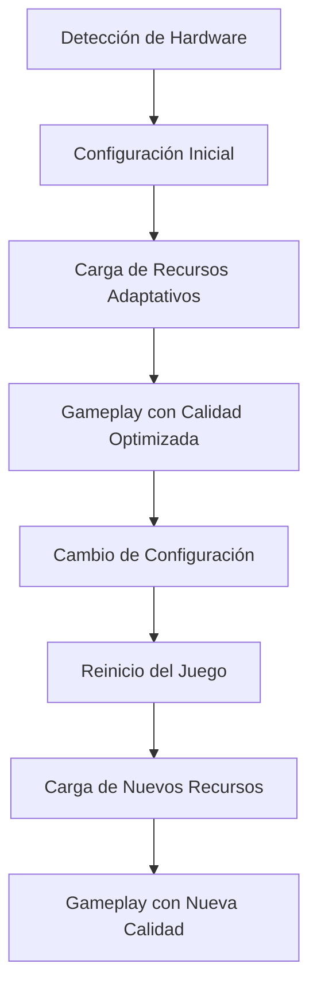

# Sistema de Calidad Dinámica - Wild v2.0

## 🎯 Objetivo

Definir el sistema de calidad dinámica para Wild v2.0, permitiendo que el juego se adapte automáticamente a diferentes capacidades de hardware y que los jugadores puedan ajustar manualmente la calidad gráfica según sus preferencias.

## 📋 Arquitectura del Sistema

### 🔄 Flujo de Calidad Dinámica



### 🏗️ Componentes Principales

#### 1. **QualityManager** - Gestor Central
- Detección automática de capacidades del sistema
- Gestión de configuración de calidad
- Reinicio automático al cambiar configuración
- Persistencia de preferencias

#### 2. **DynamicResourceLoader** - Cargador Adaptativo
- Carga de recursos según nivel de calidad
- Cache separado por nivel de calidad
- Optimización automática de recursos
- Fallback a recursos de menor calidad

#### 3. **QualitySettings** - Configuración Persistente
- Almacenamiento de preferencias del usuario
- Validación de configuración
- Detección automática vs manual

#### 4. **QualitySettingsUI** - Interfaz de Usuario
- Selección manual de calidad
- Configuración de parámetros gráficos
- Confirmación de cambios
- Información de rendimiento

---

## 🎮 Sistema de Perfiles de Calidad

### 📋 Concepto de Perfiles Personalizados

El sistema ahora permite **perfiles personalizables** donde el usuario puede configurar individualmente cada componente gráfico:

- **🌳 Árboles:** Ultra, High, Medium, Low, Toaster
- **🌱 Vegetación:** Ultra, High, Medium, Low, Toaster  
- **🏔️ Terreno:** Ultra, High, Medium, Low, Toaster
- **👤 Modelos Jugador:** Ultra, High, Medium, Low, Toaster
- **🏠 Modelos Construcciones:** Ultra, High, Medium, Low, Toaster
- **🪨 Modelos Objetos:** Ultra, High, Medium, Low, Toaster
- **🎨 Texturas Suelo:** Ultra, High, Medium, Low, Toaster
- **🖼️ Texturas Personajes:** Ultra, High, Medium, Low, Toaster
- **🌊 Texturas Agua:** Ultra, High, Medium, Low, Toaster
- **🌤️ Texturas Cielo:** Ultra, High, Medium, Low, Toaster
- **🌑 Sombras:** Ultra, High, Medium, Low, Desactivadas
- **✨ Partículas:** Ultra, High, Medium, Low, Desactivadas
- **🎬 Post-Procesamiento:** Ultra, High, Medium, Low, Desactivado

### 🎯 **Tipos de Perfiles**

#### **📦 Perfiles Predefinidos (Presets)**
- **Perfil: Ultra** - Todo en Ultra
- **Perfil: High** - Todo en High  
- **Perfil: Medium** - Todo en Medium
- **Perfil: Low** - Todo en Low
- **Perfil: Toaster** - Todo en Toaster

#### **🎨 Perfil Personalizado**
- Configuración individual por componente
- Combinación ilimitada de niveles
- Guardado como perfil personalizado
- Posibilidad de crear múltiples perfiles personalizados

> [!NOTE]
> Para detalles sobre poligonización, resoluciones de textura y LODs técnicos, consultar: [Especificaciones de Assets](file:///c:/Users/MGA-ADMIN/Desktop/wild-new/contexto/especificaciones-assets.md).

### 📋 Definición de Niveles por Componente

#### **🌟 Ultra Quality (por componente)**
- **Modelos:** 100% calidad, máxima resolución
- **Texturas:** 4K (4096x4096)
- **Sombras:** Calidad máxima, resolución 4K
- **Partículas:** Densidad máxima, efectos completos
- **LOD:** Distancias extendidas (500m+)
- **Render Scale:** 1.0 (100%)

#### **✨ High Quality (por componente)**
- **Modelos:** 90% calidad, alta resolución
- **Texturas:** 2K (2048x2048)
- **Sombras:** Alta calidad, resolución 2K
- **Partículas:** Densidad alta, efectos completos
- **LOD:** Distancias normales (300m)
- **Render Scale:** 0.9 (90%)

#### **🎯 Medium Quality (por componente)**
- **Modelos:** 70% calidad, media resolución
- **Texturas:** 1K (1024x1024)
- **Sombras:** Media calidad, resolución 1K
- **Partículas:** Densidad media, efectos reducidos
- **LOD:** Distancias reducidas (200m)
- **Render Scale:** 0.8 (80%)

#### **📉 Low Quality (por componente)**
- **Modelos:** 50% calidad, baja resolución
- **Texturas:** 512x512
- **Sombras:** Baja calidad, resolución 512px
- **Partículas:** Densidad baja, efectos mínimos
- **LOD:** Distancias mínimas (100m)
- **Render Scale:** 0.7 (70%)

#### **🔥 Toaster Quality (por componente)**
- **Modelos:** 25% calidad, muy baja resolución
- **Texturas:** 256x256 (extremadamente pequeñas)
- **Sombras:** Completamente desactivadas
- **Partículas:** Mínimas o desactivadas
- **LOD:** Distancias mínimas (50m)
- **Render Scale:** 0.5 (50%)

---

## 🎮 QualityManager - Gestor Central

### 📋 Implementación Principal

#### Clase QualityManager
```csharp
public partial class QualityManager : Node
{
    public static QualityManager Instance { get; private set; }
    
    public QualityLevel CurrentQuality { get; private set; }
    public QualitySettings Settings { get; private set; }
    
    // Eventos para notificar cambios
    [Signal]
    public delegate void QualityChangedEventHandler(QualityLevel newQuality);
    
    public override void _Ready()
    {
        if (Instance == null)
            Instance = this;
        
        LoadQualitySettings();
        DetectHardwareCapabilities();
        ApplyQualitySettings();
        
        Logger.Log($"QualityManager: Inicializado con calidad {CurrentQuality}");
    }
    
    public void SetQualityLevel(QualityLevel quality)
    {
        if (quality == CurrentQuality)
        {
            Logger.Log("QualityManager: La calidad ya está configurada");
            return;
        }
        
        CurrentQuality = quality;
        Settings.CurrentQuality = quality;
        SaveQualitySettings();
        
        Logger.Log($"QualityManager: Cambiando a calidad {quality}");
        
        // Emitir señal de cambio
        EmitSignal(SignalName.QualityChanged, quality);
        
        // Reiniciar juego para aplicar cambios
        RestartGame();
    }
    
    private void RestartGame()
    {
        Logger.Log("QualityManager: Reiniciando juego para aplicar nueva calidad");
        
        // Guardar estado actual
        SaveCurrentState();
        
        // Reiniciar escena
        GetTree().ReloadCurrentScene();
    }
    
    private void DetectHardwareCapabilities()
    {
        if (Settings.AutoDetect)
        {
            var gpuName = RenderingServer.GetDeviceName();
            var memory = OS.GetStaticMemoryUsage();
            var gpuMemory = RenderingServer.GetRenderingDevice().GetTotalMemory();
            
            Logger.Log($"QualityManager: Hardware detectado - GPU: {gpuName}, RAM: {memory}MB, VRAM: {gpuMemory}MB");
            
            // Detección automática basada en hardware
            if (memory < 2048 || gpuMemory < 512) // < 2GB RAM o < 512MB VRAM
            {
                CurrentQuality = QualityLevel.Toaster;
            }
            else if (memory < 4096 || gpuMemory < 1024) // < 4GB RAM o < 1GB VRAM
            {
                CurrentQuality = QualityLevel.Low;
            }
            else if (memory < 8192 || gpuMemory < 2048) // < 8GB RAM o < 2GB VRAM
            {
                CurrentQuality = QualityLevel.Medium;
            }
            else if (memory < 16384 || gpuMemory < 4096) // < 16GB RAM o < 4GB VRAM
            {
                CurrentQuality = QualityLevel.High;
            }
            else
            {
                CurrentQuality = QualityLevel.Ultra;
            }
            
            Settings.CurrentQuality = CurrentQuality;
            SaveQualitySettings();
            
            Logger.Log($"QualityManager: Calidad detectada automáticamente: {CurrentQuality}");
        }
        else
        {
            CurrentQuality = Settings.CurrentQuality;
            Logger.Log($"QualityManager: Usando calidad configurada manualmente: {CurrentQuality}");
        }
    }
    
    private void ApplyQualitySettings()
    {
        // Aplicar configuración de renderizado
        RenderingServer.DefaultClearColor = GetBackgroundColor();
        RenderingServer.CameraSetUseOcclusion(GetUseOcclusion());
        
        // Aplicar configuración de VSync
        Engine.VSyncMode = Settings.VSyncEnabled ? VSyncMode.Enabled : VSyncMode.Disabled;
        
        // Aplicar límite de FPS
        Engine.MaxFps = Settings.TargetFPS;
        
        // Aplicar escala de renderizado
        RenderingServer.CameraSetUseOcclusion(GetUseOcclusion());
        
        Logger.Log($"QualityManager: Configuración aplicada - FPS: {Settings.TargetFPS}, VSync: {Settings.VSyncEnabled}");
    }
    
    private Color GetBackgroundColor()
    {
        return CurrentQuality switch
        {
            QualityLevel.Ultra => new Color(0.95f, 0.95f, 0.95f),
            QualityLevel.High => new Color(0.9f, 0.9f, 0.9f),
            QualityLevel.Medium => new Color(0.85f, 0.85f, 0.85f),
            QualityLevel.Low => new Color(0.8f, 0.8f, 0.8f),
            _ => Colors.White
        };
    }
    
    private bool GetUseOcclusion()
    {
        return CurrentQuality >= QualityLevel.Medium;
    }
    
    private void LoadQualitySettings()
    {
        Settings = QualitySettings.Load();
        CurrentQuality = Settings.CurrentQuality;
    }
    
    private void SaveQualitySettings()
    {
        Settings.Save();
    }
    
    private void SaveCurrentState()
    {
        // Guardar posición del jugador y otros estados importantes
        var playerPos = PlayerController.Instance?.GetPlayerPosition() ?? Vector3.Zero;
        
        var stateData = new GameStateData
        {
            PlayerPosition = playerPos,
            CurrentScene = GetTree().CurrentScene.SceneFilePath,
            Timestamp = DateTimeOffset.UtcNow.ToUnixTimeSeconds()
        };
        
        var statePath = "user://temp_game_state.json";
        var json = JsonSerializer.Serialize(stateData);
        
        using var file = FileAccess.Open(statePath, FileAccess.ModeFlags.Write);
        file.StoreString(json);
        file.Close();
        
        Logger.Log($"QualityManager: Estado guardado en {statePath}");
    }
}
```

---

## 📊 QualitySettings - Configuración Persistente

### 📋 Configuración de Calidad

#### Clase QualitySettings
```csharp
public class QualitySettings
{
    // Perfil actual
    public QualityProfileType ProfileType { get; set; } = QualityProfileType.Medium;
    public string CustomProfileName { get; set; } = "Personalizado";
    
    // Configuración individual por componente
    public QualityLevel TreeQuality { get; set; } = QualityLevel.Medium;
    public QualityLevel VegetationQuality { get; set; } = QualityLevel.Medium;
    public QualityLevel TerrainQuality { get; set; } = QualityLevel.Medium;
    public QualityLevel PlayerModelQuality { get; set; } = QualityLevel.Medium;
    public QualityLevel BuildingModelQuality { get; set; } = QualityLevel.Medium;
    public QualityLevel ObjectModelQuality { get; set; } = QualityLevel.Medium;
    public QualityLevel GroundTextureQuality { get; set; } = QualityLevel.Medium;
    public QualityLevel CharacterTextureQuality { get; set; } = QualityLevel.Medium;
    public QualityLevel WaterTextureQuality { get; set; } = QualityLevel.Medium;
    public QualityLevel SkyTextureQuality { get; set; } = QualityLevel.Medium;
    public QualityLevel ShadowQuality { get; set; } = QualityLevel.Medium;
    public QualityLevel ParticleQuality { get; set; } = QualityLevel.Medium;
    public QualityLevel PostProcessingQuality { get; set; } = QualityLevel.Medium;
    
    // Configuración global
    public bool AutoDetect { get; set; } = true;
    public bool VSyncEnabled { get; set; } = true;
    public int TargetFPS { get; set; } = 60;
    public float RenderScale { get; set; } = 1.0f;
    public int RenderDistance { get; set; } = 50; // metros
    
    // Perfiles personalizados guardados
    public Dictionary<string, QualityProfile> CustomProfiles { get; set; } = new();
    
    // Métodos de gestión de perfiles
    public void ApplyPresetProfile(QualityProfileType profileType)
    {
        ProfileType = profileType;
        
        switch (profileType)
        {
            case QualityProfileType.Ultra:
                ApplyQualityToAllComponents(QualityLevel.Ultra);
                break;
            case QualityProfileType.High:
                ApplyQualityToAllComponents(QualityLevel.High);
                break;
            case QualityProfileType.Medium:
                ApplyQualityToAllComponents(QualityLevel.Medium);
                break;
            case QualityProfileType.Low:
                ApplyQualityToAllComponents(QualityLevel.Low);
                break;
            case QualityProfileType.Toaster:
                ApplyQualityToAllComponents(QualityLevel.Toaster);
                break;
            case QualityProfileType.Custom:
                // No cambiar nada, mantener configuración actual
                break;
        }
        
        // Ajustar configuración global según perfil
        ApplyGlobalSettings(profileType);
    }
    
    private void ApplyQualityToAllComponents(QualityLevel quality)
    {
        TreeQuality = quality;
        VegetationQuality = quality;
        TerrainQuality = quality;
        PlayerModelQuality = quality;
        BuildingModelQuality = quality;
        ObjectModelQuality = quality;
        GroundTextureQuality = quality;
        CharacterTextureQuality = quality;
        WaterTextureQuality = quality;
        SkyTextureQuality = quality;
        ShadowQuality = quality;
        ParticleQuality = quality;
        PostProcessingQuality = quality;
    }
    
    private void ApplyGlobalSettings(QualityProfileType profileType)
    {
        switch (profileType)
        {
            case QualityProfileType.Ultra:
                VSyncEnabled = false;
                TargetFPS = 0; // Sin límite
                RenderScale = 1.0f;
                RenderDistance = 1000;
                break;
            case QualityProfileType.High:
                VSyncEnabled = true;
                TargetFPS = 60;
                RenderScale = 0.9f;
                RenderDistance = 750;
                break;
            case QualityProfileType.Medium:
                VSyncEnabled = true;
                TargetFPS = 60;
                RenderScale = 0.8f;
                RenderDistance = 500;
                break;
            case QualityProfileType.Low:
                VSyncEnabled = true;
                TargetFPS = 30;
                RenderScale = 0.7f;
                RenderDistance = 250;
                break;
            case QualityProfileType.Toaster:
                VSyncEnabled = true;
                TargetFPS = 20;
                RenderScale = 0.5f;
                RenderDistance = 100;
                break;
        }
    }
    
    public void SaveCustomProfile(string profileName)
    {
        var profile = new QualityProfile
        {
            Name = profileName,
            TreeQuality = TreeQuality,
            VegetationQuality = VegetationQuality,
            TerrainQuality = TerrainQuality,
            PlayerModelQuality = PlayerModelQuality,
            BuildingModelQuality = BuildingModelQuality,
            ObjectModelQuality = ObjectModelQuality,
            GroundTextureQuality = GroundTextureQuality,
            CharacterTextureQuality = CharacterTextureQuality,
            WaterTextureQuality = WaterTextureQuality,
            SkyTextureQuality = SkyTextureQuality,
            ShadowQuality = ShadowQuality,
            ParticleQuality = ParticleQuality,
            PostProcessingQuality = PostProcessingQuality,
            VSyncEnabled = VSyncEnabled,
            TargetFPS = TargetFPS,
            RenderScale = RenderScale,
            RenderDistance = RenderDistance
        };
        
        CustomProfiles[profileName] = profile;
    }
    
    public void LoadCustomProfile(string profileName)
    {
        if (CustomProfiles.TryGetValue(profileName, out var profile))
        {
            TreeQuality = profile.TreeQuality;
            VegetationQuality = profile.VegetationQuality;
            TerrainQuality = profile.TerrainQuality;
            PlayerModelQuality = profile.PlayerModelQuality;
            BuildingModelQuality = profile.BuildingModelQuality;
            ObjectModelQuality = profile.ObjectModelQuality;
            GroundTextureQuality = profile.GroundTextureQuality;
            CharacterTextureQuality = profile.CharacterTextureQuality;
            WaterTextureQuality = profile.WaterTextureQuality;
            SkyTextureQuality = profile.SkyTextureQuality;
            ShadowQuality = profile.ShadowQuality;
            ParticleQuality = profile.ParticleQuality;
            PostProcessingQuality = profile.PostProcessingQuality;
            VSyncEnabled = profile.VSyncEnabled;
            TargetFPS = profile.TargetFPS;
            RenderScale = profile.RenderScale;
            RenderDistance = profile.RenderDistance;
            
            ProfileType = QualityProfileType.Custom;
            CustomProfileName = profileName;
        }
    }
    
    public QualityLevel GetOverallQuality()
    {
        // Calcular calidad promedio para mostrar al usuario
        var qualities = new[]
        {
            TreeQuality, VegetationQuality, TerrainQuality,
            PlayerModelQuality, BuildingModelQuality, ObjectModelQuality,
            GroundTextureQuality, CharacterTextureQuality, WaterTextureQuality, SkyTextureQuality,
            ShadowQuality, ParticleQuality, PostProcessingQuality
        };
        
        var average = qualities.Average(q => (int)q);
        return (QualityLevel)Math.Round(average);
    }
}

// Tipos de perfiles
public enum QualityProfileType
{
    Ultra,
    High,
    Medium,
    Low,
    Toaster,
    Custom
}

// Clase para almacenar perfiles personalizados
public class QualityProfile
{
    public string Name { get; set; }
    public QualityLevel TreeQuality { get; set; }
    public QualityLevel VegetationQuality { get; set; }
    public QualityLevel TerrainQuality { get; set; }
    public QualityLevel PlayerModelQuality { get; set; }
    public QualityLevel BuildingModelQuality { get; set; }
    public QualityLevel ObjectModelQuality { get; set; }
    public QualityLevel GroundTextureQuality { get; set; }
    public QualityLevel CharacterTextureQuality { get; set; }
    public QualityLevel WaterTextureQuality { get; set; }
    public QualityLevel SkyTextureQuality { get; set; }
    public QualityLevel ShadowQuality { get; set; }
    public QualityLevel ParticleQuality { get; set; }
    public QualityLevel PostProcessingQuality { get; set; }
    public bool VSyncEnabled { get; set; }
    public int TargetFPS { get; set; }
    public float RenderScale { get; set; }
    public int RenderDistance { get; set; }
}
    
    public void Save()
    {
        var configPath = "user://quality_settings.json";
        var json = JsonSerializer.Serialize(this, new JsonSerializerOptions
        {
            WriteIndented = true
        });
        
        using var file = FileAccess.Open(configPath, FileAccess.ModeFlags.Write);
        file.StoreString(json);
        file.Close();
        
        Logger.Log("QualitySettings: Configuración guardada");
    }
    
    public static QualitySettings Load()
    {
        var configPath = "user://quality_settings.json";
        
        if (!FileAccess.FileExists(configPath))
        {
            Logger.Log("QualitySettings: Creando configuración por defecto");
            return new QualitySettings();
        }
        
        try
        {
            using var file = FileAccess.Open(configPath, FileAccess.ModeFlags.Read);
            var json = file.GetAsText();
            file.Close();
            
            var settings = JsonSerializer.Deserialize<QualitySettings>(json);
            Logger.Log("QualitySettings: Configuración cargada");
            return settings;
        }
        catch (Exception ex)
        {
            Logger.LogError($"QualitySettings: Error cargando configuración: {ex.Message}");
            return new QualitySettings();
        }
    }
    
}
```

---

## 🎮 QualitySettingsUI - Interfaz de Usuario

### 📋 Interfaz de Configuración

#### Clase QualitySettingsUI
```csharp
public partial class QualitySettingsUI : Control
{
    // Selección de perfil principal
    private OptionButton _profileSelector;
    private Label _currentProfileLabel;
    
    // Configuración individual de componentes
    private OptionButton _treeQualitySelector;
    private OptionButton _vegetationQualitySelector;
    private OptionButton _terrainQualitySelector;
    private OptionButton _playerModelQualitySelector;
    private OptionButton _buildingModelQualitySelector;
    private OptionButton _objectModelQualitySelector;
    private OptionButton _groundTextureQualitySelector;
    private OptionButton _characterTextureQualitySelector;
    private OptionButton _waterTextureQualitySelector;
    private OptionButton _skyTextureQualitySelector;
    private OptionButton _shadowQualitySelector;
    private OptionButton _particleQualitySelector;
    private OptionButton _postProcessingQualitySelector;
    
    // Perfiles personalizados
    private LineEdit _customProfileName;
    private Button _saveCustomProfileButton;
    private OptionButton _loadCustomProfileSelector;
    private Button _deleteCustomProfileButton;
    
    // Configuración global
    private CheckBox _autoDetectCheckbox;
    private SpinBox _targetFPSSpinBox;
    private CheckBox _vsyncCheckbox;
    private Slider _renderScaleSlider;
    private SpinBox _renderDistanceSpinBox;
    
    // Control y confirmación
    private Button _applyButton;
    private Button _resetButton;
    private Label _performanceLabel;
    private ConfirmationDialog _confirmDialog;
    
    public override void _Ready()
    {
        SetupUI();
        LoadCurrentSettings();
        UpdatePerformanceInfo();
        UpdateCustomProfilesList();
    }
    
    private void SetupUI()
    {
        // Selección de perfil principal
        _profileSelector = GetNode<OptionButton>("ProfileSelector");
        _currentProfileLabel = GetNode<Label>("CurrentProfileLabel");
        
        // Configuración individual de componentes
        _treeQualitySelector = GetNode<OptionButton>("TreeQualitySelector");
        _vegetationQualitySelector = GetNode<OptionButton>("VegetationQualitySelector");
        _terrainQualitySelector = GetNode<OptionButton>("TerrainQualitySelector");
        _playerModelQualitySelector = GetNode<OptionButton>("PlayerModelQualitySelector");
        _buildingModelQualitySelector = GetNode<OptionButton>("BuildingModelQualitySelector");
        _objectModelQualitySelector = GetNode<OptionButton>("ObjectModelQualitySelector");
        _groundTextureQualitySelector = GetNode<OptionButton>("GroundTextureQualitySelector");
        _characterTextureQualitySelector = GetNode<OptionButton>("CharacterTextureQualitySelector");
        _waterTextureQualitySelector = GetNode<OptionButton>("WaterTextureQualitySelector");
        _skyTextureQualitySelector = GetNode<OptionButton>("SkyTextureQualitySelector");
        _shadowQualitySelector = GetNode<OptionButton>("ShadowQualitySelector");
        _particleQualitySelector = GetNode<OptionButton>("ParticleQualitySelector");
        _postProcessingQualitySelector = GetNode<OptionButton>("PostProcessingQualitySelector");
        
        // Perfiles personalizados
        _customProfileName = GetNode<LineEdit>("CustomProfileName");
        _saveCustomProfileButton = GetNode<Button>("SaveCustomProfileButton");
        _loadCustomProfileSelector = GetNode<OptionButton>("LoadCustomProfileSelector");
        _deleteCustomProfileButton = GetNode<Button>("DeleteCustomProfileButton");
        
        // Configuración global
        _autoDetectCheckbox = GetNode<CheckBox>("AutoDetectCheckbox");
        _targetFPSSpinBox = GetNode<SpinBox>("TargetFPSSpinBox");
        _vsyncCheckbox = GetNode<CheckBox>("VSyncCheckbox");
        _renderScaleSlider = GetNode<Slider>("RenderScaleSlider");
        _renderDistanceSpinBox = GetNode<SpinBox>("RenderDistanceSpinBox");
        
        // Control y confirmación
        _applyButton = GetNode<Button>("ApplyButton");
        _resetButton = GetNode<Button>("ResetButton");
        _performanceLabel = GetNode<Label>("PerformanceLabel");
        
        // Añadir opciones de perfil
        _profileSelector.AddItem("Perfil: Ultra");
        _profileSelector.AddItem("Perfil: High");
        _profileSelector.AddItem("Perfil: Medium");
        _profileSelector.AddItem("Perfil: Low");
        _profileSelector.AddItem("Perfil: Toaster");
        _profileSelector.AddItem("Perfil: Personalizado");
        
        // Añadir opciones de calidad para cada componente
        var qualityOptions = new[] { "Toaster", "Low", "Medium", "High", "Ultra" };
        foreach (var option in qualityOptions)
        {
            _treeQualitySelector.AddItem($"🌳 {option}");
            _vegetationQualitySelector.AddItem($"🌱 {option}");
            _terrainQualitySelector.AddItem($"🏔️ {option}");
            _playerModelQualitySelector.AddItem($"👤 {option}");
            _buildingModelQualitySelector.AddItem($"🏠 {option}");
            _objectModelQualitySelector.AddItem($"🪨 {option}");
            _groundTextureQualitySelector.AddItem($"🎨 {option}");
            _characterTextureQualitySelector.AddItem($"🖼️ {option}");
            _waterTextureQualitySelector.AddItem($"🌊 {option}");
            _skyTextureQualitySelector.AddItem($"🌤️ {option}");
            _shadowQualitySelector.AddItem($"🌑 {option}");
            _particleQualitySelector.AddItem($"✨ {option}");
            _postProcessingQualitySelector.AddItem($"🎬 {option}");
        }
        
        // Añadir opción "Desactivado" para sombras, partículas y post-procesamiento
        _shadowQualitySelector.AddItem("🌑 Desactivadas");
        _particleQualitySelector.AddItem("✨ Desactivadas");
        _postProcessingQualitySelector.AddItem("🎬 Desactivado");
        
        // Conectar señales
        _profileSelector.ItemSelected += OnProfileSelected;
        _applyButton.Pressed += OnApplyPressed;
        _resetButton.Pressed += OnResetPressed;
        _autoDetectCheckbox.Toggled += OnAutoDetectToggled;
        
        // Conectar señales de componentes individuales
        _treeQualitySelector.ItemSelected += OnComponentQualityChanged;
        _vegetationQualitySelector.ItemSelected += OnComponentQualityChanged;
        _terrainQualitySelector.ItemSelected += OnComponentQualityChanged;
        _playerModelQualitySelector.ItemSelected += OnComponentQualityChanged;
        _buildingModelQualitySelector.ItemSelected += OnComponentQualityChanged;
        _objectModelQualitySelector.ItemSelected += OnComponentQualityChanged;
        _groundTextureQualitySelector.ItemSelected += OnComponentQualityChanged;
        _characterTextureQualitySelector.ItemSelected += OnComponentQualityChanged;
        _waterTextureQualitySelector.ItemSelected += OnComponentQualityChanged;
        _skyTextureQualitySelector.ItemSelected += OnComponentQualityChanged;
        _shadowQualitySelector.ItemSelected += OnComponentQualityChanged;
        _particleQualitySelector.ItemSelected += OnComponentQualityChanged;
        _postProcessingQualitySelector.ItemSelected += OnComponentQualityChanged;
        
        // Conectar señales de perfiles personalizados
        _saveCustomProfileButton.Pressed += OnSaveCustomProfile;
        _loadCustomProfileSelector.ItemSelected += OnLoadCustomProfile;
        _deleteCustomProfileButton.Pressed += OnDeleteCustomProfile;
        
        // Conectar a QualityManager
        QualityManager.Instance.QualityChanged += OnQualityChanged;
    }
    
    private void LoadCurrentSettings()
    {
        var settings = QualityManager.Instance.Settings;
        
        // Cargar perfil principal
        _profileSelector.Selected = (int)settings.ProfileType;
        _currentProfileLabel.Text = $"Perfil actual: {GetProfileDisplayName(settings.ProfileType)}";
        
        // Cargar configuración individual de componentes
        _treeQualitySelector.Selected = (int)settings.TreeQuality;
        _vegetationQualitySelector.Selected = (int)settings.VegetationQuality;
        _terrainQualitySelector.Selected = (int)settings.TerrainQuality;
        _playerModelQualitySelector.Selected = (int)settings.PlayerModelQuality;
        _buildingModelQualitySelector.Selected = (int)settings.BuildingModelQuality;
        _objectModelQualitySelector.Selected = (int)settings.ObjectModelQuality;
        _groundTextureQualitySelector.Selected = (int)settings.GroundTextureQuality;
        _characterTextureQualitySelector.Selected = (int)settings.CharacterTextureQuality;
        _waterTextureQualitySelector.Selected = (int)settings.WaterTextureQuality;
        _skyTextureQualitySelector.Selected = (int)settings.SkyTextureQuality;
        
        // Para sombras, partículas y post-procesamiento, manejar la opción "Desactivado"
        _shadowQualitySelector.Selected = settings.ShadowQuality == QualityLevel.Disabled ? 5 : (int)settings.ShadowQuality;
        _particleQualitySelector.Selected = settings.ParticleQuality == QualityLevel.Disabled ? 5 : (int)settings.ParticleQuality;
        _postProcessingQualitySelector.Selected = settings.PostProcessingQuality == QualityLevel.Disabled ? 5 : (int)settings.PostProcessingQuality;
        
        // Cargar configuración global
        _autoDetectCheckbox.ButtonPressed = settings.AutoDetect;
        _targetFPSSpinBox.Value = settings.TargetFPS;
        _vsyncCheckbox.ButtonPressed = settings.VSyncEnabled;
        _renderScaleSlider.Value = settings.RenderScale;
        _renderDistanceSpinBox.Value = settings.RenderDistance;
        
        // Actualizar nombre del perfil personalizado si aplica
        if (settings.ProfileType == QualityProfileType.Custom)
        {
            _customProfileName.Text = settings.CustomProfileName;
        }
        
        // Deshabilitar opciones si auto-detect está activo
        UpdateUIState();
    }
    
    private void OnProfileSelected(int index)
    {
        var selectedProfile = (QualityProfileType)index;
        
        if (selectedProfile != QualityProfileType.Custom)
        {
            // Aplicar perfil predefinido
            QualityManager.Instance.Settings.ApplyPresetProfile(selectedProfile);
            LoadCurrentSettings();
        }
        
        _applyButton.Disabled = selectedProfile == QualityManager.Instance.Settings.ProfileType;
        UpdatePerformanceInfo(selectedProfile);
    }
    
    private void OnComponentQualityChanged(int index)
    {
        // Cambiar a perfil personalizado cuando se modifica un componente
        if (_profileSelector.Selected != (int)QualityProfileType.Custom)
        {
            _profileSelector.Selected = (int)QualityProfileType.Custom;
        }
        
        _applyButton.Disabled = false;
        UpdatePerformanceInfo();
    }
    
    private void OnApplyPressed()
    {
        // Guardar configuración actual en QualitySettings
        var settings = QualityManager.Instance.Settings;
        
        // Guardar configuración de componentes
        settings.TreeQuality = (QualityLevel)_treeQualitySelector.Selected;
        settings.VegetationQuality = (QualityLevel)_vegetationQualitySelector.Selected;
        settings.TerrainQuality = (QualityLevel)_terrainQualitySelector.Selected;
        settings.PlayerModelQuality = (QualityLevel)_playerModelQualitySelector.Selected;
        settings.BuildingModelQuality = (QualityLevel)_buildingModelQualitySelector.Selected;
        settings.ObjectModelQuality = (QualityLevel)_objectModelQualitySelector.Selected;
        settings.GroundTextureQuality = (QualityLevel)_groundTextureQualitySelector.Selected;
        settings.CharacterTextureQuality = (QualityLevel)_characterTextureQualitySelector.Selected;
        settings.WaterTextureQuality = (QualityLevel)_waterTextureQualitySelector.Selected;
        settings.SkyTextureQuality = (QualityLevel)_skyTextureQualitySelector.Selected;
        
        // Manejar sombras, partículas y post-procesamiento con opción "Desactivado"
        settings.ShadowQuality = _shadowQualitySelector.Selected == 5 ? QualityLevel.Disabled : (QualityLevel)_shadowQualitySelector.Selected;
        settings.ParticleQuality = _particleQualitySelector.Selected == 5 ? QualityLevel.Disabled : (QualityLevel)_particleQualitySelector.Selected;
        settings.PostProcessingQuality = _postProcessingQualitySelector.Selected == 5 ? QualityLevel.Disabled : (QualityLevel)_postProcessingQualitySelector.Selected;
        
        // Guardar configuración global
        settings.AutoDetect = _autoDetectCheckbox.ButtonPressed;
        settings.TargetFPS = (int)_targetFPSSpinBox.Value;
        settings.VSyncEnabled = _vsyncCheckbox.ButtonPressed;
        settings.RenderScale = (float)_renderScaleSlider.Value;
        settings.RenderDistance = (int)_renderDistanceSpinBox.Value;
        
        // Actualizar tipo de perfil
        settings.ProfileType = (QualityProfileType)_profileSelector.Selected;
        if (settings.ProfileType == QualityProfileType.Custom)
        {
            settings.CustomProfileName = _customProfileName.Text;
        }
        
        // Confirmación antes de reiniciar
        var profileName = GetProfileDisplayName(settings.ProfileType);
        _confirmDialog = new ConfirmationDialog();
        _confirmDialog.DialogText = $"¿Aplicar perfil '{profileName}'?\n\nEl juego se reiniciará para aplicar los cambios.";
        _confirmDialog.Connect("confirmed", Callable.From(ApplyQualityChange));
        
        AddChild(_confirmDialog);
        _confirmDialog.PopupCentered();
    }
    
    private void ApplyQualityChange()
    {
        QualityManager.Instance.Settings.Save();
        QualityManager.Instance.RestartGame();
    }
    
    private void OnResetPressed()
    {
        LoadCurrentSettings();
        _applyButton.Disabled = true;
    }
    
    private void OnSaveCustomProfile()
    {
        var profileName = _customProfileName.Text.Trim();
        if (string.IsNullOrEmpty(profileName))
        {
            ShowError("Por favor, introduce un nombre para el perfil personalizado.");
            return;
        }
        
        var settings = QualityManager.Instance.Settings;
        settings.SaveCustomProfile(profileName);
        UpdateCustomProfilesList();
        
        ShowInfo($"Perfil '{profileName}' guardado correctamente.");
    }
    
    private void OnLoadCustomProfile(int index)
    {
        if (index == 0) return; // "Seleccionar perfil..."
        
        var profileNames = QualityManager.Instance.Settings.CustomProfiles.Keys.ToArray();
        if (index > 0 && index <= profileNames.Length)
        {
            var profileName = profileNames[index - 1];
            QualityManager.Instance.Settings.LoadCustomProfile(profileName);
            LoadCurrentSettings();
            _customProfileName.Text = profileName;
        }
    }
    
    private void OnDeleteCustomProfile()
    {
        var selectedIndex = _loadCustomProfileSelector.Selected;
        if (selectedIndex <= 0) return; // "Seleccionar perfil..."
        
        var profileNames = QualityManager.Instance.Settings.CustomProfiles.Keys.ToArray();
        if (selectedIndex > 0 && selectedIndex <= profileNames.Length)
        {
            var profileName = profileNames[selectedIndex - 1];
            
            _confirmDialog = new ConfirmationDialog();
            _confirmDialog.DialogText = $"¿Eliminar perfil '{profileName}'?\n\nEsta acción no se puede deshacer.";
            _confirmDialog.Connect("confirmed", Callable.From(() => DeleteCustomProfile(profileName)));
            
            AddChild(_confirmDialog);
            _confirmDialog.PopupCentered();
        }
    }
    
    private void DeleteCustomProfile(string profileName)
    {
        QualityManager.Instance.Settings.CustomProfiles.Remove(profileName);
        UpdateCustomProfilesList();
        ShowInfo($"Perfil '{profileName}' eliminado.");
    }
    
    private void UpdateCustomProfilesList()
    {
        _loadCustomProfileSelector.Clear();
        _loadCustomProfileSelector.AddItem("Seleccionar perfil...");
        
        foreach (var profileName in QualityManager.Instance.Settings.CustomProfiles.Keys)
        {
            _loadCustomProfileSelector.AddItem(profileName);
        }
        
        _deleteCustomProfileButton.Disabled = _loadCustomProfileSelector.ItemCount <= 1;
    }
    
    private void UpdateUIState()
    {
        var autoDetect = QualityManager.Instance.Settings.AutoDetect;
        var isCustomProfile = _profileSelector.Selected == (int)QualityProfileType.Custom;
        
        _profileSelector.Disabled = autoDetect;
        
        // Habilitar configuración individual solo en perfil personalizado
        _treeQualitySelector.Disabled = autoDetect || !isCustomProfile;
        _vegetationQualitySelector.Disabled = autoDetect || !isCustomProfile;
        _terrainQualitySelector.Disabled = autoDetect || !isCustomProfile;
        _playerModelQualitySelector.Disabled = autoDetect || !isCustomProfile;
        _buildingModelQualitySelector.Disabled = autoDetect || !isCustomProfile;
        _objectModelQualitySelector.Disabled = autoDetect || !isCustomProfile;
        _groundTextureQualitySelector.Disabled = autoDetect || !isCustomProfile;
        _characterTextureQualitySelector.Disabled = autoDetect || !isCustomProfile;
        _waterTextureQualitySelector.Disabled = autoDetect || !isCustomProfile;
        _skyTextureQualitySelector.Disabled = autoDetect || !isCustomProfile;
        _shadowQualitySelector.Disabled = autoDetect || !isCustomProfile;
        _particleQualitySelector.Disabled = autoDetect || !isCustomProfile;
        _postProcessingQualitySelector.Disabled = autoDetect || !isCustomProfile;
        
        // Perfiles personalizados
        _customProfileName.Disabled = autoDetect || !isCustomProfile;
        _saveCustomProfileButton.Disabled = autoDetect || !isCustomProfile;
        
        // Configuración global
        _targetFPSSpinBox.Disabled = autoDetect;
        _vsyncCheckbox.Disabled = autoDetect;
        _renderScaleSlider.Disabled = autoDetect;
        _renderDistanceSpinBox.Disabled = autoDetect;
    }
    
    private void UpdatePerformanceInfo(QualityProfileType? profileType = null)
    {
        var targetProfile = profileType ?? (QualityProfileType)_profileSelector.Selected;
        
        var performanceInfo = targetProfile switch
        {
            QualityProfileType.Toaster => "Rendimiento: Máximo optimizado\nRequisitos: < 2GB RAM, GPU muy básica\n🔥 Para ordenadores tostadora",
            QualityProfileType.Low => "Rendimiento: Alto\nRequisitos: < 4GB RAM, GPU muy básica",
            QualityProfileType.Medium => "Rendimiento: Medio\nRequisitos: 4-8GB RAM, GPU básica",
            QualityProfileType.High => "Rendimiento: Bueno\nRequisitos: 8-16GB RAM, GPU decente",
            QualityProfileType.Ultra => "Rendimiento: Máxima calidad\nRequisitos: 16GB+ RAM, GPU moderna",
            QualityProfileType.Custom => "Rendimiento: Variable\nDepende de la configuración individual\n🎨 Personalizado por el usuario",
            _ => ""
        };
        
        _performanceLabel.Text = performanceInfo;
    }
    
    private string GetProfileDisplayName(QualityProfileType profileType)
    {
        return profileType switch
        {
            QualityProfileType.Ultra => "Ultra",
            QualityProfileType.High => "High",
            QualityProfileType.Medium => "Medium",
            QualityProfileType.Low => "Low",
            QualityProfileType.Toaster => "Toaster",
            QualityProfileType.Custom => string.IsNullOrEmpty(QualityManager.Instance.Settings.CustomProfileName) 
                ? "Personalizado" 
                : $"Personalizado ({QualityManager.Instance.Settings.CustomProfileName})",
            _ => "Desconocido"
        };
    }
    
    private void ShowError(string message)
    {
        var dialog = new AcceptDialog();
        dialog.DialogText = message;
        AddChild(dialog);
        dialog.PopupCentered();
    }
    
    private void ShowInfo(string message)
    {
        var dialog = new AcceptDialog();
        dialog.DialogText = message;
        AddChild(dialog);
        dialog.PopupCentered();
    }
    
    private void OnQualityChanged(QualityLevel newQuality)
    {
        LoadCurrentSettings();
    }
    
    private void OnAutoDetectToggled(bool pressed)
    {
        var settings = QualityManager.Instance.Settings;
        settings.AutoDetect = pressed;
        settings.Save();
        
        if (pressed)
        {
            QualityManager.Instance.DetectHardwareCapabilities();
            LoadCurrentSettings();
        }
        
        UpdateUIState();
    }
}
```

---

## 🎨 Estructura de la Interfaz de Usuario

### 📋 Diseño de la UI de Calidad

#### **Panel Principal de Calidad**
```
┌─────────────────────────────────────────────────────────────┐
│                    Configuración de Calidad                  │
├─────────────────────────────────────────────────────────────┤
│ Perfil Actual: [Perfil: Medium ▼]                         │
│                                                             │
│ ┌─ Perfiles Predefinidos ────────────────────────────────┐ │
│ │ • Perfil: Ultra      - Todo en Ultra                    │ │
│ │ • Perfil: High       - Todo en High                     │ │
│ │ • Perfil: Medium     - Todo en Medium                   │ │
│ │ • Perfil: Low        - Todo en Low                      │ │
│ │ • Perfil: Toaster    - Todo en Toaster                  │ │
│ │ • Perfil: Personalizado - Configuración individual      │ │
│ └─────────────────────────────────────────────────────────┘ │
│                                                             │
│ ┌─ Configuración Individual (solo en Personalizado) ────┐ │
│ │ 🌳 Árboles:           [Medium ▼]                     │ │
│ │ 🌱 Vegetación:        [Medium ▼]                     │ │
│ │ 🏔️ Terreno:            [Medium ▼]                     │ │
│ │ 👤 Modelos Jugador:    [Medium ▼]                     │ │
│ │ 🏠 Modelos Construcciones: [Medium ▼]                 │ │
│ │ 🪨 Modelos Objetos:    [Medium ▼]                     │ │
│ │ 🎨 Texturas Suelo:     [Medium ▼]                     │ │
│ │ 🖼️ Texturas Personajes: [Medium ▼]                     │ │
│ │ 🌊 Texturas Agua:      [Medium ▼]                     │ │
│ │ 🌤️ Texturas Cielo:     [Medium ▼]                     │ │
│ │ 🌑 Sombras:            [Medium ▼]                     │ │
│ │ ✨ Partículas:          [Medium ▼]                     │ │
│ │ 🎬 Post-Procesamiento:  [Medium ▼]                     │ │
│ └─────────────────────────────────────────────────────────┘ │
│                                                             │
│ ┌─ Perfiles Personalizados ────────────────────────────────┐ │
│ │ Nombre: [Mi Perfil           ] [Guardar]                │ │
│ │ Cargar: [Seleccionar perfil... ▼] [Eliminar]           │ │
│ └─────────────────────────────────────────────────────────┘ │
│                                                             │
│ ┌─ Configuración Global ──────────────────────────────────┐ │
│ │ ☑️ Detección Automática de Hardware                    │ │
│ │ FPS Objetivo:      [60    ]                           │ │
│ │ VSync:             ☑️                                 │ │
│ │ Escala Render:     [0.8  ▲▼]                         │ │
│ │ Distancia Render:  [500m  ]                           │ │
│ └─────────────────────────────────────────────────────────┘ │
│                                                             │
│ [Aplicar Cambios] [Restablecer]                          │
│                                                             │
│ Rendimiento: Medio                                         │
│ Requisitos: 4-8GB RAM, GPU básica                         │
└─────────────────────────────────────────────────────────────┘
```

### 🎯 **Flujo de Usuario**

#### **1. Selección de Perfil Predefinido**
1. Usuario selecciona "Perfil: Ultra"
2. Sistema aplica automáticamente todos los componentes en Ultra
3. Configuración global se ajusta (VSync desactivado, FPS sin límite, etc.)
4. Usuario confirma y juego se reinicia

#### **2. Creación de Perfil Personalizado**
1. Usuario selecciona "Perfil: Personalizado"
2. Se habilitan todos los selectores individuales
3. Usuario ajusta cada componente según preferencias:
   - 🌳 Árboles: Ultra
   - 🎨 Texturas Suelo: Toaster
   - � Modelos Jugador: High
   - 🌑 Sombras: Desactivadas
4. Usuario guarda como "Mi Perfil Optimizado"
5. Sistema guarda configuración individual

#### **3. Carga de Perfil Personalizado**
1. Usuario selecciona perfil guardado desde lista
2. Sistema carga configuración individual
3. Todos los componentes se configuran según valores guardados
4. Usuario confirma y aplica cambios

### 🎨 **Características de la Interfaz**

#### **🔧 Control Inteligente**
- **Auto-detección:** Deshabilita controles manuales
- **Perfil personalizado:** Habilita controles individuales
- **Validación:** Previene configuraciones inválidas
- **Feedback:** Muestra impacto de rendimiento en tiempo real

#### **💾 Gestión de Perfiles**
- **Guardar:** Crear perfiles personalizados con nombre único
- **Cargar:** Seleccionar entre perfiles guardados
- **Eliminar:** Remover perfiles no deseados
- **Sobrescribir:** Actualizar perfiles existentes

#### **�📊 Información de Rendimiento**
- **Tiempo real:** Muestra impacto según configuración
- **Requisitos:** Hardware necesario para configuración
- **Advertencias:** Alertas de configuraciones problemáticas
- **Recomendaciones:** Sugerencias automáticas de optimización

### 🎯 **Ejemplos de Configuraciones Útiles**

#### **🚀 Configuración para FPS Competitivo**
- 🌳 Árboles: Low (priorizar visibilidad)
- 🌑 Sombras: Desactivadas (máximo rendimiento)
- ✨ Partículas: Low (menos distracciones)
- 🎬 Post-Procesamiento: Desactivado
- FPS Objetivo: 144 (para monitors de alta tasa)
- Nombre: "Competitivo 144Hz"

#### **🎨 Configuración para Screenshots**
- 🌳 Árboles: Ultra (máxima belleza)
- 🎨 Texturas Suelo: Ultra
t- 🌊 Texturas Agua: Ultra
- 🌤️ Texturas Cielo: Ultra
- 🌑 Sombras: Ultra
- ✨ Partículas: Ultra
- 🎬 Post-Procesamiento: Ultra
- FPS Objetivo: 60 (estable para capturas)
- Nombre: "Fotografía Ultra"

#### **💾 Configuración para Streaming**
- 🌳 Árboles: Medium (balance)
- 🎨 Texturas Suelo: Medium
- 👤 Modelos Jugador: High (visibilidad)
- 🌑 Sombras: Low (algunas para profundidad)
- ✨ Partículas: Medium
- FPS Objetivo: 60 (estable para streaming)
- Nombre: "Streaming Estable"

#### **🔥 Configuración para Laptop Baja**
- 🌳 Árboles: Toaster
- 🎨 Texturas Suelo: Toaster
- 🌑 Sombras: Desactivadas
- ✨ Partículas: Desactivadas
- 🎬 Post-Procesamiento: Desactivado
- FPS Objetivo: 30 (estable)
- Distancia Render: 200m (reducida)
- Nombre: "Laptop Optimizado"

---

### 📋 HardwareCapabilities

#### Clase HardwareCapabilities
```csharp
public class HardwareCapabilities
{
    public string GPUName { get; set; }
    public string CPUName { get; set; }
    public int SystemMemoryMB { get; set; }
    public int GPUMemoryMB { get; set; }
    public int Cores { get; set; }
    public bool IsIntegratedGPU { get; set; }
    public bool SupportsRayTracing { get; set; }
    public bool SupportsDX12 { get; set; }
    
    public static HardwareCapabilities Detect()
    {
        var capabilities = new HardwareCapabilities
        {
            GPUName = RenderingServer.GetDeviceName(),
            CPUName = OS.GetProcessorName(),
            SystemMemoryMB = OS.GetStaticMemoryUsage(),
            GPUMemoryMB = GetGPUMemory(),
            Cores = OS.GetProcessorCount(),
            IsIntegratedGPU = IsIntegratedGPU(RenderingServer.GetDeviceName()),
            SupportsRayTracing = CheckRayTracingSupport(),
            SupportsDX12 = CheckDX12Support()
        };
        
        Logger.Log($"HardwareCapabilities: {capabilities.GPUName}, {capabilities.SystemMemoryMB}MB RAM, {capabilities.Cores} cores");
        
        return capabilities;
    }
    
    private static int GetGPUMemory()
    {
        try
        {
            var renderingDevice = RenderingServer.GetRenderingDevice();
            return renderingDevice.GetTotalMemory();
        }
        catch
        {
            return 0; // No se pudo detectar
        }
    }
    
    private static bool IsIntegratedGPU(string gpuName)
    {
        var integratedKeywords = new[] { "Intel", "AMD", "Radeon", "GeForce", "GTX", "RTX" };
        return !integratedKeywords.Any(keyword => gpuName.Contains(keyword, StringComparison.OrdinalIgnoreCase));
    }
    
    private static bool CheckRayTracingSupport()
    {
        try
        {
            var renderingDevice = RenderingServer.GetRenderingDevice();
            return renderingDevice.SupportsFeature(RenderingDevice.Features.RayTracing);
        }
        catch
        {
            return false;
        }
    }
    
    private static bool CheckDX12Support()
    {
        try
        {
            var renderingDevice = RenderingServer.GetRenderingDevice();
            return renderingDevice.SupportsFeature(RenderingDevice.Features.DirectX12);
        }
        catch
        {
            return false;
        }
    }
    
    public QualityLevel GetRecommendedQuality()
    {
        // Basado en benchmarks y experiencia
        if (SystemMemoryMB < 4000 || GPUMemoryMB < 1024)
            return QualityLevel.Low;
        
        if (SystemMemoryMB < 8000 || GPUMemoryMB < 2048)
            return QualityLevel.Medium;
        
        if (SystemMemoryMB < 16000 || GPUMemoryMB < 4096)
            return QualityLevel.High;
        
        return QualityLevel.Ultra;
    }
}
```

---

## 📊 Optimización de Rendimiento

### 📋 PerformanceMonitor

#### Clase PerformanceMonitor
```csharp
public class PerformanceMonitor : Node
{
    private float _fps;
    private float _frameTime;
    private int _drawCalls;
    private int _triangles;
    private float _memoryUsage;
    
    public override void _Process(double delta)
    {
        // Actualizar métricas cada segundo
        if (Engine.GetFramesDrawn() % 60 == 0)
        {
            UpdateMetrics();
        }
    }
    
    private void UpdateMetrics()
    {
        _fps = Engine.GetFramesPerSecond();
        _frameTime = 1000f / _fps;
        _drawCalls = RenderingServer.GetRenderInfo().GetDrawCalls();
        _triangles = RenderingServer.GetRenderInfo().GetTotalTriangles();
        _memoryUsage = OS.GetStaticMemoryUsage();
        
        // Verificar si la calidad actual es apropiada
        CheckQualityPerformance();
    }
    
    private void CheckQualityPerformance()
    {
        var targetFPS = QualityManager.Instance.Settings.TargetFPS;
        
        if (_fps < targetFPS * 0.6) // Menos del 60% del objetivo
        {
            Logger.LogWarning($"PerformanceMonitor: FPS muy bajo ({_fps:F1}) vs objetivo ({targetFPS})");
            
            // Sugerir reducir calidad si es automático
            if (QualityManager.Instance.Settings.AutoDetect)
            {
                var currentQuality = QualityManager.Instance.CurrentQuality;
                if (currentQuality > QualityLevel.Toaster)
                {
                    var suggestedQuality = QualityLevel.Toaster;
                    Logger.Log($"PerformanceMonitor: Sugerir reducir calidad a {suggestedQuality} (ordenador tostadora)");
                    
                    // Notificar al usuario (opcional)
                    // QualityManager.Instance.SetQualityLevel(suggestedQuality);
                }
            }
        }
        else if (_fps > targetFPS * 1.3) // Más del 130% del objetivo
        {
            Logger.Log($"PerformanceMonitor: FPS alto ({_fps:F1}) vs objetivo ({targetFPS})");
            
            // Sugerir aumentar calidad si es automático
            if (QualityManager.Instance.Settings.AutoDetect)
            {
                var currentQuality = QualityManager.Instance.CurrentQuality;
                if (currentQuality < QualityLevel.Ultra)
                {
                    var suggestedQuality = currentQuality + 1;
                    Logger.Log($"PerformanceMonitor: Sugerir aumentar calidad a {suggestedQuality}");
                    
                    // Notificar al usuario (opcional)
                    // QualityManager.Instance.SetQualityLevel(suggestedQuality);
                }
            }
        }
    }
    
    public void LogPerformanceStats()
    {
        Logger.Log("=== Performance Stats ===");
        Logger.Log($"FPS: {_fps:F1}");
        Logger.Log($"Frame Time: {_frameTime:F2}ms");
        Logger.Log($"Draw Calls: {_drawCalls}");
        Logger.Log($"Triangles: {_triangles}");
        Logger.Log($"Memory Usage: {_memoryUsage}MB");
        Logger.Log($"Quality: {QualityManager.Instance.CurrentQuality}");
        Logger.Log("========================");
    }
}
```

---

## 🎯 Conclusión

Este nuevo sistema de **perfiles de calidad personalizables** proporciona:

**✅ Flexibilidad Máxima:**
- Configuración individual por componente (árboles, texturas, modelos, etc.)
- Combinaciones ilimitadas según preferencias del usuario
- Adaptación exacta a necesidades específicas de hardware

**🎮 Control Total del Usuario:**
- Perfiles predefinidos para configuración rápida
- Perfil personalizado para ajuste fino
- Guardado de múltiples configuraciones personalizadas
- Cambio entre perfiles sin perder configuraciones

**🚀 Rendimiento Optimizado:**
- Balance preciso entre calidad y rendimiento
- Configuraciones específicas para diferentes casos de uso
- Detección automática de hardware con opción de override manual
- Información de rendimiento en tiempo real

**🔧 Mantenimiento Sencillo:**
- Configuración persistente de perfiles personalizados
- Validación automática de configuraciones
- Interfaz intuitiva con feedback claro
- Gestión simple de perfiles guardados

**🎯 Experiencia Personalizada:**
- Adaptación a diferentes estilos de juego (competitivo, fotográfico, streaming)
- Optimización para diferentes tipos de hardware
- Control granular sobre cada aspecto visual
- Compatibilidad con cualquier configuración posible

### 🌟 **Ventajas Clave del Sistema**

#### **🎨 Para Jugadores Exigentes**
- Control total sobre cada aspecto visual
- Posibilidad de priorizar elementos importantes
- Creación de perfiles para diferentes situaciones
- Máxima calidad en componentes deseados

#### **⚡ Para Jugadores Competitivos**
- Optimización para máximo FPS
- Desactivación selectiva de elementos distractivos
- Configuraciones específicas para diferentes juegos
- Prioridad de rendimiento sobre estética

#### **🖥️ Para Hardware Limitado**
- Ajuste fino para sacar máximo rendimiento
- Balance inteligente entre componentes
- Configuraciones específicas para laptops y equipos antiguos
- Experiencia jugable en cualquier hardware

#### **📺 Para Content Creators**
- Perfil especializado para máxima calidad visual
- Configuraciones optimizadas para streaming
- Control sobre elementos que afectan la calidad de video
- Flexibilidad para diferentes tipos de contenido

### 🎮 **Ejemplos de Uso Real**

**Caso 1: Jugador con GPU potente pero CPU limitada**
- 🌳 Árboles: Ultra (GPU lo maneja bien)
- 🎨 Texturas: High (balance CPU/GPU)
- 🌑 Sombras: Medium (CPU intensive)
- ✨ Partículas: Low (reducir carga CPU)
- Resultado: Máxima calidad visual con rendimiento estable

**Caso 2: Laptop para gaming en movimiento**
- 🌳 Árboles: Low (priorizar FPS)
- 🎨 Texturas Suelo: Medium (calidad aceptable)
- 👤 Modelos Jugador: High (visibilidad importante)
- 🌑 Sombras: Desactivadas (máximo rendimiento)
- Resultado: Experiencia fluida en hardware limitado

**Caso 3: Streaming a 1080p 60fps**
- 🌳 Árboles: Medium (balance visual/rendimiento)
- 🎨 Texturas: High (buena calidad para stream)
- 🌑 Sombras: Low (algunas para profundidad sin impacto)
- 🎬 Post-Procesamiento: Medium (mejorar visual sin afectar FPS)
- Resultado: Stream estable con buena calidad visual

El resultado es un **sistema de calidad profesional y altamente personalizable** que permite a cada jugador obtener exactamente la experiencia que desea, sin importar su hardware o sus preferencias personales. Wild v2.0 se adapta perfectamente a cada usuario, proporcionando siempre el mejor equilibrio entre calidad y rendimiento según sus necesidades específicas.
