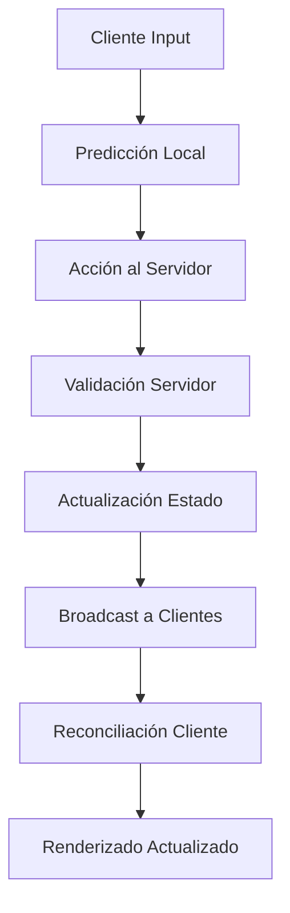

# Diseño de Software - Wild v2.0

## 🎯 Objetivo

Definir el diseño de software a nivel de programación para Wild v2.0, estableciendo los patrones arquitectónicos, principios de diseño y estructura de código que garantizarán un sistema mantenible, escalable y eficiente.

## 📋 Principios Fundamentales de Diseño

### 🎯 Principios SOLID

#### **S** - Single Responsibility Principle
Cada clase y componente debe tener una única responsabilidad bien definida.

```csharp
// ✅ Bueno: Responsabilidad única
public class ChunkRenderer
{
    // Única responsabilidad: renderizar chunks
    public async Task<MeshInstance3D> RenderChunk(Vector2I chunkPos) { }
}

// ❌ Evitar: Múltiples responsabilidades
public class ChunkManagerRendererLoader // Demasiado en el nombre
{
    public void ManageChunks() { }
    public void RenderChunks() { }
    public void LoadChunks() { }
}
```

#### **O** - Open/Closed Principle
Las clases deben estar abiertas para extensión pero cerradas para modificación.

```csharp
// ✅ Bueno: Extensible mediante interfaces
public interface IBiomaGenerator
{
    BiomaType GenerateBioma(Vector2I position);
}

public class PraderaGenerator : IBiomaGenerator { }
public class BosqueGenerator : IBiomaGenerator { }
// Se pueden añadir nuevos biomas sin modificar código existente
```

#### **L** - Liskov Substitution Principle
Las subclases deben poder reemplazar a sus clases base sin alterar el funcionamiento.

```csharp
// ✅ Bueno: Polimorfismo consistente
public abstract class BiomaType
{
    public abstract BiomaCharacteristics GetCharacteristics();
    public abstract float GetHeightModifier(Vector3 position);
}

public class PraderaBioma : BiomaType { }
public class BosqueBioma : BiomaType { }
// Cualquier bioma puede usarse donde se espere BiomaType
```

#### **I** - Interface Segregation Principle
Las interfaces deben ser específicas y no forzar a implementar métodos innecesarios.

```csharp
// ✅ Bueno: Interfaces específicas
public interface IRenderer
{
    void Render();
}

public interface ICacheable
{
    void Cache();
    void Invalidate();
}

// ❌ Evitar: Interfaces demasiado grandes
public interface ITerrainSystem
{
    void Render();
    void Cache();
    void Load();
    void Save();
    void Generate();
    void Optimize();
}
```

#### **D** - Dependency Inversion Principle
Depender de abstracciones, no de implementaciones concretas.

```csharp
// ✅ Bueno: Inyección de dependencias
public class TerrainSystem
{
    private readonly IBiomaGenerator _biomaGenerator;
    private readonly IChunkRenderer _renderer;
    
    public TerrainSystem(IBiomaGenerator biomaGenerator, IChunkRenderer renderer)
    {
        _biomaGenerator = biomaGenerator;
        _renderer = renderer;
    }
}
```

---

## 🏗️ Arquitectura General

### 📋 Patrón de Arquitectura: Layered Architecture

```mermaid
graph TD
    A[UI Layer] --> B[Application Layer]
    B --> C[Domain Layer]
    C --> D[Infrastructure Layer]
    
    A1[Menus] --> A
    A2[HUD] --> A
    A3[Settings] --> A
    
    B1[SceneManager] --> B
    B2[GameWorld] --> B
    B3[NetworkManager] --> B
    
    C1[TerrainSystem] --> C
    C2[BiomaManager] --> C
    C3[CharacterManager] --> C
    
    D1[FileSystem] --> D
    D2[Network] --> D
    D3[Rendering] --> D
```



### 📋 Separación de Responsabilidades

#### **UI Layer** - Interfaz de Usuario
- Menús y navegación
- HUD y feedback visual
- Configuración y opciones
- No contiene lógica de negocio

#### **Application Layer** - Coordinación
- Gestión de escenas y estados
- Coordinación entre sistemas
- Manejo de eventos del usuario
- Orquestación de flujos

#### **Domain Layer** - Lógica de Negocio
- Reglas del juego y simulación
- Generación procedural
- Sistema de biomas
- Lógica de personajes

#### **Infrastructure Layer** - Servicios
- Persistencia de datos
- Comunicación de red
- Renderizado y gráficos
- Sistema de archivos

---

## 🎮 Patrones de Diseño Específicos

#### Clase PersonajeManager (Singleton)
```csharp
public partial class PersonajeManager : Node
{
    private static PersonajeManager _instance;
    private Dictionary<string, Personaje> _personajes = new();
    private string _personajeActualId = "";
    
    public override void _Ready()
    {
        _instance = this;
        Inicializar("user://characters/");
    }
    
    public void CrearPersonaje(string apodo, string genero)
    {
        // Validaciones de 3-20 caracteres
        // Persistencia en JSON
        // Garantía de al menos un personaje
        var nuevo = new Personaje { apodo = apodo, genero = genero };
        GuardarPersonaje(nuevo);
        SeleccionarPersonaje(nuevo.id);
    }
    
    public void GuardarSeleccion()
    {
        // Persiste el ID actual en selected.dat
    }
}
```
### 📋 Singleton Pattern (Controlado)

#### Implementación con Inicialización Ordenada
```csharp
public partial class BiomaManager : Node
{
    private static BiomaManager _instance;
    private static bool _isInitialized = false;
    
    public static BiomaManager Instance
    {
        get
        {
            if (_instance == null)
                throw new InvalidOperationException("BiomaManager no inicializado");
            return _instance;
        }
    }
    
    public override void _Ready()
    {
        if (_instance != null && _instance != this)
        {
            QueueFree(); // Eliminar duplicados
            return;
        }
        
        _instance = this;
        Initialize();
    }
    
    private void Initialize()
    {
        if (_isInitialized) return;
        
        // Inicialización ordenada
        LoadConfiguration();
        SetupNoiseGenerator();
        InitializeCache();
        
        _isInitialized = true;
        Logger.Log("BiomaManager: Inicializado correctamente");
    }
}
```

#### Reglas de Singleton
1. **Inicialización controlada:** Solo en `_Ready()`
2. **Orden estricto:** Dependencias primero
3. **Validación de estado:** Verificar inicialización
4. **Logging consistente:** Registrar eventos importantes

### 📋 Factory Pattern

#### Generación de Componentes
```csharp
public class BiomaFactory
{
    private readonly Dictionary<BiomaType, Func<IBiomaGenerator>> _generators;
    
    public BiomaFactory()
    {
        _generators = new Dictionary<BiomaType, Func<IBiomaGenerator>>
        {
            { BiomaType.Pradera, () => new PraderaGenerator() },
            { BiomaType.Bosque, () => new BosqueGenerator() },
            { BiomaType.Desierto, () => new DesiertoGenerator() },
            { BiomaType.Montaña, () => new MontañaGenerator() }
        };
    }
    
    public IBiomaGenerator CreateGenerator(BiomaType biomaType)
    {
        if (_generators.TryGetValue(biomaType, out var generator))
        {
            return generator();
        }
        
        Logger.LogWarning($"BiomaFactory: Tipo de bioma no soportado: {biomaType}");
        return new DefaultGenerator();
    }
}
```

### 📋 Observer Pattern

#### Sistema de Eventos Desacoplado
```csharp
public class QualityManager : Node
{
    [Signal]
    public delegate void QualityChangedEventHandler(QualityLevel newQuality);
    
    public void SetQualityLevel(QualityLevel quality)
    {
        CurrentQuality = quality;
        
        // Notificar a todos los suscriptores
        EmitSignal(SignalName.QualityChanged, quality);
        
        Logger.Log($"QualityManager: Calidad cambiada a {quality}");
    }
}

public class TerrainRenderer : Node
{
    public override void _Ready()
    {
        // Suscribirse a cambios de calidad
        QualityManager.Instance.QualityChanged += OnQualityChanged;
    }
    
    private void OnQualityChanged(QualityLevel newQuality)
    {
        // Reaccionar al cambio de calidad
        UpdateRenderQuality(newQuality);
        Logger.Log($"TerrainRenderer: Calidad actualizada a {newQuality}");
    }
}
```

### 📋 Command Pattern

#### Manejo de Acciones del Usuario
```csharp
public interface ICommand
{
    bool Execute();
    bool Undo();
    string GetDescription();
}

public class MovePlayerCommand : ICommand
{
    private readonly Vector3 _direction;
    private readonly PlayerController _player;
    private Vector3 _previousPosition;
    
    public MovePlayerCommand(PlayerController player, Vector3 direction)
    {
        _player = player;
        _direction = direction;
    }
    
    public bool Execute()
    {
        _previousPosition = _player.Position;
        _player.Move(_direction);
        return true;
    }
    
    public bool Undo()
    {
        _player.Position = _previousPosition;
        return true;
    }
    
    public string GetDescription()
    {
        return $"Mover jugador hacia {_direction}";
    }
}

public class InputHandler
{
    private readonly Stack<ICommand> _commandHistory = new();
    
    public void HandleInput(InputEvent @event)
    {
        ICommand command = ParseInputToCommand(@event);
        if (command != null && command.Execute())
        {
            _commandHistory.Push(command);
        }
    }
    
    public void UndoLastAction()
    {
        if (_commandHistory.Count > 0)
        {
            var command = _commandHistory.Pop();
            command.Undo();
        }
    }
}
```

---

## 🔧 Estructura de Código

### 📋 Organización de Namespaces

#### Jerarquía Lógica
```csharp
namespace Wild.Core
{
    // Sistemas centrales del motor
    namespace Wild.Core.Terrain
    {
        public class TerrainSystem { }
        public class ChunkRenderer { }
        public class BiomaManager { }
    }
    
    namespace Wild.Core.Network
    {
        public class NetworkManager { }
        public class GameServer { }
        public class GameClient { }
    }
    
    namespace Wild.Core.UI
    {
        public class SceneManager { }
        public class HUD { }
        public class MenuManager { }
    }
}

namespace Wild.Gameplay
{
    // Lógica específica del juego
    namespace Wild.Gameplay.Characters
    {
        public class CharacterManager { }
        public class PlayerController { }
    }
    
    namespace Wild.Gameplay.World
    {
        public class GameWorld { }
        public class SurvivalSystem { }
    }
}

namespace Wild.Infrastructure
{
    // Servicios y utilidades
    namespace Wild.Infrastructure.Persistence
    {
        public class SaveSystem { }
        public class ConfigLoader { }
    }
    
    namespace Wild.Infrastructure.Logging
    {
        public static class Logger { }
        public class LogManager { }
    }
}
```

### 📋 Convenciones de Nomenclatura

#### Clases y Structs
```csharp
// PascalCase para clases públicas
public class TerrainRenderer { }
public class BiomaManager { }
public class PlayerController { }

// Prefijos consistentes para interfaces
public interface IBiomaGenerator { }
public interface IChunkRenderer { }
public interface INetworkManager { }

// Sufijos para clases especializadas
public class QualitySettings { }
public class NetworkMessage { }
public class CharacterData { }
```

#### Métodos y Propiedades
```csharp
public class ChunkRenderer
{
    // PascalCase para métodos públicos
    public async Task<MeshInstance3D> RenderChunk(Vector2I chunkPos) { }
    public void SetQualityLevel(QualityLevel quality) { }
    public bool IsChunkVisible(Vector2I chunkPos) { }
    
    // camelCase para métodos privados
    private void UpdateChunkVisibility() { }
    private bool ShouldRenderChunk(Vector2I chunkPos) { }
    private async Task LoadChunkData(Vector2I chunkPos) { }
    
    // Propiedades públicas
    public QualityLevel CurrentQuality { get; private set; }
    public int LoadedChunkCount { get; private set; }
    
    // Campos privados con _
    private readonly Dictionary<Vector2I, ChunkData> _chunkCache;
    private QualityLevel _currentQuality;
}
```

#### Constantes y Enums
```csharp
public static class TerrainConstants
{
    public const int CHUNK_SIZE = 10;
    public const int VERTEX_COUNT = 11;
    public const float RENDER_DISTANCE = 500.0f;
    public const int MAX_CHUNKS_LOADED = 1000;
}

public enum QualityLevel
{
    Toaster = 0,
    Low = 1,
    Medium = 2,
    High = 3,
    Ultra = 4
}

public enum BiomaType
{
    Pradera,
    Bosque,
    Desierto,
    Montaña,
    Océano,
    Tundra,
    Jungla,
    Cañón
}
```

---

## 🔄 Gestión del Ciclo de Vida

### 📋 Inicialización Controlada

#### Orden de Inicialización Crítico
```csharp
public partial class GameBootstrap : Node
{
    public override void _Ready()
    {
        // 1. Sistema de logging (primero siempre)
        InitializeLogger();
        
        // 2. Sistema de coordenadas (fundamento)
        InitializeCoordinateSystem();
        
        // 3. Gestores de configuración
        InitializeQualityManager();
        InitializeConfigLoader();
        
        // 4. Sistemas centrales
        InitializeBiomaManager();
        InitializeNetworkManager();
        
        // 5. Sistemas de juego
        InitializeTerrainSystem();
        InitializeCharacterManager();
        
        // 6. UI y escenas
        InitializeSceneManager();
        InitializeUI();
        
        Logger.Log("GameBootstrap: Todos los sistemas inicializados");
    }
    
    private void InitializeLogger()
    {
        var logger = new Logger();
        AddChild(logger);
        Logger.Log("GameBootstrap: Logger inicializado");
    }
    
    private void InitializeCoordinateSystem()
    {
        var coordinateSystem = new CoordinateSystem();
        AddChild(coordinateSystem);
        Logger.Log("GameBootstrap: Sistema de coordenadas inicializado");
    }
    
    // ... otros métodos de inicialización
}
```

#### Validación de Estado
```csharp
public abstract class GameManager : Node
{
    protected abstract bool IsReady { get; }
    
    public override void _Process(double delta)
    {
        if (!IsReady)
        {
            WaitForReady();
            return;
        }
        
        ProcessGameLogic(delta);
    }
    
    private void WaitForReady()
    {
        // Esperar a que todos los sistemas estén listos
        var allReady = CheckAllSystemsReady();
        
        if (allReady)
        {
            OnAllSystemsReady();
        }
    }
    
    protected virtual void OnAllSystemsReady()
    {
        Logger.Log($"{GetType().Name}: Todos los sistemas listos");
    }
}
```

---

## 🎯 Manejo de Errores y Logging

### 📋 Estrategia de Manejo de Excepciones

#### Jerarquía de Excepciones
```csharp
// Excepción base del proyecto
public class WildException : Exception
{
    public string System { get; }
    public string Component { get; }
    
    public WildException(string system, string component, string message) 
        : base($"[{system}:{component}] {message}")
    {
        System = system;
        Component = component;
    }
}

// Excepciones específicas
public class TerrainException : WildException
{
    public TerrainException(string component, string message) 
        : base("Terrain", component, message) { }
}

public class NetworkException : WildException
{
    public NetworkException(string component, string message) 
        : base("Network", component, message) { }
}

public class RenderException : WildException
{
    public RenderException(string component, string message) 
        : base("Render", component, message) { }
}
```

#### Manejo Robusto de Errores
```csharp
public class ChunkRenderer
{
    public async Task<MeshInstance3D> RenderChunkSafe(Vector2I chunkPos)
    {
        try
        {
            return await RenderChunk(chunkPos);
        }
        catch (TerrainException ex)
        {
            Logger.LogError($"ChunkRenderer: Error de terreno en chunk {chunkPos}: {ex.Message}");
            return CreateErrorChunk(chunkPos);
        }
        catch (RenderException ex)
        {
            Logger.LogError($"ChunkRenderer: Error de renderizado en chunk {chunkPos}: {ex.Message}");
            return CreateFallbackChunk(chunkPos);
        }
        catch (Exception ex)
        {
            Logger.LogError($"ChunkRenderer: Error inesperado en chunk {chunkPos}: {ex.Message}");
            return CreateDefaultChunk(chunkPos);
        }
    }
    
    private MeshInstance3D CreateErrorChunk(Vector2I chunkPos)
    {
        // Chunk rojo para indicar error
        var chunk = new MeshInstance3D();
        chunk.Mesh = CreateCubeMesh(Colors.Red);
        chunk.Position = new Vector3(chunkPos.X * 10, 0, chunkPos.Y * 10);
        return chunk;
    }
}
```

### 📋 Sistema de Logging Estructurado

#### Contexto y Niveles
```csharp
public static class Logger
{
    public static void LogInfo(string system, string component, string message)
    {
        WriteLog("INFO", system, component, message);
    }
    
    public static void LogWarning(string system, string component, string message)
    {
        WriteLog("WARNING", system, component, message);
    }
    
    public static void LogError(string system, string component, string message)
    {
        WriteLog("ERROR", system, component, message);
    }
    
    public static void LogError(string system, string component, string message, Exception ex)
    {
        WriteLog("ERROR", system, component, $"{message}\nException: {ex}");
    }
    
    private static void WriteLog(string level, string system, string component, string message)
    {
        var timestamp = DateTime.Now.ToString("yyyy-MM-dd HH:mm:ss.fff");
        var logEntry = $"[{timestamp}] [{level}] [{system}:{component}] {message}";
        
        // Escribir a archivo y consola según configuración
        File.AppendAllText("user://logs/wild.log", logEntry + Environment.NewLine);
        
        if (IsDevelopmentMode())
        {
            GD.Print(logEntry);
        }
    }
}
```

---

## 🚀 Optimización y Rendimiento

### 📋 Sistema de Pooling de Objetos

#### ObjectPool Genérico
```csharp
public class ObjectPool<T> where T : class, new()
{
    private readonly Queue<T> _pool = new();
    private readonly Func<T> _createFunc;
    private readonly Action<T> _resetAction;
    private readonly int _maxSize;
    
    public ObjectPool(int maxSize = 100, Func<T> createFunc = null, Action<T> resetAction = null)
    {
        _maxSize = maxSize;
        _createFunc = createFunc ?? (() => new T());
        _resetAction = resetAction;
    }
    
    public T Get()
    {
        if (_pool.Count > 0)
        {
            return _pool.Dequeue();
        }
        
        return _createFunc();
    }
    
    public void Return(T item)
    {
        if (_pool.Count < _maxSize)
        {
            _resetAction?.Invoke(item);
            _pool.Enqueue(item);
        }
    }
    
    public void Clear()
    {
        _pool.Clear();
    }
}
```

#### PoolManager Centralizado
```csharp
public static class PoolManager
{
    private static readonly Dictionary<string, object> _pools = new();
    
    public static ObjectPool<T> GetPool<T>(string poolId, int maxSize = 100) where T : class, new()
    {
        var key = $"{typeof(T).Name}_{poolId}";
        
        if (!_pools.ContainsKey(key))
        {
            _pools[key] = new ObjectPool<T>(maxSize);
        }
        
        return (ObjectPool<T>)_pools[key];
    }
    
    public static void ClearAllPools()
    {
        foreach (var pool in _pools.Values)
        {
            if (pool is IDisposable disposable)
            {
                disposable.Dispose();
            }
        }
        _pools.Clear();
    }
}
```

### 📋 Sistema de Caching

#### Cache Thread-Safe
```csharp
public class ThreadSafeCache<TKey, TValue>
{
    private readonly Dictionary<TKey, TValue> _cache = new();
    private readonly ReaderWriterLockSlim _lock = new();
    private readonly int _maxSize;
    
    public ThreadSafeCache(int maxSize = 1000)
    {
        _maxSize = maxSize;
    }
    
    public bool TryGet(TKey key, out TValue value)
    {
        _lock.EnterReadLock();
        try
        {
            return _cache.TryGetValue(key, out value);
        }
        finally
        {
            _lock.ExitReadLock();
        }
    }
    
    public void Set(TKey key, TValue value)
    {
        _lock.EnterWriteLock();
        try
        {
            if (_cache.Count >= _maxSize)
            {
                CleanupOldest();
            }
            
            _cache[key] = value;
        }
        finally
        {
            _lock.ExitWriteLock();
        }
    }
    
    private void CleanupOldest()
    {
        // Eliminar 25% de los elementos más antiguos
        var keysToRemove = _cache.Keys.Take(_cache.Count / 4);
        foreach (var key in keysToRemove)
        {
            _cache.Remove(key);
        }
    }
}
```

---

## 🎯 Testing y Calidad

### 📋 Arquitectura para Testing

#### Dependency Injection para Testing
```csharp
public interface ITerrainSystem
{
    Task<ChunkData> GenerateChunk(Vector2I position);
    void SetBiomaManager(IBiomaManager manager);
}

public class TerrainSystem : ITerrainSystem
{
    private readonly IBiomaManager _biomaManager;
    
    public TerrainSystem(IBiomaManager biomaManager)
    {
        _biomaManager = biomaManager;
    }
    
    // Implementación real
}

public class MockTerrainSystem : ITerrainSystem
{
    // Implementación para testing
    public async Task<ChunkData> GenerateChunk(Vector2I position)
    {
        return new ChunkData { Position = position };
    }
}
```

#### Unit Tests con Mocking
```csharp
[Test]
public async Task TerrainSystem_GenerateChunk_ReturnsValidChunk()
{
    // Arrange
    var mockBiomaManager = new Mock<IBiomaManager>();
    mockBiomaManager.Setup(x => x.GetBiomaAtPosition(It.IsAny<Vector3>()))
                  .Returns(BiomaType.Pradera);
    
    var terrainSystem = new TerrainSystem(mockBiomaManager.Object);
    var chunkPos = new Vector2I(0, 0);
    
    // Act
    var result = await terrainSystem.GenerateChunk(chunkPos);
    
    // Assert
    Assert.IsNotNull(result);
    Assert.AreEqual(chunkPos, result.Position);
    Assert.AreEqual(BiomaType.Pradera, result.Bioma);
}
```

---

## 🔍 Investigaciones y Mejoras Basadas en Investigación

### 📋 Patrones de Arquitectura Modernos (2024)

#### **Balance entre Flexibilidad y Rendimiento**
Según Game Programming Patterns, la arquitectura debe encontrar un equilibrio:

```csharp
// ✅ Bueno: Código simple y directo
public class ChunkRenderer
{
    public async Task<MeshInstance3D> RenderChunk(Vector2I chunkPos)
    {
        // Lógica directa sin abstracción excesiva
        var chunkData = await GenerateChunkData(chunkPos);
        return CreateMesh(chunkData);
    }
}

// ⚠️ Considerar: Abstracción solo donde sea necesario
public interface IChunkRenderer
{
    Task<MeshInstance3D> RenderChunk(Vector2I chunkPos);
}

// Usar solo si realmente necesitamos múltiples implementaciones
```

#### **Simplicidad sobre Complejidad**
- **Código directo:** Soluciones simples que resuelven el problema
- **Evitar sobre-ingeniería:** No añadir complejidad "por si acaso"
- **Refactorización continua:** Simplificar código existente

### 📋 Async/Await Optimizado para .NET 8

#### **Mecanismos Internos de async/await**
```csharp
public class TerrainSystem
{
    // ✅ Bueno: Usar async/await correctamente
    public async Task<ChunkData> GenerateChunkAsync(Vector2I chunkPos)
    {
        // No bloquear el thread principal
        var heightData = await GenerateHeightDataAsync(chunkPos);
        var biomaData = await GenerateBiomaDataAsync(chunkPos);
        
        return new ChunkData
        {
            Position = chunkPos,
            Heights = heightData,
            Biomes = biomaData
        };
    }
    
    // ✅ Bueno: Operación I/O-bound sin bloqueo
    private async Task<float[,]> GenerateHeightDataAsync(Vector2I chunkPos)
    {
        // Usar Task.Run para trabajo intensivo en CPU
        return await Task.Run(() => 
        {
            // Generación procedural intensiva
            return NoiseGenerator.GenerateHeightMap(chunkPos);
        });
    }
}
```

#### **Thread Pooling Eficiente**
```csharp
public class AsyncChunkProcessor
{
    private readonly SemaphoreSlim _semaphore;
    private readonly int _maxConcurrentChunks = 4;
    
    public AsyncChunkProcessor()
    {
        _semaphore = new SemaphoreSlim(_maxConcurrentChunks);
    }
    
    public async Task ProcessChunksAsync(List<Vector2I> chunkPositions)
    {
        var tasks = chunkPositions.Select(async chunkPos =>
        {
            await _semaphore.WaitAsync();
            try
            {
                return await ProcessSingleChunkAsync(chunkPos);
            }
            finally
            {
                _semaphore.Release();
            }
        });
        
        return await Task.WhenAll(tasks);
    }
}
```

### 📋 Multithreading en Godot 4

#### **Prácticas Recomendadas**
```csharp
public class ThreadSafeTerrainCache
{
    private readonly Dictionary<Vector2I, ChunkData> _cache = new();
    private readonly ReaderWriterLockSlim _lock = new();
    
    public bool TryGetChunk(Vector2I chunkPos, out ChunkData chunk)
    {
        _lock.EnterReadLock();
        try
        {
            return _cache.TryGetValue(chunkPos, out chunk);
        }
        finally
        {
            _lock.ExitReadLock();
        }
    }
    
    public void SetChunk(Vector2I chunkPos, ChunkData chunk)
    {
        _lock.EnterWriteLock();
        try
        {
            _cache[chunkPos] = chunk;
        }
        finally
        {
            _lock.ExitWriteLock();
        }
    }
}
```

#### **Integración con el Thread Pool de Godot**
```csharp
public partial class TerrainWorker : Node
{
    private Thread _workerThread;
    private volatile bool _isRunning = false;
    
    public override void _Ready()
    {
        _workerThread = new Thread();
        _workerThread.Start(_WorkerLoop);
    }
    
    private void _WorkerLoop()
    {
        while (_isRunning)
        {
            // Procesar cola de chunks
            var chunkPos = GetNextChunkToProcess();
            if (chunkPos != null)
            {
                ProcessChunkInThread(chunkPos);
            }
            
            // Pequeña pausa para no sobrecargar CPU
            OS.DelayMsec(1);
        }
    }
    
    private void ProcessChunkInThread(Vector2I chunkPos)
    {
        // Generación de chunk en thread separado
        var chunkData = GenerateChunkData(chunkPos);
        
        // Enviar resultado al thread principal via CallDeferred
        CallDeferred(MethodName.OnChunkGenerated, chunkData);
    }
    
    public void OnChunkGenerated(ChunkData chunkData)
    {
        // Ejecutado en el thread principal
        AddChunkToScene(chunkData);
    }
    
    public override void _ExitTree()
    {
        _isRunning = false;
        _workerThread.WaitToFinish();
    }
}
```

### 📋 Técnicas de Optimización de Terreno

#### **Chunking con Culling Inteligente**
```csharp
public class OptimizedChunkManager
{
    private readonly Dictionary<Vector2I, ChunkNode> _activeChunks = new();
    private readonly HashSet<Vector2I> _visibleChunks = new();
    
    public void UpdateVisibleChunks(Vector3 playerPos, Camera3D camera)
    {
        var newVisibleChunks = GetChunksInFrustum(playerPos, camera);
        
        // Solo procesar chunks que cambiaron de visibilidad
        var chunksToAdd = newVisibleChunks.Except(_visibleChunks);
        var chunksToRemove = _visibleChunks.Except(newVisibleChunks);
        
        // Generar nuevos chunks visibles
        foreach (var chunkPos in chunksToAdd)
        {
            if (!_activeChunks.ContainsKey(chunkPos))
            {
                GenerateChunkAsync(chunkPos);
            }
        }
        
        // Ocultar chunks que ya no son visibles
        foreach (var chunkPos in chunksToRemove)
        {
            if (_activeChunks.TryGetValue(chunkPos, out var chunk))
            {
                chunk.Visible = false;
                _activeChunks.Remove(chunkPos);
            }
        }
        
        _visibleChunks = newVisibleChunks;
    }
    
    private HashSet<Vector2I> GetChunksInFrustum(Vector3 playerPos, Camera3D camera)
    {
        var visible = new HashSet<Vector2I>();
        var frustum = camera.GetFrustum();
        
        // Solo verificar chunks en rango razonable
        var checkRadius = 300; // 30 chunks
        var playerChunkPos = WorldToChunkCoords(playerPos);
        
        for (int x = -3; x <= 3; x++)
        {
            for (int z = -3; z <= 3; z++)
            {
                var chunkPos = new Vector2I(playerChunkPos.X + x, playerChunkPos.Y + z);
                var chunkWorldPos = new Vector3(chunkPos.X * 10, 0, chunkPos.Y * 10);
                
                if (frustum.IsPositionInFrustum(chunkWorldPos))
                {
                    visible.Add(chunkPos);
                }
            }
        }
        
        return visible;
    }
}
```

---

## 🎯 Conclusión

Este diseño de software para Wild v2.0 establece:

**✅ Arquitectura Sólida:**
- Principios SOLID aplicados consistentemente
- Patrones de diseño probados y apropiados
- Separación clara de responsabilidades
- Dependencias bien definidas e inyectables

**🚀 Rendimiento Optimizado:**
- Sistema de pooling para evitar GC
- Caching thread-safe y eficiente
- Manejo asíncrono de operaciones
- Optimización de memoria controlada

**🔧 Mantenibilidad Garantizada:**
- Código modular y desacoplado
- Nomenclatura consistente y clara
- Logging estructurado y contextual
- Testing facilitado mediante DI

**🛡️ Robustez y Estabilidad:**
- Manejo robusto de excepciones
- Validación de estado en tiempo real
- Inicialización controlada y ordenada
- Recuperación elegante de fallos

**🎯 Separación de Responsabilidades por Componente:**
- **HUDManager:** Coordinación centralizada de elementos UI
- **TerrainRenderer:** Renderizado exclusivo de terreno (sin HUD)
- **UIElements:** Componentes individuales del HUD (salud, energía, inventario)
- **EventBus:** Comunicación desacoplada entre sistemas
- **Observables:** Patrón Observer para actualizaciones de estado

#### **Implementación de HUDManager**
```csharp
public class HUDManager : Node
{
    private readonly EventBus _eventBus;
    private readonly Dictionary<string, UIElement> _elements;
    
    public HUDManager(EventBus eventBus)
    {
        _eventBus = eventBus;
        _elements = new Dictionary<string, UIElement>();
    }
    
    public void RegisterElement(string id, UIElement element)
    {
        _elements[id] = element;
        
        // Suscribir a eventos del personaje
        _eventBus.Subscribe<CharacterStatsUpdated>(OnCharacterStatsUpdated);
        _eventBus.Subscribe<InventoryChanged>(OnInventoryChanged);
    }
    
    private void OnCharacterStatsUpdated(CharacterStatsUpdated stats)
    {
        if (_elements.TryGetValue("health", out var healthElement))
            healthElement.UpdateValue(stats.Health);
            
        if (_elements.TryGetValue("energy", out var energyElement))
            energyElement.UpdateValue(stats.Energy);
    }
    
    private void OnInventoryChanged(InventoryChanged inventory)
    {
        if (_elements.TryGetValue("inventory", out var inventoryElement))
            inventoryElement.UpdateInventory(inventory.Items);
    }
}

public class EventBus
{
    private readonly Dictionary<Type, List<Delegate>> _subscribers = new();
    
    public void Subscribe<T>(Action<T> handler)
    {
        var type = typeof(T);
        if (!_subscribers.ContainsKey(type))
            _subscribers[type] = new List<Delegate>();
        
        _subscribers[type].Add(handler);
    }
    
    public void Publish<T>(T eventData)
    {
        var type = typeof(T);
        if (_subscribers.TryGetValue(type, out var handlers))
        {
            foreach (var handler in handlers)
            {
                ((Action<T>)handler)?.Invoke(eventData);
            }
        }
    }
}
```

#### **Separación de TerrainRenderer**
```csharp
public class TerrainRenderer : Node
{
    // Responsabilidad única: renderizado de terreno
    public async Task<MeshInstance3D> RenderChunk(Vector2I chunkPos)
    {
        // Solo renderizado, sin HUD
        var chunkData = await GenerateChunkData(chunkPos);
        return CreateTerrainMesh(chunkData);
    }
    
    // No depende de HUDManager
    // Comunicación con otros sistemas vía EventBus
    private void OnChunkGenerated(ChunkData chunkData)
    {
        // Publicar evento para que otros sistemas reaccionen
        EventBus.Instance.Publish(new ChunkGenerated { Data = chunkData });
    }
}
```

**🌐 Arquitectura Cliente-Servidor**

#### **Modelo Autoritativo Servidor-Centralizado**
```csharp
// Servidor: Control completo del estado del juego
public class GameServer : Node
{
    private readonly Dictionary<string, ClientConnection> _clients;
    private readonly WorldState _worldState;
    private readonly TerrainSystem _terrainSystem;
    
    public void ProcessClientAction(ClientAction action)
    {
        // Servidor valida y ejecuta todas las acciones
        switch (action.Type)
        {
            case ActionType.PlayerMove:
                ValidateAndMovePlayer(action.ClientId, action.Data);
                break;
            case ActionType.TerrainModify:
                ValidateAndModifyTerrain(action.Data);
                break;
            case ActionType.InventoryOperation:
                ValidateInventoryOperation(action.ClientId, action.Data);
                break;
        }
        
        // Broadcast del estado actualizado a todos los clientes
        BroadcastStateUpdate();
    }
}

// Cliente: Interfaz ligera con renderizado local
public class GameClient : Node
{
    private readonly NetworkClient _networkClient;
    private readonly LocalRenderer _localRenderer;
    private readonly InputPredictor _inputPredictor;
    
    public void SendPlayerInput(Vector3 movement)
    {
        // Predicción local para respuesta inmediata
        _inputPredictor.PredictMovement(movement);
        
        // Enviar acción al servidor
        var action = new ClientAction
        {
            Type = ActionType.PlayerMove,
            Data = movement
        };
        
        _networkClient.SendAction(action);
    }
    
    public void OnServerStateUpdate(ServerState state)
    {
        // Reconciliar predicciones con estado real del servidor
        _inputPredictor.Reconcile(state);
        
        // Actualizar renderizado local
        _localRenderer.UpdateFromServerState(state);
    }
}
```

#### **Separación de Responsabilidades**

**Servidor (Autoridad Central):**
- **GameServer:** Estado completo del mundo
- **WorldState:** Datos persistentes del juego
- **TerrainSystem:** Generación y validación de terreno
- **PlayerManager:** Control de todos los jugadores
- **ValidationSystem:** Validación de todas las acciones cliente

**Cliente (Representación Local):**
- **GameClient:** Conexión y comunicación con servidor
- **LocalRenderer:** Renderizado basado en estado del servidor
- **InputPredictor:** Predicción de movimiento para suavidad
- **UIController:** Interfaz de usuario local
- **EffectsRenderer:** Efectos visuales locales (partículas, sonidos)

#### **Flujo de Juego Multijugador**


#### **Sincronización de Terreno**
```csharp
// Servidor genera y distribuye terreno
public class ServerTerrainManager
{
    public async Task<ChunkData> GetChunkForClient(Vector2I chunkPos)
    {
        // Generar chunk si no existe
        if (!_worldState.HasChunk(chunkPos))
        {
            var chunkData = await _terrainSystem.GenerateChunk(chunkPos);
            _worldState.SetChunk(chunkPos, chunkData);
        }
        
        return _worldState.GetChunk(chunkPos);
    }
}

// Cliente renderiza terreno basado en datos del servidor
public class ClientTerrainRenderer
{
    public void UpdateChunk(ServerChunkData serverData)
    {
        // Renderizar chunk con datos validados del servidor
        var mesh = CreateMeshFromServerData(serverData);
        RenderChunk(mesh);
    }
}
```

#### **Ventajas del Modelo Servidor-Centralizado**
- **Seguridad:** Servidor valida todas las acciones
- **Consistencia:** Estado único y autoritativo
- **Escalabilidad:** Servidor gestiona carga de múltiples clientes
- **Experiencia Fluida:** Predicción local reduce latencia percibida
- **Cooperativo Natural:** Jugadores comparten el mismo mundo persistente

**📈 Escalabilidad Asegurada:**
- Diseño extensible mediante interfaces
- Componentes reutilizables y configurables
- Arquitectura layered que crece con el proyecto
- Sistema de plugins y fábricas

El resultado es una base de código profesional que permitirá un desarrollo eficiente, mantenible y escalable de Wild v2.0, aprendiendo de las lecciones del proyecto original y aplicando las mejores prácticas de ingeniería de software, con soporte nativo para multijugador cooperativo donde el servidor mantiene la autoridad del estado del juego.
