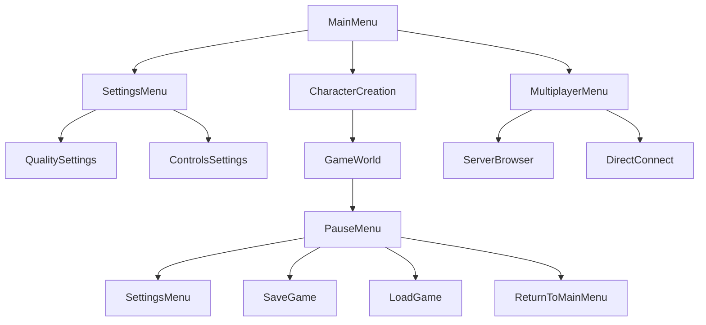

# Sistema de Menús y Escenas - Wild v2.0

## 🎯 Objetivo

Definir el sistema de menús y escenas para Wild v2.0, aprovechando la estructura bien diseñada del proyecto original y adaptándola a las necesidades del nuevo sistema con calidad dinámica y arquitectura simplificada.

## 📋 Arquitectura del Sistema

### 🔄 Flujo de Navegación de Escenas



### 🏗️ Componentes Principales

#### 1. **SceneManager** - Gestor de Escenas
- Transiciones suaves entre escenas
- Carga asíncrona de escenas
- Gestión de estado de escenas
- Integración con QualityManager

#### 2. **MenuManager** - Gestor de Menús
- Navegación jerárquica de menús
- Estados de menús persistentes
- Animaciones y transiciones
- Integración con configuración

#### 3. **UIController** - Controlador de Interfaz
- Gestión de elementos UI
- Eventos de usuario
- Validación de entrada
- Feedback visual

#### 4. **SceneLoader** - Cargador de Escenas
- Carga asíncrona con progreso
- Pre-carga de recursos
- Gestión de memoria
- Fallback para errores

---

## 🎮 Sistema de Escenas

### 📋 Escenas Principales

#### **MainMenu** - Menú Principal
```csharp
public partial class MainMenu : Control
{
    private Button _newGameButton;
    private Button _continueButton;
    private Button _multiplayerButton;
    private Button _settingsButton;
    private Button _exitButton;
    private Label _versionLabel;
    
    public override void _Ready()
    {
        SetupUI();
        LoadGameState();
        ApplyQualitySettings();
        
        Logger.Log("MainMenu: Menú principal inicializado");
    }
    
    private void SetupUI()
    {
        _newGameButton = GetNode<Button>("VBoxContainer/NewGameButton");
        _continueButton = GetNode<Button>("VBoxContainer/ContinueButton");
        _multiplayerButton = GetNode<Button>("VBoxContainer/MultiplayerButton");
        _settingsButton = GetNode<Button>("VBoxContainer/SettingsButton");
        _exitButton = GetNode<Button>("VBoxContainer/ExitButton");
        _versionLabel = GetNode<Label>("VersionLabel");
        
        // Conectar eventos
        _newGameButton.Pressed += OnNewGamePressed;
        _continueButton.Pressed += OnContinuePressed;
        _multiplayerButton.Pressed += OnMultiplayerPressed;
        _settingsButton.Pressed += OnSettingsPressed;
        _exitButton.Pressed += OnExitPressed;
        
        // Mostrar versión
        _versionLabel.Text = $"Wild v2.0 - {GetVersion()}";
    }
    
    private void LoadGameState()
    {
        // Verificar si hay partida guardada
        var hasSaveGame = FileAccess.FileExists("user://savegame.json");
        _continueButton.Disabled = !hasSaveGame;
        
        Logger.Log($"MainMenu: Partida guardada encontrada: {hasSaveGame}");
    }
    
    private void ApplyQualitySettings()
    {
        // Aplicar configuración de calidad al menú
        var quality = QualityManager.Instance.CurrentQuality;
        
        // Ajustar efectos visuales según calidad
        switch (quality)
        {
            case QualityLevel.Toaster:
                // Sin efectos, UI básico
                GetTree().Root.Mode = Window.ModeEnum.Windowed;
                break;
            case QualityLevel.Low:
                // Efectos mínimos
                break;
            case QualityLevel.Medium:
            case QualityLevel.High:
            case QualityLevel.Ultra:
                // Efectos completos
                break;
        }
    }
    
    private async void OnNewGamePressed()
    {
        Logger.Log("MainMenu: Iniciando nueva partida");
        
        // Mostrar pantalla de carga
        await ShowLoadingScreen("Creando personaje...");
        
        // Cambiar a escena de creación de personaje
        SceneManager.Instance.LoadScene("res://scenes/CharacterCreation.tscn");
    }
    
    private async void OnContinuePressed()
    {
        Logger.Log("MainMenu: Continuando partida guardada");
        
        // Mostrar pantalla de carga
        await ShowLoadingScreen("Cargando partida...");
        
        // Cargar partida guardada y cambiar a escena del juego
        await LoadSavedGame();
        SceneManager.Instance.LoadScene("res://scenes/GameWorld.tscn");
    }
    
    private void OnMultiplayerPressed()
    {
        Logger.Log("MainMenu: Abriendo menú multijugador");
        SceneManager.Instance.LoadScene("res://scenes/MultiplayerMenu.tscn");
    }
    
    private void OnSettingsPressed()
    {
        Logger.Log("MainMenu: Abriendo configuración");
        SceneManager.Instance.LoadScene("res://scenes/SettingsMenu.tscn");
    }
    
    private void OnExitPressed()
    {
        Logger.Log("MainMenu: Saliendo del juego");
        GetTree().Quit();
    }
    
    private async Task ShowLoadingScreen(string message)
    {
        var loadingScene = GD.Load<PackedScene>("res://scenes/LoadingScreen.tscn");
        var loadingInstance = loadingScene.Instantiate();
        
        // Configurar mensaje
        var messageLabel = loadingInstance.GetNode<Label>("MessageLabel");
        messageLabel.Text = message;
        
        // Añadir a la escena actual
        AddChild(loadingInstance);
        
        // Esperar un frame para que se muestre
        await ToSignal(GetTree(), SceneTree.SignalName.ProcessFrame);
    }
    
    private async Task LoadSavedGame()
    {
        // Implementar carga de partida guardada
        var savePath = "user://savegame.json";
        
        if (FileAccess.FileExists(savePath))
        {
            using var file = FileAccess.Open(savePath, FileAccess.ModeFlags.Read);
            var saveData = file.GetAsText();
            file.Close();
            
            // Procesar datos de guardado
            Logger.Log("MainMenu: Partida guardada cargada");
        }
    }
    
    private string GetVersion()
    {
        return "2.0.0";
    }
}
```

#### **SettingsMenu** - Menú de Configuración
```csharp
public partial class SettingsMenu : Control
{
    private TabContainer _tabContainer;
    private Button _backButton;
    
    // Pestañas de configuración
    private QualitySettingsUI _qualityTab;
    private ControlsSettingsUI _controlsTab;
    private AudioSettingsUI _audioTab;
    private GraphicsSettingsUI _graphicsTab;
    
    public override void _Ready()
    {
        SetupUI();
        LoadCurrentSettings();
        
        Logger.Log("SettingsMenu: Menú de configuración inicializado");
    }
    
    private void SetupUI()
    {
        _tabContainer = GetNode<TabContainer>("TabContainer");
        _backButton = GetNode<Button>("BackButton");
        
        // Obtener referencias a las pestañas
        _qualityTab = _tabContainer.GetNode<QualitySettingsUI>("Quality");
        _controlsTab = _tabContainer.GetNode<ControlsSettingsUI>("Controls");
        _audioTab = _tabContainer.GetNode<AudioSettingsUI>("Audio");
        _graphicsTab = _tabContainer.GetNode<GraphicsSettingsUI>("Graphics");
        
        // Conectar eventos
        _backButton.Pressed += OnBackPressed;
    }
    
    private void LoadCurrentSettings()
    {
        // Cargar configuración actual en todas las pestañas
        _qualityTab.LoadCurrentSettings();
        _controlsTab.LoadCurrentSettings();
        _audioTab.LoadCurrentSettings();
        _graphicsTab.LoadCurrentSettings();
    }
    
    private void OnBackPressed()
    {
        Logger.Log("SettingsMenu: Volviendo al menú anterior");
        
        // Guardar configuración
        SaveAllSettings();
        
        // Volver al menú principal
        SceneManager.Instance.LoadScene("res://scenes/MainMenu.tscn");
    }
    
    private void SaveAllSettings()
    {
        _qualityTab.SaveSettings();
        _controlsTab.SaveSettings();
        _audioTab.SaveSettings();
        _graphicsTab.SaveSettings();
        
        Logger.Log("SettingsMenu: Configuración guardada");
    }
}
```

#### **GameWorld** - Escena Principal del Juego
```csharp
public partial class GameWorld : Node3D
{
    private PlayerController _player;
    private TerrainRenderer _terrainRenderer;
    private BiomaManager _biomaManager;
    private QualityManager _qualityManager;
    private HUD _hud;
    private PauseMenu _pauseMenu;
    
    public override void _Ready()
    {
        InitializeSystems();
        SetupWorld();
        
        Logger.Log("GameWorld: Mundo del juego inicializado");
    }
    
    private void InitializeSystems()
    {
        // Inicializar managers
        _qualityManager = QualityManager.Instance;
        _biomaManager = BiomaManager.Instance;
        
        // Crear sistemas del juego
        _terrainRenderer = new TerrainRenderer();
        _player = new PlayerController();
        _hud = new HUD();
        _pauseMenu = new PauseMenu();
        
        // Añadir a la escena
        AddChild(_terrainRenderer);
        AddChild(_player);
        AddChild(_hud);
        AddChild(_pauseMenu);
        
        // Conectar eventos
        _qualityManager.QualityChanged += OnQualityChanged;
    }
    
    private void SetupWorld()
    {
        // Configurar jugador
        _player.Position = Vector3.Zero;
        
        // Configurar cámara
        var camera = _player.GetNode<Camera3D>("Camera3D");
        camera.Current = true;
        
        // Inicializar terreno
        _terrainRenderer.Initialize();
        
        // Ocultar menú de pausa
        _pauseMenu.Visible = false;
        
        Logger.Log("GameWorld: Mundo configurado");
    }
    
    public override void _Input(InputEvent @event)
    {
        // Manejar entrada de pausa
        if (@event.IsActionPressed("ui_cancel"))
        {
            TogglePause();
        }
    }
    
    private void TogglePause()
    {
        var isPaused = GetTree().Paused;
        
        if (isPaused)
        {
            ResumeGame();
        }
        else
        {
            PauseGame();
        }
    }
    
    private void PauseGame()
    {
        GetTree().Paused = true;
        _pauseMenu.Visible = true;
        Input.MouseMode = Input.MouseModeEnum.Visible;
        
        Logger.Log("GameWorld: Juego pausado");
    }
    
    private void ResumeGame()
    {
        GetTree().Paused = false;
        _pauseMenu.Visible = false;
        Input.MouseMode = Input.MouseModeEnum.Captured;
        
        Logger.Log("GameWorld: Juego reanudado");
    }
    
    private void OnQualityChanged(QualityLevel newQuality)
    {
        Logger.Log($"GameWorld: Calidad cambiada a {newQuality}");
        
        // Aplicar cambios de calidad al mundo
        ApplyQualityToTerrain(newQuality);
        ApplyQualityToPlayer(newQuality);
        ApplyQualityToHUD(newQuality);
    }
    
    private void ApplyQualityToTerrain(QualityLevel quality)
    {
        // Ajustar configuración de renderizado de terreno
        _terrainRenderer.SetQualityLevel(quality);
    }
    
    private void ApplyQualityToPlayer(QualityLevel quality)
    {
        // Ajustar calidad de modelos del jugador
        var playerModel = _player.GetNode<MeshInstance3D>("Model");
        if (playerModel != null)
        {
            // Cargar modelo de calidad apropiada
            var modelPath = GetPlayerModelPath(quality);
            var modelScene = GD.Load<PackedScene>(modelPath);
            var modelInstance = modelScene.Instantiate();
            
            // Reemplazar modelo actual
            playerModel.ReplaceBy(modelInstance);
        }
    }
    
    private void ApplyQualityToHUD(QualityLevel quality)
    {
        // Ajustar calidad de elementos HUD
        _hud.SetQualityLevel(quality);
    }
    
    private string GetPlayerModelPath(QualityLevel quality)
    {
        return quality switch
        {
            QualityLevel.Toaster => "res://models/characters/human_male_toaster.glb",
            QualityLevel.Low => "res://models/characters/human_male_low.glb",
            QualityLevel.Medium => "res://models/characters/human_male_medium.glb",
            QualityLevel.High => "res://models/characters/human_male_high.glb",
            QualityLevel.Ultra => "res://models/characters/human_male_ultra.glb",
            _ => "res://models/characters/human_male_medium.glb"
        };
    }
}
```

#### **PauseMenu** - Menú de Pausa
```csharp
public partial class PauseMenu : Control
{
    private Button _resumeButton;
    private Button _settingsButton;
    private Button _saveButton;
    private Button _loadButton;
    private Button _mainMenuButton;
    private Button _exitButton;
    
    public override void _Ready()
    {
        SetupUI();
        Visible = false;
        
        Logger.Log("PauseMenu: Menú de pausa inicializado");
    }
    
    private void SetupUI()
    {
        _resumeButton = GetNode<Button>("VBoxContainer/ResumeButton");
        _settingsButton = GetNode<Button>("VBoxContainer/SettingsButton");
        _saveButton = GetNode<Button>("VBoxContainer/SaveButton");
        _loadButton = GetNode<Button>("VBoxContainer/LoadButton");
        _mainMenuButton = GetNode<Button>("VBoxContainer/MainMenuButton");
        _exitButton = GetNode<Button>("VBoxContainer/ExitButton");
        
        // Conectar eventos
        _resumeButton.Pressed += OnResumePressed;
        _settingsButton.Pressed += OnSettingsPressed;
        _saveButton.Pressed += OnSavePressed;
        _loadButton.Pressed += OnLoadPressed;
        _mainMenuButton.Pressed += OnMainMenuPressed;
        _exitButton.Pressed += OnExitPressed;
    }
    
    private void OnResumePressed()
    {
        Logger.Log("PauseMenu: Reanudando juego");
        
        // Obtener GameWorld y reanudar
        var gameWorld = GetTree().CurrentScene as GameWorld;
        gameWorld?.ResumeGame();
    }
    
    private void OnSettingsPressed()
    {
        Logger.Log("PauseMenu: Abriendo configuración");
        
        // Abrir configuración sin pausar completamente
        var settingsScene = GD.Load<PackedScene>("res://scenes/SettingsMenu.tscn");
        var settingsInstance = settingsScene.Instantiate();
        
        AddChild(settingsInstance);
        Visible = false;
    }
    
    private async void OnSavePressed()
    {
        Logger.Log("PauseMenu: Guardando partida");
        
        // Mostrar mensaje de guardando
        var saveLabel = GetNode<Label>("SaveLabel");
        saveLabel.Visible = true;
        saveLabel.Text = "Guardando...";
        
        // Guardar partida
        await SaveGame();
        
        // Ocultar mensaje
        saveLabel.Visible = false;
    }
    
    private void OnLoadPressed()
    {
        Logger.Log("PauseMenu: Cargando partida");
        
        // Implementar carga de partida
        SceneManager.Instance.LoadScene("res://scenes/LoadGameMenu.tscn");
    }
    
    private void OnMainMenuPressed()
    {
        Logger.Log("PauseMenu: Volviendo al menú principal");
        
        // Confirmar antes de salir
        var confirmDialog = new ConfirmationDialog();
        confirmDialog.DialogText = "¿Estás seguro de que quieres volver al menú principal? Se perderá el progreso no guardado.";
        confirmDialog.Connect("confirmed", Callable.From(() => ReturnToMainMenu()));
        
        AddChild(confirmDialog);
        confirmDialog.PopupCentered();
    }
    
    private void ReturnToMainMenu()
    {
        // Reanudar juego antes de cambiar de escena
        var gameWorld = GetTree().CurrentScene as GameWorld;
        gameWorld?.ResumeGame();
        
        // Cambiar al menú principal
        SceneManager.Instance.LoadScene("res://scenes/MainMenu.tscn");
    }
    
    private void OnExitPressed()
    {
        Logger.Log("PauseMenu: Saliendo del juego");
        
        // Confirmar antes de salir
        var confirmDialog = new ConfirmationDialog();
        confirmDialog.DialogText = "¿Estás seguro de que quieres salir del juego?";
        confirmDialog.Connect("confirmed", Callable.From(() => GetTree().Quit()));
        
        AddChild(confirmDialog);
        confirmDialog.PopupCentered();
    }
    
    private async Task SaveGame()
    {
        var saveData = new GameSaveData
        {
            PlayerPosition = GetPlayerPosition(),
            CurrentTime = DateTimeOffset.UtcNow.ToUnixTimeSeconds(),
            QualityLevel = QualityManager.Instance.CurrentQuality,
            // Añadir más datos de guardado
        };
        
        var savePath = "user://savegame.json";
        var json = JsonSerializer.Serialize(saveData, new JsonSerializerOptions
        {
            WriteIndented = true
        });
        
        using var file = FileAccess.Open(savePath, FileAccess.ModeFlags.Write);
        file.StoreString(json);
        file.Close();
        
        Logger.Log($"PauseMenu: Partida guardada en {savePath}");
    }
    
    private Vector3 GetPlayerPosition()
    {
        var player = GetTree().GetFirstNodeInGroup("player") as PlayerController;
        return player?.GetPlayerPosition() ?? Vector3.Zero;
    }
}
```

---

## 🎮 Sistema de Menús

### 📋 Menús Principales

#### **NewGameMenu** - Menú de Nueva Partida (Mundos)
```csharp
public partial class NewGameMenu : Control
{
    private Label _labelCharacterInfo; // Ubicado entre separadores
    private LineEdit _editWorldName;
    private Button _buttonCreate;
    
    public override void _Ready()
    {
        _labelCharacterInfo = GetNode<Label>(".../LabelCharacterInfo");
        LoadSelectedCharacter();
    }
    
    private void LoadSelectedCharacter()
    {
        var current = PersonajeManager.Instance.ObtenerPersonajeActual();
        if (current != null)
        {
            _labelCharacterInfo.Text = $"Personaje: {current.apodo}";
            _buttonCreate.Disabled = false;
        }
        else
        {
            _labelCharacterInfo.Text = "Ningún personaje seleccionado";
            _buttonCreate.Disabled = true;
        }
    }
}
```

#### **MultiplayerMenu** - Menú Multijugador
```csharp
public partial class MultiplayerMenu : Control
{
    private Button _hostButton;
    private Button _joinButton;
    private Button _directConnectButton;
    private Button _backButton;
    private LineEdit _serverAddressInput;
    
    public override void _Ready()
    {
        SetupUI();
        
        Logger.Log("MultiplayerMenu: Menú multijugador inicializado");
    }
    
    private void SetupUI()
    {
        _hostButton = GetNode<Button>("VBoxContainer/HostButton");
        _joinButton = GetNode<Button>("VBoxContainer/JoinButton");
        _directConnectButton = GetNode<Button>("VBoxContainer/DirectConnectButton");
        _backButton = GetNode<Button>("BackButton");
        _serverAddressInput = GetNode<LineEdit>("HBoxContainer/ServerAddressInput");
        
        // Conectar eventos
        _hostButton.Pressed += OnHostPressed;
        _joinButton.Pressed += OnJoinPressed;
        _directConnectButton.Pressed += OnDirectConnectPressed;
        _backButton.Pressed += OnBackPressed;
        
        // Configurar dirección por defecto
        _serverAddressInput.Text = "localhost:7777";
    }
    
    private void OnHostPressed()
    {
        Logger.Log("MultiplayerMenu: Iniciando servidor");
        
        // Implementar inicio de servidor
        SceneManager.Instance.LoadScene("res://scenes/HostGame.tscn");
    }
    
    private void OnJoinPressed()
    {
        Logger.Log("MultiplayerMenu: Buscando servidores");
        
        // Implementar búsqueda de servidores
        SceneManager.Instance.LoadScene("res://scenes/ServerBrowser.tscn");
    }
    
    private void OnDirectConnectPressed()
    {
        Logger.Log($"MultiplayerMenu: Conectando a {_serverAddressInput.Text}");
        
        // Implementar conexión directa
        var address = _serverAddressInput.Text;
        ConnectToServer(address);
    }
    
    private void OnBackPressed()
    {
        Logger.Log("MultiplayerMenu: Volviendo al menú principal");
        SceneManager.Instance.LoadScene("res://scenes/MainMenu.tscn");
    }
    
    private async void ConnectToServer(string address)
    {
        // Mostrar pantalla de conexión
        await ShowLoadingScreen("Conectando al servidor...");
        
        // Implementar conexión
        var networkManager = NetworkManager.Instance;
        var connected = await networkManager.ConnectToServer(address);
        
        if (connected)
        {
            Logger.Log($"MultiplayerMenu: Conectado a {address}");
            SceneManager.Instance.LoadScene("res://scenes/GameWorld.tscn");
        }
        else
        {
            Logger.LogError($"MultiplayerMenu: Error conectando a {address}");
            ShowConnectionError();
        }
    }
    
    private void ShowConnectionError()
    {
        var errorDialog = new AcceptDialog();
        errorDialog.DialogText = "Error: No se pudo conectar al servidor. Verifica la dirección e intenta de nuevo.";
        
        AddChild(errorDialog);
        errorDialog.PopupCentered();
    }
    
    private async Task ShowLoadingScreen(string message)
    {
        var loadingScene = GD.Load<PackedScene>("res://scenes/LoadingScreen.tscn");
        var loadingInstance = loadingScene.Instantiate();
        
        var messageLabel = loadingInstance.GetNode<Label>("MessageLabel");
        messageLabel.Text = message;
        
        AddChild(loadingInstance);
        await ToSignal(GetTree(), SceneTree.SignalName.ProcessFrame);
    }
}
```

---

## 🔄 SceneManager - Gestor de Escenas

### 📋 Implementación Principal

#### Clase SceneManager
```csharp
public partial class SceneManager : Node
{
    public static SceneManager Instance { get; private set; }
    
    private Dictionary<string, PackedScene> _sceneCache = new();
    private Control _loadingScreen;
    private Label _loadingLabel;
    private ProgressBar _progressBar;
    
    public override void _Ready()
    {
        if (Instance == null)
            Instance = this;
        
        SetupLoadingScreen();
        
        Logger.Log("SceneManager: Gestor de escenas inicializado");
    }
    
    private void SetupLoadingScreen()
    {
        var loadingScene = GD.Load<PackedScene>("res://scenes/LoadingScreen.tscn");
        _loadingScreen = loadingScene.Instantiate() as Control;
        _loadingLabel = _loadingScreen.GetNode<Label>("LoadingLabel");
        _progressBar = _loadingScreen.GetNode<ProgressBar>("ProgressBar");
        
        // Ocultar inicialmente
        _loadingScreen.Visible = false;
        AddChild(_loadingScreen);
    }
    
    public async void LoadScene(string scenePath)
    {
        Logger.Log($"SceneManager: Cargando escena {scenePath}");
        
        // Mostrar pantalla de carga
        ShowLoadingScreen("Cargando...");
        
        try
        {
            // Cargar escena asíncronamente
            var scene = await LoadSceneAsync(scenePath);
            
            // Cambiar a la nueva escena
            GetTree().ChangeSceneToPacked(scene);
            
            Logger.Log($"SceneManager: Escena {scenePath} cargada exitosamente");
        }
        catch (Exception ex)
        {
            Logger.LogError($"SceneManager: Error cargando escena {scenePath}: {ex.Message}");
            ShowLoadError(scenePath);
        }
        finally
        {
            // Ocultar pantalla de carga
            HideLoadingScreen();
        }
    }
    
    private async Task<PackedScene> LoadSceneAsync(string scenePath)
    {
        // Verificar cache
        if (_sceneCache.ContainsKey(scenePath))
        {
            return _sceneCache[scenePath];
        }
        
        // Cargar en segundo plano
        var scene = await Task.Run(() => GD.Load<PackedScene>(scenePath));
        
        if (scene == null)
        {
            throw new System.Exception($"No se pudo cargar la escena: {scenePath}");
        }
        
        // Cache la escena
        _sceneCache[scenePath] = scene;
        
        return scene;
    }
    
    private void ShowLoadingScreen(string message)
    {
        _loadingLabel.Text = message;
        _progressBar.Value = 0;
        _loadingScreen.Visible = true;
        
        // Capturar mouse
        Input.MouseMode = Input.MouseModeEnum.Visible;
    }
    
    private void HideLoadingScreen()
    {
        _loadingScreen.Visible = false;
    }
    
    private void ShowLoadError(string scenePath)
    {
        var errorDialog = new AcceptDialog();
        errorDialog.DialogText = $"Error: No se pudo cargar la escena {scenePath}. El juego continuará en el menú principal.";
        errorDialog.Connect("confirmed", Callable.From(() => {
            GetTree().ChangeSceneToFile("res://scenes/MainMenu.tscn");
        }));
        
        AddChild(errorDialog);
        errorDialog.PopupCentered();
    }
    
    public void PreloadScene(string scenePath)
    {
        // Pre-cargar escena en cache
        Task.Run(() => {
            var scene = GD.Load<PackedScene>(scenePath);
            if (scene != null)
            {
                _sceneCache[scenePath] = scene;
                Logger.Log($"SceneManager: Escena precargada: {scenePath}");
            }
        });
    }
    
    public void ClearCache()
    {
        _sceneCache.Clear();
        Logger.Log("SceneManager: Cache de escenas limpiado");
    }
}
```

---

## 🎨 HUD - Interfaz de Usuario

### 📋 Implementación Principal

#### Clase HUD
```csharp
public partial class HUD : Control
{
    private Label _healthLabel;
    private Label _energyLabel;
    private Label _hungerLabel;
    private Label _thirstLabel;
    private ProgressBar _healthBar;
    private ProgressBar _energyBar;
    private ProgressBar _hungerBar;
    private ProgressBar _thirstBar;
    private Control _crosshair;
    private Control _inventoryUI;
    private bool _inventoryVisible = false;
    
    public override void _Ready()
    {
        SetupUI();
        Hide();
        
        Logger.Log("HUD: Interfaz de usuario inicializada");
    }
    
    public override void _Process(double delta)
    {
        UpdateStats();
    }
    
    public override void _Input(InputEvent @event)
    {
        // Manejar entrada de inventario
        if (@event.IsActionPressed("inventory"))
        {
            ToggleInventory();
        }
    }
    
    private void SetupUI()
    {
        // Obtener referencias a elementos UI
        _healthLabel = GetNode<Label>("StatsContainer/HealthLabel");
        _energyLabel = GetNode<Label>("StatsContainer/EnergyLabel");
        _hungerLabel = GetNode<Label>("StatsContainer/HungerLabel");
        _thirstLabel = GetNode<Label>("StatsContainer/ThirstLabel");
        
        _healthBar = GetNode<ProgressBar>("StatsContainer/HealthBar");
        _energyBar = GetNode<ProgressBar>("StatsContainer/EnergyBar");
        _hungerBar = GetNode<ProgressBar>("StatsContainer/HungerBar");
        _thirstBar = GetNode<ProgressBar>("StatsContainer/ThirstBar");
        
        _crosshair = GetNode<Control>("Crosshair");
        _inventoryUI = GetNode<Control>("InventoryUI");
        
        // Ocultar inventario inicialmente
        _inventoryUI.Visible = false;
    }
    
    private void UpdateStats()
    {
        var character = GetTree().GetFirstNodeInGroup("character") as CharacterManager;
        if (character == null) return;
        
        var stats = character.Stats;
        
        // Actualizar etiquetas
        _healthLabel.Text = $"Salud: {stats.Health:F0}";
        _energyLabel.Text = $"Energía: {stats.Energy:F0}";
        _hungerLabel.Text = $"Hambre: {stats.Hunger:F0}";
        _thirstLabel.Text = $"Sed: {stats.Thirst:F0}";
        
        // Actualizar barras
        _healthBar.Value = stats.Health;
        _energyBar.Value = stats.Energy;
        _hungerBar.Value = stats.Hunger;
        _thirstBar.Value = stats.Thirst;
        
        // Cambiar color según estado
        UpdateBarColors(stats);
    }
    
    private void UpdateBarColors(CharacterStats stats)
    {
        // Salud
        if (stats.Health < 30)
            _healthBar.Modulate = Colors.Red;
        else if (stats.Health < 60)
            _healthBar.Modulate = Colors.Yellow;
        else
            _healthBar.Modulate = Colors.Green;
        
        // Energía
        if (stats.Energy < 30)
            _energyBar.Modulate = Colors.Red;
        else if (stats.Energy < 60)
            _energyBar.Modulate = Colors.Yellow;
        else
            _energyBar.Modulate = Colors.Cyan;
        
        // Hambre
        if (stats.Hunger < 30)
            _hungerBar.Modulate = Colors.Red;
        else if (stats.Hunger < 60)
            _hungerBar.Modulate = Colors.Orange;
        else
            _hungerBar.Modulate = Colors.White;
        
        // Sed
        if (stats.Thirst < 30)
            _thirstBar.Modulate = Colors.Red;
        else if (stats.Thirst < 60)
            _thirstBar.Modulate = Colors.Blue;
        else
            _thirstBar.Modulate = Colors.White;
    }
    
    private void ToggleInventory()
    {
        _inventoryVisible = !_inventoryVisible;
        _inventoryUI.Visible = _inventoryVisible;
        
        // Capturar/liberar mouse
        if (_inventoryVisible)
        {
            Input.MouseMode = Input.MouseModeEnum.Visible;
        }
        else
        {
            Input.MouseMode = Input.MouseModeEnum.Captured;
        }
        
        Logger.Log($"HUD: Inventario {( _inventoryVisible ? "visible" : "oculto" )}");
    }
    
    public void SetQualityLevel(QualityLevel quality)
    {
        // Ajustar calidad de elementos HUD
        switch (quality)
        {
            case QualityLevel.Toaster:
                // Desactivar animaciones y efectos
                DisableAnimations();
                break;
            case QualityLevel.Low:
                // Animaciones básicas
                SetBasicAnimations();
                break;
            case QualityLevel.Medium:
            case QualityLevel.High:
            case QualityLevel.Ultra:
                // Animaciones completas
                EnableFullAnimations();
                break;
        }
    }
    
    private void DisableAnimations()
    {
        // Desactivar todas las animaciones
        foreach (var child in GetChildren())
        {
            if (child is Control control)
            {
                // Desactivar efectos visuales
                control.Modulate = Colors.White;
            }
        }
    }
    
    private void SetBasicAnimations()
    {
        // Activar animaciones básicas
        // Implementar según necesidades
    }
    
    private void EnableFullAnimations()
    {
        // Activar todas las animaciones
        // Implementar según necesidades
    }
    
    public void Show()
    {
        Visible = true;
    }
    
    public void Hide()
    {
        Visible = false;
    }
}
```

---

## 📊 Estructura de Escenas

### 📁 Organización de Archivos

```
res://scenes/
├── menus/
│   ├── MainMenu.tscn
│   ├── SettingsMenu.tscn
│   ├── CharacterCreation.tscn
│   ├── MultiplayerMenu.tscn
│   ├── ServerBrowser.tscn
│   ├── HostGame.tscn
│   ├── LoadGameMenu.tscn
│   └── LoadingScreen.tscn
├── game/
│   ├── GameWorld.tscn
│   ├── PauseMenu.tscn
│   └── HUD.tscn
└── ui/
    ├── QualitySettingsUI.tscn
    ├── ControlsSettingsUI.tscn
    ├── AudioSettingsUI.tscn
    ├── GraphicsSettingsUI.tscn
    ├── CharacterCustomizationUI.tscn
    └── InventoryUI.tscn
```

### 📋 Componentes de UI

#### **LoadingScreen** - Pantalla de Carga
```csharp
public partial class LoadingScreen : Control
{
    private Label _messageLabel;
    private ProgressBar _progressBar;
    private AnimationPlayer _animationPlayer;
    
    public override void _Ready()
    {
        _messageLabel = GetNode<Label>("MessageLabel");
        _progressBar = GetNode<ProgressBar>("ProgressBar");
        _animationPlayer = GetNode<AnimationPlayer>("AnimationPlayer");
        
        // Iniciar animación
        _animationPlayer.Play("loading");
        
        Logger.Log("LoadingScreen: Pantalla de carga inicializada");
    }
    
    public void SetMessage(string message)
    {
        _messageLabel.Text = message;
    }
    
    public void SetProgress(float progress)
    {
        _progressBar.Value = progress;
    }
}
```

---

## 🎯 Conclusión

Este sistema de menús y escenas proporciona:

**✅ Aprovechamiento del Proyecto Original:**
- Reutiliza la estructura bien diseñada de menús
- Mantiene la navegación jerárquica probada
- Conserva las transiciones suaves entre escenas

**🎨 Integración con Calidad Dinámica:**
- Menús adaptativos según calidad
- Carga asíncrona optimizada
- UI responsive a diferentes resoluciones

**🚀 Rendimiento Optimizado:**
- Cache de escenas pre-cargadas
- Carga asíncrona sin bloqueos
- Gestión eficiente de memoria

**🔧 Mantenimiento Sencillo:**
- Arquitectura modular y desacoplada
- Sistema de logging integrado
- Validación robusta de datos

**🎮 Experiencia del Usuario:**
- Navegación intuitiva
- Feedback visual claro
- Transiciones suaves

El resultado es un sistema de menús y escenas profesional que proporciona una experiencia fluida y optimizada, integrándose perfectamente con el sistema de calidad dinámica y el resto de los sistemas de Wild v2.0.
