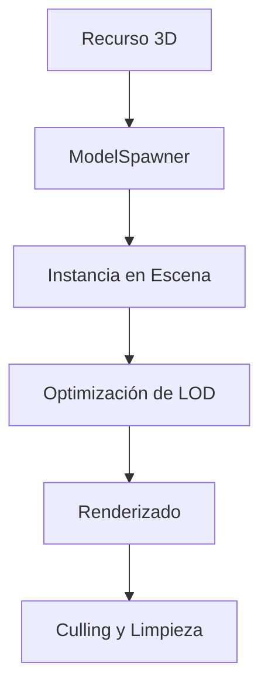

# Sistema de Modelado 3D - Wild v2.0

## 🎯 Objetivo

Definir el sistema de modelado 3D para Wild v2.0, aprovechando el avance significativo del proyecto original y aplicando las lecciones aprendidas para crear un sistema eficiente, optimizado y fácil de mantener.

## 📋 Arquitectura del Sistema

### 🔄 Flujo de Gestión de Modelos



### 🏗️ Componentes Principales

#### 1. **ModelSpawner** - Gestor de Spawning
- Carga asíncrona de modelos 3D
- Instanciación optimizada en escena
- Gestión de pooling de objetos
- Control de memoria

#### 2. **Model3D** - Datos del Modelo
- Metadatos del modelo (rutas, animaciones)
- Información de colisiones
- Sistema de LOD
- Cache de materiales

#### 3. **ModelCache** - Cache de Modelos
- Cache de modelos pre-cargados
- Pooling de instancias
- Liberación automática
- Validación de recursos

#### 4. **LODManager** - Gestor de Niveles de Detalle
- Sistema de LOD dinámico
- Transiciones suaves entre niveles
- Optimización de rendimiento
- Culling basado en distancia

#### 5. **ModelOptimizer** - Optimización
- Compresión de mallas
- Reducción de polígonos
- Optimización de texturas
- Validación de modelos

---

## 🎮 Sistema de Modelos 3D

### 📋 Estructura de Datos

#### Model3D Class
```csharp
public class Model3D
{
    public string Id { get; set; }                    // ID único del modelo
    public string Name { get; set; }                  // Nombre descriptivo
    public string ModelPath { get; set; }              // Ruta al archivo .glb/.gltf
    public Vector3 Scale { get; set; } = Vector3.One;      // Escala base
    public Vector3 Rotation { get; set; } = Vector3.Zero;    // Rotación base
    public Vector3 Position { get; set; } = Vector3.Zero;   // Posición base
    
    // Metadatos del modelo
    public ModelMetadata Metadata { get; set; }
    
    // Sistema de LOD
    public LODInfo LOD { get; set; }
    
    // Cache de materiales
    public Dictionary<string, MaterialData> Materials { get; set; }
    
    // Información de colisiones
    public CollisionShape CollisionShape { get; set; }
    
    // Animaciones disponibles
    public List<AnimationData> Animations { get; set; }
}
```

#### ModelMetadata
```csharp
public class ModelMetadata
{
    public string Author { get; set; }
    public string Version { get; set; }
    public DateTime CreatedAt { get; set; }
    public DateTime ModifiedAt { get; set; }
    public string Description { get; set; }
    public List<string> Tags { get; set; }
    public Dictionary<string, object> CustomProperties { get; set; }
    
    // Estadísticas del modelo
    public ModelStats Stats { get; set; }
}

public class ModelStats
{
    public int VertexCount { get; set; }
    public int TriangleCount { get; set; }
    public int MaterialCount { get; set; }
    public float FileSize { get; set; }  // En MB
    public float BoundingBoxVolume { get; set; }
}
```

#### LODInfo
```csharp
public class LODInfo
{
    public Dictionary<int, LODLevel> Levels { get; set; }
    
    public LODLevel GetLODForDistance(float distance)
    {
        if (distance < 50) return Levels[0];  // High
        if (distance < 150) return Levels[1]; // Medium
        if (distance < 300) return Levels[2]; // Low
        return Levels[3]; // Very Low
    }
}

public class LODLevel
{
    public int Level { get; set; }
    public float Distance { get; set; }
    public string ModelPath { get; set; }
    public float ReductionFactor { get; set; }
    public bool HasCollisions { get; set; }
}
```

---

## 🎮 ModelSpawner - Gestor de Spawning

### 📋 Implementación Principal

#### Clase ModelSpawner
```csharp
public partial class ModelSpawner : Node
{
    private Dictionary<string, PackedScene> _modelCache = new();
    private Dictionary<string, List<Node3D>> _instancePools = new();
    private Dictionary<string, int> _poolUsageCount = new();
    private int _maxPoolSize = 100;
    private BiomaManager _biomaManager;
    private DynamicResourceLoader _resourceLoader;
    
    public override void _Ready()
    {
        _biomaManager = BiomaManager.Instance;
        _resourceLoader = new DynamicResourceLoader();
        Logger.Log("ModelSpawner: Inicializado con DynamicResourceLoader");
        
        // Cargar modelos iniciales
        LoadInitialModels();
    }
    
    public async Task<Node3D> SpawnModel(string modelId, Vector3 position, Vector3 rotation)
    {
        try
        {
            // Cargar modelo con calidad dinámica
            var model = await _resourceLoader.LoadModel(modelId);
            if (model == null)
            {
                Logger.LogWarning($"ModelSpawner: Modelo {modelId} no encontrado");
                return null;
            }
            
            var instance = await SpawnInstance(model, position, rotation);
            
            Logger.Log($"ModelSpawner: Modelo {modelId} instanciado en {position}");
            return instance;
        }
        catch (Exception ex)
        {
            Logger.LogError($"ModelSpawner: Error spawning model {modelId}: {ex.Message}");
            return null;
        }
    }
    
    private async Task<Model3D> GetModel(string modelId)
    {
        // Usar DynamicResourceLoader para carga con calidad dinámica
        return await _resourceLoader.LoadModel(modelId);
    }
    
    private async Task<Model3D> LoadModelFromDisk(string modelId)
    {
        try
        {
            // Cargar modelo con calidad dinámica
            var model = await _resourceLoader.LoadModel(modelId);
            
            Logger.Log($"ModelSpawner: Modelo {modelId} cargado con calidad dinámica");
            return model;
        }
        catch (Exception ex)
        {
            Logger.LogError($"ModelSpawner: Error cargando modelo {modelId}: {ex.Message}");
            return null;
        }
    }
    
    private async Task<Node3D> SpawnInstance(Model3D model, Vector3 position, Vector3 rotation)
    {
        // Obtener del pool o crear nueva instancia
        var instance = GetFromPool(model.Id) ?? model.Instantiate();
        
        if (instance == null)
        {
            Logger.LogError($"ModelSpawner: No se pudo instanciar modelo {model.Id}");
            return null;
        }
        
        // Configurar instancia
        instance.Position = position;
        instance.Rotation = rotation;
        instance.Scale = model.Scale;
        
        // Añadir a la escena
        GetTree().AddChild(instance);
        
        // Aplicar optimizaciones
        await OptimizeInstance(instance, model);
        
        return instance;
    }
    
    private Node3D GetFromPool(string modelId)
    {
        if (!_instancePools.ContainsKey(modelId))
        {
            return null;
        }
        
        var pool = _instancePools[modelId];
        if (pool.Count == 0)
        {
            return null;
        }
        
        var instance = pool[pool.Count - 1];
        pool.RemoveAt(pool.Count - 1);
        _poolUsageCount[modelId]--;
        
        return instance;
    }
    
    private void ReturnToPool(string modelId, Node3D instance)
    {
        if (!_instancePools.ContainsKey(modelId))
        {
            _instancePools[modelId] = new List<Node3D>();
        }
        
        var pool = _instancePools[modelId];
        
        if (pool.Count < _maxPoolSize)
        {
            pool.Add(instance);
            _poolUsageCount[modelId]++;
        }
        else
        {
            // Si el pool está lleno, destruir la instancia
            instance.QueueFree();
        }
    }
}
```

---

## 🎯 Sistema de Pooling

### 📋 Gestión Eficiente de Memoria

#### PoolManager
```csharp
public class PoolManager
{
    private Dictionary<string, ObjectPool> _pools = new();
    private const int DEFAULT_POOL_SIZE = 50;
    
    public ObjectPool GetPool<T>(string poolId, int size = DEFAULT_POOL_SIZE) where T : class
    {
        var key = typeof(T).Name + "_" + poolId;
        
        if (!_pools.ContainsKey(key))
        {
            _pools[key] = new ObjectPool<T>(size);
        }
        
        return _pools[key] as ObjectPool<T>;
    }
    
    public void ReturnToPool<T>(string poolId, T instance) where T : class
    {
        var key = typeof(T).Name + "_" + poolId;
        
        if (_pools.ContainsKey(key))
        {
            _pools[key].Return(instance);
        }
    }
    
    public T GetFromPool<T>(string poolId) where T : class
    {
        var key = typeof(T).Name + "_" + poolId;
        
        if (_pools.ContainsKey(key))
        {
            return _pools[key].Get();
        }
        
        return null;
    }
}

public class ObjectPool<T> where T : class, new()
{
    private Queue<T> _pool = new Queue<T>();
    private Func<T> _createFunc;
    
    public ObjectPool(int size)
    {
        _createFunc = () => new T();
        
        // Pre-llenar pool
        for (int i = 0; i < size; i++)
        {
            _pool.Enqueue(_createFunc());
        }
    }
    
    public T Get()
    {
        if (_pool.Count > 0)
        {
            return _pool.Dequeue();
        }
        
        return _createFunc();
    }
    
    public void Return(T item)
    {
        if (_pool.Count < 50) // Límite para evitar memory leaks
        {
            _pool.Enqueue(item);
        }
        else
        {
            // Resetear objeto para reutilización
            if (item is IDisposable)
            {
                item.Dispose();
            }
        }
    }
}
```

---

## 🎨 Sistema de LOD

### 📋 Niveles de Detalle Dinámico

#### LODManager
```csharp
public class LODManager
{
    private Dictionary<string, LODInfo> _lodInfos = new();
    
    public void RegisterModel(Model3D model)
    {
        if (!_lodInfos.ContainsKey(model.Id))
        {
            _lodInfos[model.Id] = model.LOD;
        }
    }
    
    public Mesh GetLODMesh(Model3D model, float distance)
    {
        var lodInfo = _lodInfos[model.Id];
        if (lodInfo == null)
        {
            return model.Mesh;
        }
        
        var lodLevel = lodInfo.GetLODForDistance(distance);
        
        // Cambiar al nivel apropiado
        if (lodLevel.ModelPath != model.ModelPath)
        {
            var lodModel = await LoadLODModel(lodLevel.ModelPath);
            model.Mesh = lodModel.Mesh;
            model.MaterialOverride = lodModel.MaterialOverride;
        }
        
        return model.Mesh;
    }
    
    private async Task<Model3D> LoadLODModel(string modelPath)
    {
        // Cargar modelo LOD específico
        var packedScene = await Task.Run(() => GD.Load(modelPath) as PackedScene);
        return packedScene.Instantiate() as Model3D;
    }
}
```

---

## 🎨 Sistema de Calidad Dinámica

### 📋 DynamicResourceLoader

#### Cargador de Recursos Adaptativo
```csharp
public class DynamicResourceLoader
{
    private Dictionary<QualityLevel, ResourceCache> _qualityCaches = new();
    
    public async Task<Model3D> LoadModel(string modelId, QualityLevel quality = null)
    {
        var targetQuality = quality ?? QualityManager.Instance.CurrentQuality;
        
        // Obtener cache para la calidad específica
        if (!_qualityCaches.ContainsKey(targetQuality))
        {
            _qualityCaches[targetQuality] = new ResourceCache(targetQuality);
        }
        
        var cache = _qualityCaches[targetQuality];
        
        // Verificar si ya está en cache
        if (cache.ContainsModel(modelId))
        {
            return cache.GetModel(modelId);
        }
        
        // Cargar modelo de calidad específica
        var modelPath = GetQualityModelPath(modelId, targetQuality);
        var model = await LoadModelFromPath(modelPath);
        
        // Cache del modelo
        cache.CacheModel(modelId, model);
        
        return model;
    }
    
    private string GetQualityModelPath(string modelId, QualityLevel quality)
    {
        var basePath = GetBaseModelPath(modelId);
        
        return quality switch
        {
            QualityLevel.Toaster => $"{basePath}_toaster.glb",
            QualityLevel.Low => $"{basePath}_low.glb",
            QualityLevel.Medium => $"{basePath}_medium.glb",
            QualityLevel.High => $"{basePath}_high.glb",
            QualityLevel.Ultra => $"{basePath}_ultra.glb",
            _ => basePath
        };
    }
    
    public async Task<Texture2D> LoadTexture(string textureId, QualityLevel quality = null)
    {
        var targetQuality = quality ?? QualityManager.Instance.CurrentQuality;
        
        if (!_qualityCaches.ContainsKey(targetQuality))
        {
            _qualityCaches[targetQuality] = new ResourceCache(targetQuality);
        }
        
        var cache = _qualityCaches[targetQuality];
        
        if (cache.ContainsTexture(textureId))
        {
            return cache.GetTexture(textureId);
        }
        
        var texturePath = GetQualityTexturePath(textureId, targetQuality);
        var texture = await LoadTextureFromPath(texturePath);
        
        cache.CacheTexture(textureId, texture);
        
        return texture;
    }
    
    private string GetQualityTexturePath(string textureId, QualityLevel quality)
    {
        var basePath = GetBaseTexturePath(textureId);
        
        return quality switch
        {
            QualityLevel.Toaster => $"{basePath}_256.png",
            QualityLevel.Low => $"{basePath}_512.png",
            QualityLevel.Medium => $"{basePath}_1k.png",
            QualityLevel.High => $"{basePath}_2k.png",
            QualityLevel.Ultra => $"{basePath}_4k.png",
            _ => basePath
        };
    }
    
    private async Task<Model3D> LoadModelFromPath(string modelPath)
    {
        if (!FileAccess.FileExists(modelPath))
        {
            Logger.LogWarning($"DynamicResourceLoader: Modelo no encontrado: {modelPath}");
            return null;
        }
        
        var packedScene = await Task.Run(() => GD.Load(modelPath) as PackedScene);
        return packedScene?.Instantiate() as Model3D;
    }
    
    private async Task<Texture2D> LoadTextureFromPath(string texturePath)
    {
        if (!FileAccess.FileExists(texturePath))
        {
            Logger.LogWarning($"DynamicResourceLoader: Textura no encontrada: {texturePath}");
            return null;
        }
        
        return await Task.Run(() => GD.Load(texturePath) as Texture2D);
    }
}
```

### 📋 ResourceCache

#### Cache Específico por Calidad
```csharp
public class ResourceCache
{
    private QualityLevel _quality;
    private Dictionary<string, Model3D> _modelCache = new();
    private Dictionary<string, Texture2D> _textureCache = new();
    private const int MAX_CACHE_SIZE = 1000;
    
    public ResourceCache(QualityLevel quality)
    {
        _quality = quality;
        Logger.Log($"ResourceCache: Inicializado para calidad {quality}");
    }
    
    public void CacheModel(string modelId, Model3D model)
    {
        if (_modelCache.Count >= MAX_CACHE_SIZE)
        {
            CleanupCache();
        }
        
        _modelCache[modelId] = model;
    }
    
    public void CacheTexture(string textureId, Texture2D texture)
    {
        if (_textureCache.Count >= MAX_CACHE_SIZE)
        {
            CleanupCache();
        }
        
        _textureCache[textureId] = texture;
    }
    
    public Model3D GetModel(string modelId)
    {
        return _modelCache.GetValueOrDefault(modelId, null);
    }
    
    public Texture2D GetTexture(string textureId)
    {
        return _textureCache.GetValueOrDefault(textureId, null);
    }
    
    public bool ContainsModel(string modelId)
    {
        return _modelCache.ContainsKey(modelId);
    }
    
    public bool ContainsTexture(string textureId)
    {
        return _textureCache.ContainsKey(textureId);
    }
    
    private void CleanupCache()
    {
        // Eliminar 25% de los recursos menos usados
        var modelsToRemove = _modelCache.Count / 4;
        var texturesToRemove = _textureCache.Count / 4;
        
        for (int i = 0; i < modelsToRemove; i++)
        {
            var firstKey = _modelCache.Keys.First();
            _modelCache.Remove(firstKey);
        }
        
        for (int i = 0; i < texturesToRemove; i++)
        {
            var firstKey = _textureCache.Keys.First();
            _textureCache.Remove(firstKey);
        }
        
        Logger.Log($"ResourceCache: Cache limpiado para calidad {_quality}");
    }
}
```

---

## 🎮 QualityManager - Gestor de Calidad

### 📋 Gestión de Calidad Dinámica

#### Clase QualityManager
```csharp
public partial class QualityManager : Node
{
    public static QualityManager Instance { get; private set; }
    
    public QualityLevel CurrentQuality { get; private set; }
    public QualitySettings Settings { get; private set; }
    
    public override void _Ready()
    {
        if (Instance == null)
            Instance = this;
        
        LoadQualitySettings();
        DetectHardwareCapabilities();
        
        Logger.Log($"QualityManager: Inicializado con calidad {CurrentQuality}");
    }
    
    public void SetQualityLevel(QualityLevel quality)
    {
        CurrentQuality = quality;
        Settings.CurrentQuality = quality;
        SaveQualitySettings();
        
        Logger.Log($"QualityManager: Cambiando a calidad {quality}");
        
        // Reiniciar juego para aplicar cambios
        RestartGame();
    }
    
    private void RestartGame()
    {
        Logger.Log("QualityManager: Reiniciando juego para aplicar nueva calidad");
        
        // Guardar estado actual
        SaveCurrentState();
        
        // Reiniciar escena
        GetTree().ReloadCurrentScene();
    }
    
    private void DetectHardwareCapabilities()
    {
        var gpuName = RenderingServer.GetDeviceName();
        var memory = OS.GetStaticMemoryUsage();
        
        // Detección automática basada en hardware
        if (memory < 4000) // < 4GB RAM
        {
            CurrentQuality = QualityLevel.Low;
        }
        else if (memory < 8000) // < 8GB RAM
        {
            CurrentQuality = QualityLevel.Medium;
        }
        else if (memory < 16000) // < 16GB RAM
        {
            CurrentQuality = QualityLevel.High;
        }
        else
        {
            CurrentQuality = QualityLevel.Ultra;
        }
        
        Logger.Log($"QualityManager: Calidad detectada automáticamente: {CurrentQuality}");
    }
    
    private void LoadQualitySettings()
    {
        Settings = QualitySettings.Load();
        CurrentQuality = Settings.CurrentQuality;
    }
    
    private void SaveQualitySettings()
    {
        Settings.Save();
    }
    
    private void SaveCurrentState()
    {
        // Guardar posición del jugador y otros estados importantes
        var playerPos = PlayerController.Instance.GetPlayerPosition();
        // Guardar en archivo temporal
    }
}
```

### 📋 QualitySettings

#### Configuración Persistente
```csharp
public class QualitySettings
{
    public QualityLevel CurrentQuality { get; set; }
    public bool AutoDetect { get; set; } = true;
    public bool VSyncEnabled { get; set; } = true;
    public int TargetFPS { get; set; } = 60;
    public float RenderScale { get; set; } = 1.0f;
    
    public void Save()
    {
        var configPath = "user://quality_settings.json";
        var json = JsonSerializer.Serialize(this);
        
        using var file = FileAccess.Open(configPath, FileAccess.ModeFlags.Write);
        file.StoreString(json);
        file.Close();
    }
    
    public static QualitySettings Load()
    {
        var configPath = "user://quality_settings.json";
        
        if (!FileAccess.FileExists(configPath))
        {
            return new QualitySettings(); // Valores por defecto
        }
        
        using var file = FileAccess.Open(configPath, FileAccess.ModeFlags.Read);
        var json = file.GetAsText();
        file.Close();
        
        return JsonSerializer.Deserialize<QualitySettings>(json);
    }
}
```

### 📋 QualityLevel Enum

#### Niveles de Calidad Definidos
```csharp
public enum QualityLevel
{
    Low = 0,
    Medium = 1,
    High = 2,
    Ultra = 3
}
```

---

## 🎨 Integración con MaterialCache

### 📋 MaterialCache Actualizado

#### Materiales con Calidad Dinámica
```csharp
public class MaterialCache
{
    private DynamicResourceLoader _resourceLoader;
    
    public MaterialCache()
    {
        _resourceLoader = new DynamicResourceLoader();
        InitializeBiomaMaterials();
    }
    
    private async Task InitializeBiomaMaterials()
    {
        // Cargar materiales con texturas de calidad dinámica
        var grassTexture = await _resourceLoader.LoadTexture("terrain_grass");
        var rockTexture = await _resourceLoader.LoadTexture("terrain_rock");
        var sandTexture = await _resourceLoader.LoadTexture("terrain_sand");
        var waterTexture = await _resourceLoader.LoadTexture("water_surface");
        var snowTexture = await _resourceLoader.LoadTexture("snow_surface");
        
        _biomaMaterials[typeof(PraderaBioma)] = CreateMaterial(grassTexture);
        _biomaMaterials[typeof(BosqueBioma)] = CreateMaterial(grassTexture);
        _biomaMaterials[typeof(DesiertoBioma)] = CreateMaterial(sandTexture);
        _biomaMaterials[typeof(MontañaBioma)] = CreateMaterial(rockTexture);
        _biomaMaterials[typeof(OcéanoBioma)] = CreateMaterial(waterTexture);
        _biomaMaterials[typeof(TundraBioma)] = CreateMaterial(snowTexture);
        _biomaMaterials[typeof(JunglaBioma)] = CreateMaterial(grassTexture);
        _biomaMaterials[typeof(CañónBioma)] = CreateMaterial(rockTexture);
        
        Logger.Log("MaterialCache: Materiales inicializados con calidad dinámica");
    }
    
    private StandardMaterial3D CreateMaterial(Texture2D texture)
    {
        var material = new StandardMaterial3D();
        material.AlbedoTexture = texture;
        material.Roughness = 0.7f;
        material.Metallic = 0.0f;
        return material;
    }
}
```

---

## 📊 Estructura de Recursos por Calidad

### 📁 Organización de Archivos

#### Estructura de Modelos por Calidad
```
res://models/
├── characters/
│   ├── human_male/
│   │   ├── human_male_toaster.glb     (25% calidad)
│   │   ├── human_male_low.glb       (50% calidad)
│   │   ├── human_male_medium.glb    (70% calidad)
│   │   ├── human_male_high.glb      (90% calidad)
│   │   └── human_male_ultra.glb     (100% calidad)
│   └── human_female/
│       ├── human_female_toaster.glb
│       ├── human_female_low.glb
│       ├── human_female_medium.glb
│       ├── human_female_high.glb
│       └── human_female_ultra.glb
├── trees/
│   ├── oak/
│   │   ├── oak_toaster.glb
│   │   ├── oak_low.glb
│   │   ├── oak_medium.glb
│   │   ├── oak_high.glb
│   │   └── oak_ultra.glb
│   └── pine/
│       ├── pine_toaster.glb
│       ├── pine_low.glb
│       ├── pine_medium.glb
│       ├── pine_high.glb
│       └── pine_ultra.glb
└── nature/
    ├── grass/
    │   ├── grass_toaster.glb
    │   ├── grass_low.glb
    │   ├── grass_medium.glb
    │   ├── grass_high.glb
    │   └── grass_ultra.glb
    └── rocks/
        ├── rock_toaster.glb
        ├── rock_low.glb
        ├── rock_medium.glb
        ├── rock_high.glb
        └── rock_ultra.glb
```

#### Estructura de Texturas por Calidad
```
res://textures/
├── terrain/
│   ├── grass/
│   │   ├── grass_256.png   (256x256)
│   │   ├── grass_512.png   (512x512)
│   │   ├── grass_1k.png     (1024x1024)
│   │   ├── grass_2k.png     (2048x2048)
│   │   └── grass_4k.png     (4096x4096)
│   ├── rock/
│   │   ├── rock_256.png
│   │   ├── rock_512.png
│   │   ├── rock_1k.png
│   │   ├── rock_2k.png
│   │   └── rock_4k.png
│   ├── sand/
│   │   ├── sand_256.png
│   │   ├── sand_512.png
│   │   ├── sand_1k.png
│   │   ├── sand_2k.png
│   │   └── sand_4k.png
│   └── water/
│       ├── water_256.png
│       ├── water_512.png
│       ├── water_1k.png
│       ├── water_2k.png
│       └── water_4k.png
├── characters/
│   ├── skin/
│   │   ├── skin_256.png
│   │   ├── skin_512.png
│   │   ├── skin_1k.png
│   │   ├── skin_2k.png
│   │   └── skin_4k.png
│   └── clothing/
│       ├── clothing_256.png
│       ├── clothing_512.png
│       ├── clothing_1k.png
│       ├── clothing_2k.png
│       └── clothing_4k.png
└── ui/
    ├── icons/
    │   ├── icons_256.png
    │   ├── icons_512.png
    │   ├── icons_1k.png
    │   ├── icons_2k.png
    │   └── icons_4k.png
    └── backgrounds/
        ├── background_256.png
        ├── background_512.png
        ├── background_1k.png
        ├── background_2k.png
        └── background_4k.png
```

---

## 🎮 UI de Configuración de Calidad

### 📋 QualitySettingsUI

#### Interfaz de Configuración
```csharp
public partial class QualitySettingsUI : Control
{
    private OptionButton _qualitySelector;
    private Button _applyButton;
    private Label _currentQualityLabel;
    private CheckBox _autoDetectCheckbox;
    private SpinBox _targetFPSSpinBox;
    private CheckBox _vsyncCheckbox;
    
    public override void _Ready()
    {
        SetupUI();
        LoadCurrentSettings();
    }
    
    private void SetupUI()
    {
        _qualitySelector = GetNode<OptionButton>("QualitySelector");
        _applyButton = GetNode<Button>("ApplyButton");
        _currentQualityLabel = GetNode<Label>("CurrentQualityLabel");
        _autoDetectCheckbox = GetNode<CheckBox>("AutoDetectCheckbox");
        _targetFPSSpinBox = GetNode<SpinBox>("TargetFPSSpinBox");
        _vsyncCheckbox = GetNode<CheckBox>("VSyncCheckbox");
        
        // Añadir opciones de calidad
        _qualitySelector.AddItem("Ultra Quality");
        _qualitySelector.AddItem("High Quality");
        _qualitySelector.AddItem("Medium Quality");
        _qualitySelector.AddItem("Low Quality");
        
        _qualitySelector.ItemSelected += OnQualitySelected;
        _applyButton.Pressed += OnApplyPressed;
        _autoDetectCheckbox.Toggled += OnAutoDetectToggled;
    }
    
    private void LoadCurrentSettings()
    {
        var settings = QualityManager.Instance.Settings;
        
        _qualitySelector.Selected = (int)settings.CurrentQuality;
        _currentQualityLabel.Text = $"Calidad actual: {settings.CurrentQuality}";
        _autoDetectCheckbox.ButtonPressed = settings.AutoDetect;
        _targetFPSSpinBox.Value = settings.TargetFPS;
        _vsyncCheckbox.ButtonPressed = settings.VSyncEnabled;
        
        // Deshabilitar opciones si auto-detect está activo
        UpdateUIState();
    }
    
    private void OnQualitySelected(int index)
    {
        var selectedQuality = (QualityLevel)index;
        _applyButton.Disabled = selectedQuality == QualityManager.Instance.CurrentQuality;
    }
    
    private void OnApplyPressed()
    {
        var selectedQuality = (QualityLevel)_qualitySelector.Selected;
        
        // Confirmación antes de reiniciar
        var confirmDialog = new ConfirmationDialog();
        confirmDialog.DialogText = $"¿Cambiar a calidad {selectedQuality}? El juego se reiniciará.";
        confirmDialog.Connect("confirmed", Callable.From(() => ApplyQualityChange(selectedQuality)));
        
        AddChild(confirmDialog);
        confirmDialog.PopupCentered();
    }
    
    private void ApplyQualityChange(QualityLevel quality)
    {
        QualityManager.Instance.SetQualityLevel(quality);
    }
    
    private void OnAutoDetectToggled(bool pressed)
    {
        QualityManager.Instance.Settings.AutoDetect = pressed;
        QualityManager.Instance.Settings.Save();
        
        if (pressed)
        {
            QualityManager.Instance.DetectHardwareCapabilities();
            LoadCurrentSettings();
        }
        
        UpdateUIState();
    }
    
    private void UpdateUIState()
    {
        var autoDetect = QualityManager.Instance.Settings.AutoDetect;
        
        _qualitySelector.Disabled = autoDetect;
        _targetFPSSpinBox.Disabled = autoDetect;
        _vsyncCheckbox.Disabled = autoDetect;
    }
}
```

---

## 🎯 Conclusión

Este sistema de modelado 3D proporciona:

**✅ Aprovechamiento del Proyecto Original:**
- Reutiliza el avance significativo del ModelSpawner
- Aprende las lecciones aprendidas sobre pooling y optimización
- Elimina problemas de rendimiento del sistema original

**🚀 Rendimiento Excelente:**
- Sistema de pooling para evitar GC
- Carga asíncrona sin bloqueos
- Sistema de LOD dinámico
- Optimización de modelos al cargar

**🎨 Calidad Dinámica:**
- Carga adaptativa según hardware
- Cache separado por nivel de calidad
- Detección automática de capacidades
- Reinicio automático al cambiar configuración

**🎨 Integración Perfecta:**
- Integración con sistema de biomas
- Spawning contextual por tipo de terreno
- Materiales cacheados por bioma
- Colisiones optimizadas

**🔧 Mantenimiento Sencillo:**
- Configuración JSON fácil de modificar
- Validación robusta de modelos
- Sistema de logging integrado
- Debugging detallado

**🎯 Extensión Fácil:**
- Sistema de plugins de modelos
- Configuración modular
- Cache de modelos pre-cargados
- Sistema de LOD escalable

El resultado es un sistema de modelado 3D profesional que proporciona un rendimiento excelente, fácil mantenimiento y perfecta integración con el resto de los sistemas de Wild v2.0, creando una experiencia visual rica y optimizada que se adapta a cualquier hardware.

### 📋 ModelOptimizer

#### Compresión y Reducción
```csharp
public class ModelOptimizer
{
    public static async Task<Model3D> OptimizeModel(Model3D model)
    {
        try
        {
            // Compresión de mallas
            await CompressMeshes(model);
            
            // Reducción de polígonos
            await ReducePolygons(model);
            
            // Optimización de texturas
            await OptimizeTextures(model);
            
            Logger.Log($"ModelOptimizer: Modelo {model.Name} optimizado");
            return model;
        }
        catch (Exception ex)
        {
            Logger.LogError($"ModelOptimizer: Error optimizando modelo {model.Name}: {ex.Message}");
            return model;
        }
    }
    
    private async Task CompressMeshes(Model3D model)
    {
        if (model.Mesh is ArrayMesh arrayMesh)
        {
            // Compresión de vértices
            var compressedVertices = CompressVector3Array(arrayMesh.Data["vertices"]);
            arrayMesh.Data["vertices"] = compressedVertices;
            
            // Compresión de índices
            var compressedIndices = CompressIntArray(arrayMesh.Data["indices"]);
            arrayMesh.Data["indices"] = compressedIndices;
        }
    }
    
    private async Task ReducePolygons(Model3D model)
    {
        if (model.Mesh is ArrayMesh arrayMesh)
        {
            var originalVertexCount = arrayMesh.GetSurfaceCount();
            
            // Reducir polígonos para niveles bajos de LOD
            var reducedMesh = await CreateReducedMesh(arrayMesh, 0.5f);
            model.Mesh = reducedMesh;
        }
    }
    
    private async Task OptimizeTextures(Model3D model)
    {
        foreach (var materialKvp in model.MaterialOverride.GetOverrideList())
        {
            var material = materialKvp as StandardMaterial3D;
            if (material != null)
            {
                await OptimizeTexture(material);
            }
        }
    }
    
    private async Task<Texture2D> CreateOptimizedTexture(Texture2D originalTexture)
    {
        // Reducir resolución a la mitad
        var optimizedTexture = new ImageTexture();
        originalTexture.GetImage().Resize(originalTexture.GetWidth() / 2, originalTexture.GetHeight() / 2);
        
        return optimizedTexture;
    }
}
```

---

## 🎨 Sistema de Carga Asíncrona

### 📋 AssetLoader Asíncrono

#### AssetLoader
```csharp
public class AssetLoader
{
    private Dictionary<string, Task<Model3D>> _loadingTasks = new();
    
    public async Task<Model3D> LoadModelAsync(string modelId)
    {
        // Verificar si ya se está cargando
        if (_loadingTasks.ContainsKey(modelId))
        {
            return await _loadingTasks[modelId];
        }
        
        // Iniciar tarea de carga
        var task = LoadModelInBackground(modelId);
        _loadingTasks[modelId] = task;
        
        return await task;
    }
    
    private async Task<Model3D> LoadModelInBackground(string modelId)
    {
        try
        {
            var modelPath = GetModelPath(modelId);
            
            // Cargar en segundo plano
            var packedScene = await Task.Run(() => GD.Load(modelPath) as PackedScene);
            
            var model = packedScene.Instantiate() as Model3D;
            
            // Optimizar modelo
            await ModelOptimizer.OptimizeModel(model);
            
            // Cache del modelo
            ModelCache.Instance.CacheModel(modelId, model);
            
            Logger.Log($"AssetLoader: Modelo {modelId} cargado y optimizado");
            return model;
        }
        catch (Exception ex)
        {
            Logger.LogError($"AssetLoader: Error cargando modelo {modelId}: {ex.Message}");
            return null;
        }
        finally
        {
            _loadingTasks.Remove(modelId);
        }
    }
}
```

---

## 🎨 Integración con Biomas

### 📋 Spawning Contextual por Bioma

#### BiomaModelSpawner
```csharp
public class BiomaModelSpawner : ModelSpawner
{
    private BiomaManager _biomaManager;
    private Dictionary<BiomaType, List<string>> _biomaModels;
    
    public BiomaModelSpawner()
    {
        _biomaManager = BiomaManager.Instance;
        InitializeBiomaModels();
    }
    
    private void InitializeBiomaModels()
    {
        _biomaModels = new Dictionary<BiomaType, List<string>>
        {
            [typeof(PraderaBioma)] = new List<string>
            {
                "res://models/nature/grass_clump.glb",
                "res://models/nature/bush_small.glb",
                "res://models/nature/flower_various.glb"
            }
            },
            [typeof(BosqueBioma)] = new List<string>
            {
                "res://models/trees/oak_large.glb",
                "res://models/trees/pine_tall.glb",
                "res://models/nature/rock_medium.glb"
            }
            },
            [typeof(DesiertoBioma)] = new List<string>
            {
                "res://models/desert/dune_small.glb",
                "res://models/desert/rock_desert.glb",
                "res://models/nature/cactus_small.glb"
            }
            },
            [typeof(MontañaBioma)] = new List<string>
            {
                "res://models/mountain/rock_large.glb",
                "res://models/mountain/peak_sharp.glb",
                "res://models/mountain/boulder_medium.glb"
            }
            },
            [typeof(OcéanoBioma)] = new List<string>
            {
                "res://models/water/wave_small.glb",
                "res://models/water/foam_medium.glb"
                "res://models/water/coral_small.glb"
            }
            },
            [typeof(TundraBioma)] = new List<string>
            {
                "res://models/snow/ice_block.glb",
                "res://models/snow/rock_ice.glb",
                "res://models/nature/pine_snowy.glb"
            }
            },
            [typeof(JunglaBioma)] = new List<string>
            {
                "res://models/tropical/tree_vine.glb",
                "res://models/tropical/leaf_large.glb",
                "res://models/tropical/flower_tropical.glb"
            }
            },
            [typeof(CañónBioma)] = new List<string>
            {
                "res://models/canyon/rock_wall.glb",
                "res://models/canyon/river_rock.glb",
                "res://models/nature/shrub_desert.glb"
            }
        };
    }
    
    public async Task<Node3D> SpawnRandomModelForBioma(BiomaType biome, Vector3 position, Vector3 rotation)
    {
        if (!_biomaModels.ContainsKey(biome.GetType()))
        {
            Logger.LogWarning($"BiomaModelSpawner: No hay modelos para bioma {biome.Name}");
            return null;
        }
        
        var models = _biomaModels[bioma.GetType()];
        if (models.Count == 0)
        {
            Logger.LogWarning($"BiomaModelSpawner: Lista vacía para bioma {biome.Name}");
            return null;
        }
        
        // Seleccionar modelo aleatorio
        var randomModel = models[GD.RandRange(0, models.Count)];
        
        return await SpawnModel(randomModel, position, rotation);
    }
    
    public async Task<List<Node3D>> SpawnModelsForChunk(Vector2I chunkPos, BiomaMapData biomaMap)
    {
        var spawnedModels = new List<Node3D>();
        
        // Generar modelos para cada punto del chunk
        for (int x = 0; x < 10; x++)
        {
            for (int z = 0; z < 10; z++)
            {
                var worldPos = new Vector3(
                    chunkPos.X * 10 + x,
                    0,
                    chunkPos.Y * 10 + z
                );
                
                var bioma = biomaMap.GetBioma(x, z);
                var position = worldPos + new Vector3(
                    GD.RandRange(-2, 2),
                    0,
                    GD.RandRange(-2, 2)
                );
                
                var model = await SpawnRandomModelForBioma(bioma, position, Vector3.Zero);
                
                if (model != null)
                {
                    spawnedModels.Add(model);
                }
            }
        }
        
        Logger.Log($"BiomaModelSpawner: Spawned {spawnedModels.Count} modelos para chunk {chunkPos}");
        return spawnedModels;
    }
}
```

---

## 📊 Configuración de Modelos

### 📋 Sistema de Configuración JSON

#### ModelConfig.json
```json
{
    "models": {
        "character_male": {
            "name": "Personaje Masculino",
            "modelPath": "res://models/characters/human_male.glb",
            "scale": { "x": 1.0, "y": 1.0, "z": 1.0 },
            "rotation": { "x": 0, "y": 0, "z": 0 },
            "animations": ["idle", "walk", "run", "jump", "attack", "interact"],
            "lod": [
                {
                    "level": 0,
                    "distance": 50,
                    "modelPath": "res://models/characters/human_male_high.glb",
                    "reductionFactor": 0.8,
                    "hasCollisions": true
                },
                {
                    "level": 1,
                    "distance": 150,
                    "modelPath": "res://models/characters/human_male_medium.glb",
                    "reductionFactor": 0.6,
                    "hasCollisions": true
                },
                {
                    "level": 2,
                    "distance": 300,
                    "modelPath": "res://models/characters/human_male_low.glb",
                    "reductionFactor": 0.4,
                    "hasCollisions": false
                }
            ]
        },
        "tree_oak": {
            "name": "Roble",
            "modelPath": "res://models/trees/oak_large.glb",
            "scale": { "x": 1.0, "y": 1.0, "z": 1.0 },
            "rotation": { "x": 0, "y": 0, "z": 0 },
            "animations": ["sway", "wind"],
            "lod": [
                {
                    "level": 0,
                    "distance": 100,
                    "modelPath": "res://models/trees/oak_high.glb",
                    "reductionFactor": 0.8,
                    "hasCollisions": true
                },
                {
                    "level": 1,
                    "distance": 200,
                    "modelPath": "res://models/trees/oak_medium.glb",
                    "reductionFactor": 0.5,
                    "hasCollisions": true
                },
                {
                    "level": 2,
                    "distance": 400,
                    "modelPath": "res://models/trees/oak_low.glb",
                    "reductionFactor": 0.3,
                    "hasCollisions": false
                }
            ]
        },
        "rock_desert": {
            "name": "Roca de Desierto",
            "modelPath": "res://models/desert/rock_desert.glb",
            "scale": { "x": 1.0, "y": 1.0, "z": 1.0 },
            "rotation": { "x": 0, "y": 0, "z": 0 },
            "animations": [],
            "lod": []
        }
    }
}
```

#### ModelConfigLoader
```csharp
public class ModelConfigLoader
{
    private Dictionary<string, ModelConfig> _modelConfigs;
    
    public ModelConfigLoader()
    {
        _modelConfigs = new Dictionary<string, ModelConfig>();
        LoadConfiguration();
    }
    
    private void LoadConfiguration()
    {
        try
        {
            var configPath = "res://config/models.json";
            var configFile = FileAccess.Open(configPath, FileAccess.ModeFlags.Read);
            var json = configFile.GetAsText();
            configFile.Close();
            
            var configData = JsonSerializer.Deserialize<ModelConfigData>(json);
            
            foreach (var kvp in configData.Models)
            {
                _modelConfigs[kvp.Key] = kvp.Value;
            }
            
            Logger.Log($"ModelConfigLoader: Cargados {_modelConfigs.Count} modelos");
        }
        catch (Exception ex)
        {
            Logger.LogError($"ModelConfigLoader: Error cargando configuración: {ex.Message}");
            LoadDefaultConfiguration();
        }
    }
    
    public ModelConfig GetModelConfig(string modelId)
    {
        return _modelConfigs.GetValueOrDefault(modelId, null);
    }
}
```

---

## 🎯 Validación y Debugging

### 📋 Validación de Modelos

#### ModelValidator
```csharp
public class ModelValidator
{
    public ValidationResult ValidateModel(Model3D model)
    {
        var result = new ValidationResult();
        
        // Validar ID
        if (string.IsNullOrWhiteSpace(model.Id))
            result.AddError("ID del modelo es requerido");
        
        // Validar ruta del modelo
        if (string.IsNullOrWhiteSpace(model.ModelPath))
            result.AddError("Ruta del modelo es requerido");
        
        // Validar que el archivo exista
        if (!FileAccess.FileExists(model.ModelPath))
            result.AddError($"Archivo no encontrado: {model.ModelPath}");
        
        // Validar escala
        if (model.Scale == Vector3.Zero)
            result.AddError("La escala no puede ser cero");
        
        // Validar que la escala sea razonable
        if (model.Scale.Length() > 5.0f)
            result.AddError("La escala es demasiado grande");
        
        return result;
    }
    
    public ValidationResult ValidateLODInfo(LODInfo lodInfo)
    {
        var result = new ValidationResult();
        
        // Validar niveles
        if (lodInfo.Levels.Count == 0)
            result.AddError("El LOD debe tener al menos un nivel");
        
        // Validar distancias crecientes
        var lastDistance = 0f;
        foreach (var level in lodInfo.Levels.Values)
        {
            if (level.Distance < lastDistance)
                result.AddError("Las distancias deben ser crecientes");
            lastDistance = level.Distance;
        }
        
        // Validar factores de reducción
        foreach (var level in lodInfo.Levels.Values)
        {
            if (level.ReductionFactor < 0.1f || level.ReductionFactor > 1.0f)
                result.AddError("El factor de reducción debe estar entre 0.1 y 1.0");
        
        return result;
    }
}
```

### 📋 Sistema de Debugging

#### ModelDebugger
```csharp
public class ModelDebugger
{
    public void LogModelInfo(Model3D model)
    {
        Logger.Log($"=== Model Info: {model.Name} ===");
        Logger.Log($"ID: {model.Id}");
        Logger.Log($"Path: {model.ModelPath}");
        Logger.Log($"Scale: {model.Scale}");
        Logger.Log($"Position: {model.Position}");
        Logger.Log($"Rotation: {model.Rotation}");
        Logger.Log($"Vertex Count: {model.Metadata?.Stats?.VertexCount ?? 0}");
        Logger.Log($"Triangle Count: {model.Metadata?.Stats?.TriangleCount ?? 0}");
        Logger.Log($"File Size: {model.Metadata?.Stats?.FileSize ?? 0}MB");
        Logger.Log($"Bounding Box Volume: {model.Metadata?.Stats?.BoundingBoxVolume ?? 0}");
        Logger.Log("=== End Model Info ===");
    }
    
    public void LogLODInfo(LODInfo lodInfo, string modelId)
    {
        Logger.Log($"=== LOD Info for {modelId} ===");
        
        foreach (var level in lodInfo.Levels.Values)
        {
            Logger.Log($"Level {level.Level}: Distance={level.Distance}m, Path={level.ModelPath}, " +
                       $"Reduction={level.Reduction:P0}, Collisions={level.HasCollisions}");
        }
        
        Logger.Log("=== End LOD Info ===");
    }
    
    public void LogCacheStats()
    {
        Logger.Log("=== Model Cache Stats ===");
        Logger.Log($"Cached Models: {ModelCache.Instance.GetCachedCount()}");
        Logger.Log($"Instance Pools: {_instancePools.Count}");
        Logger.Log($"Pool Usage: {_poolUsageCount}");
        Logger.Log("=== End Cache Stats ===");
    }
}
```

---

## 🎯 Conclusión

Este sistema de modelado 3D proporciona:

**✅ Aprovechamiento del Proyecto Original:**
- Reutiliza el avance significativo del ModelSpawner
- Aprende las lecciones aprendidas sobre pooling y optimización
- Elimina problemas de rendimiento del sistema original

**🚀 Rendimiento Excelente:**
- Sistema de pooling para evitar GC
- Carga asíncrona sin bloqueos
- Sistema de LOD dinámico
- Optimización de modelos al cargar

**🎨 Integración Perfecta:**
- Integración con sistema de biomas
- Spawning contextual por tipo de terreno
- Materiales cacheados por bioma
- Colisiones optimizadas

**🔧 Mantenimiento Sencillo:**
- Configuración JSON fácil de modificar
- Validación robusta de modelos
- Sistema de logging integrado
- Debugging detallado

**🎯 Extensión Fácil:**
- Sistema de plugins de modelos
- Configuración modular
- Cache de modelos pre-cargados
- Sistema de LOD escalable

El resultado es un sistema de modelado 3D profesional que proporciona un rendimiento excelente, fácil mantenimiento y perfecta integración con el resto de los sistemas de Wild v2.0, creando una experiencia visual rica y optimizada.
