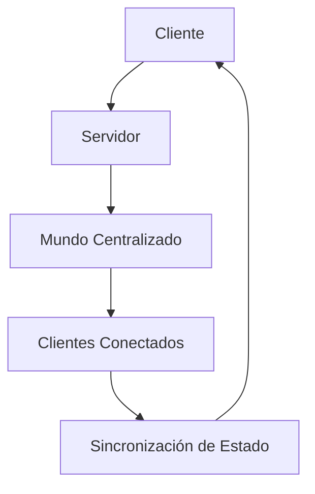

# Sistema de Red - Wild v2.0

## 🎯 Objetivo

Definir el sistema de red optimizado para Wild v2.0, aplicando las lecciones aprendidas del proyecto original para crear una arquitectura cliente-servidor limpia, eficiente y escalable.

## 📋 Arquitectura de Red

### 🔄 Modelo Cliente-Servidor Unificado



### 🏗️ Componentes Principales

#### 1. **GameServer** - Servidor Centralizado
- Gestiona estado del mundo
- Procesa lógica de juego
- Sincroniza clientes
- Valida todas las operaciones

#### 2. **GameClient** - Cliente Ligero
- Representación local del mundo
- Envia acciones del jugador
- Recibe actualizaciones del servidor
- Predice y compensa latencia

#### 3. **NetworkProtocol** - Protocolo Estandarizado
- Mensajes JSON estructurados
- Validación de datos
- Compresión opcional
- Versionado del protocolo

#### 4. **NetworkManager** - Gestor de Conexiones
- Manejo de conexiones
- Reconexión automática
- Balanceo de carga
- Estado de conexión

---

## 🚀 Protocolo de Red

### 📋 Mensajes Principales

#### 🎮 Mensajes de Jugador
```json
{
    "type": "PlayerMove",
    "timestamp": 1234567890,
    "playerId": "player_123",
    "position": { "x": 150.5, "y": 480.2, "z": 75.3 },
    "rotation": { "x": 0.0, "y": 0.0, "z": 45.0 },
    "velocity": { "x": 5.0, "y": 0.0, "z": 3.0 },
    "input": { "forward": true, "back": false, "left": false, "right": true }
}
```

#### 🌍 Mensajes de Terreno
```json
{
    "type": "ChunkData",
    "timestamp": 1234567891,
    "chunkPos": { "x": 1, "z": 2 },
    "seed": 928470,
    "heights": [
        [0.0, 1.2, 2.1, 3.0, 4.5, 5.8],
        [1.1, 2.3, 3.4, 4.2, 5.1, 6.0],
        // ... 121 valores (11x11)
    ],
    "biomes": [
        [0, 1, 0, 1, 2, 0, 1, 0],
        [1, 1, 1, 2, 1, 2, 1, 1],
        // ... 121 valores (11x11)
    ]
}
```

#### 🎨 Mensajes de Bioma
```json
{
    "type": "BiomaUpdate",
    "timestamp": 1234567892,
    "chunkPos": { "x": 1, "z": 2 },
    "biomaMap": [
        [0, 1, 0, 1, 2, 0, 1, 0],
        [1, 1, 1, 2, 1, 2, 1, 1],
        // ... 121 valores (11x11)
    ]
}
```

#### 💾 Mensajes de Sistema
```json
{
    "type": "SystemInfo",
    "timestamp": 1234567893,
    "serverInfo": {
        "playersOnline": 4,
        "chunksLoaded": 156,
        "tps": 60,
        "uptime": 3600
    },
    "worldInfo": {
        "name": "Mundo_20260310",
        "seed": 928470,
        "size": 5000
    }
}
```

---

## 🎮 GameServer - Servidor Centralizado

### 📋 Arquitectura del Servidor

#### Clase Principal
```csharp
public partial class GameServer : Node
{
    private Dictionary<string, NetworkPeer> _clients;
    private WorldState _worldState;
    private NetworkProtocol _protocol;
    private int _maxPlayers = 32;
    private float _tickRate = 60f;
    
    public override void _Ready()
    {
        _protocol = new NetworkProtocol();
        _worldState = new WorldState();
        
        Logger.Log("GameServer: Servidor inicializado");
    }
    
    public override void _Process(double delta)
    {
        // Procesar mensajes de clientes
        ProcessClientMessages();
        
        // Actualizar estado del mundo
        UpdateWorldState(delta);
        
        // Enviar actualizaciones a clientes
        BroadcastStateUpdates();
    }
}
```

#### Gestión de Clientes
```csharp
public void AddClient(NetworkPeer peer)
{
    if (_clients.Count >= _maxPlayers)
    {
        peer.Close("Servidor lleno");
        return;
    }
    
    var clientId = GenerateClientId();
    _clients[clientId] = peer;
    
    // Enviar mensaje de bienvenida
    var welcomeMsg = new WelcomeMessage
    {
        ClientId = clientId,
        ServerInfo = GetServerInfo(),
        WorldInfo = GetWorldInfo()
    };
    
    peer.SendJson(JsonSerializer.Serialize(welcomeMsg));
    Logger.Log($"GameServer: Cliente {clientId} conectado");
}
```

#### Procesamiento de Mensajes
```csharp
void ProcessClientMessages()
{
    foreach (var kvp in _clients)
    {
        var clientId = kvp.Key;
        var peer = kvp.Value;
        
        while (peer.GetAvailablePacketCount() > 0)
        {
            var packet = peer.GetPacket();
            var message = _protocol.DeserializeMessage(packet);
            
            switch (message.Type)
            {
                case "PlayerMove":
                    HandlePlayerMove(clientId, message);
                    break;
                    
                case "ChunkRequest":
                    HandleChunkRequest(clientId, message);
                    break;
                    
                case "ChatMessage":
                    HandleChatMessage(clientId, message);
                    break;
                    
                default:
                    Logger.LogWarning($"Mensaje desconocido: {message.Type}");
                    break;
            }
        }
    }
}
```

---

## 🌐 GameClient - Cliente Ligero

### 📋 Arquitectura del Cliente

#### Clase Principal
```csharp
public partial class GameClient : Node
{
    private NetworkPeer _serverPeer;
    private NetworkProtocol _protocol;
    private ClientState _clientState;
    private PredictionSystem _prediction;
    
    public override void _Ready()
    {
        _protocol = new NetworkProtocol();
        _prediction = new PredictionSystem();
        
        Logger.Log("GameClient: Cliente inicializado");
    }
    
    public async Task<bool> ConnectToServer(string address, int port)
    {
        try
        {
            _serverPeer = await NetworkManager.ConnectToServer(address, port);
            
            // Enviar mensaje de conexión
            var connectMsg = new ConnectMessage
            {
                ClientId = GetLocalPlayerId(),
                Version = "2.0.0",
                Timestamp = DateTimeOffset.UtcNow.ToUnixTimeSeconds()
            };
            
            _serverPeer.SendJson(JsonSerializer.Serialize(connectMsg));
            
            Logger.Log($"GameClient: Conectado al servidor {address}:{port}");
            return true;
        }
        catch (Exception ex)
        {
            Logger.LogError($"Error conectando al servidor: {ex.Message}");
            return false;
        }
    }
}
```

#### Predicción y Compensación de Latencia
```csharp
class PredictionSystem
{
    private Queue<PlayerState> _predictedStates = new Queue<PlayerState>();
    private PlayerState _lastConfirmedState;
    
    public void PredictMovement(PlayerInput input, float deltaTime)
    {
        // Predecir siguiente estado
        var predictedState = _lastConfirmedState.Clone();
        predictedState.ApplyInput(input, deltaTime);
        
        _predictedStates.Enqueue(predictedState);
        
        // Limitar cola de predicciones
        if (_predictedStates.Count > 10)
            _predictedStates.Dequeue();
    }
    
    public void ConfirmState(PlayerState confirmedState)
    {
        _lastConfirmedState = confirmedState;
        
        // Reconciliar predicciones
        while (_predictedStates.Count > 0)
        {
            var predicted = _predictedStates.Peek();
            if (predicted.Timestamp > confirmedState.Timestamp)
            {
                _predictedStates.Dequeue();
            }
            else
            {
                break;
            }
        }
    }
}
```

---

## 🔄 NetworkProtocol - Protocolo Estandarizado

### 📋 Definición de Mensajes

#### Estructura Base
```csharp
[JsonObject]
public class NetworkMessage
{
    [JsonProperty("type")]
    public string Type { get; set; }
    
    [JsonProperty("timestamp")]
    public long Timestamp { get; set; }
    
    [JsonProperty("data")]
    public object Data { get; set; }
}
```

#### Mensajes Específicos
```csharp
[JsonObject]
public class PlayerMoveMessage : NetworkMessage
{
    [JsonProperty("position")]
    public Vector3 Position { get; set; }
    
    [JsonProperty("rotation")]
    public Vector3 Rotation { get; set; }
    
    [JsonProperty("velocity")]
    public Vector3 Velocity { get; set; }
    
    [JsonProperty("input")]
    public PlayerInput Input { get; set; }
}

[JsonObject]
public class ChunkDataMessage : NetworkMessage
{
    [JsonProperty("chunkPos")]
    public Vector2I ChunkPos { get; set; }
    
    [JsonProperty("seed")]
    public int Seed { get; set; }
    
    [JsonProperty("heights")]
    public float[,] Heights { get; set; }
    
    [JsonProperty("biomes")]
    public BiomaType[,] Biomes { get; set; }
}
```

#### Serialización y Validación
```csharp
class NetworkProtocol
{
    public string SerializeMessage(NetworkMessage message)
    {
        var json = JsonSerializer.Serialize(message);
        return json;
    }
    
    public NetworkMessage DeserializeMessage(byte[] data)
    {
        var json = Encoding.UTF8.GetString(data);
        var message = JsonSerializer.Deserialize<NetworkMessage>(json);
        
        // Validar mensaje
        if (!ValidateMessage(message))
        {
            throw new InvalidMessageException($"Mensaje inválido: {message.Type}");
        }
        
        return message;
    }
    
    private bool ValidateMessage(NetworkMessage message)
    {
        // Validar timestamp
        if (Math.Abs(message.Timestamp - DateTimeOffset.UtcNow.ToUnixTimeSeconds()) > 60)
            return false;
        
        // Validar tipo conocido
        var knownTypes = new[] { "PlayerMove", "ChunkData", "BiomaUpdate", "SystemInfo", "ChatMessage" };
        return knownTypes.Contains(message.Type);
    }
}
```

---

## 🌐 Sincronización de Estado

### 📋 Sistema de Autoridad

#### Timestamps y Validación
```csharp
class StateSynchronization
{
    private long _lastServerTimestamp = 0;
    private const int MAX_ACCEPTABLE_LATENCY = 500; // ms
    
    public bool ValidateMessage(NetworkMessage message)
    {
        // Rechazar mensajes muy antiguos
        if (message.Timestamp < _lastServerTimestamp - MAX_ACCEPTABLE_LATENCY)
        {
            Logger.LogWarning($"Mensaje muy antiguo: {message.Type}");
            return false;
        }
        
        _lastServerTimestamp = message.Timestamp;
        return true;
    }
    
    public void ReconcileState(NetworkMessage message)
    {
        // Aplicar estado del servidor
        switch (message.Type)
        {
            case "PlayerMove":
                var moveMsg = message as PlayerMoveMessage;
                UpdatePlayerState(moveMsg);
                break;
                
            case "ChunkData":
                var chunkMsg = message as ChunkDataMessage;
                UpdateChunkData(chunkMsg);
                break;
                
            case "BiomaUpdate":
                var biomeMsg = message as BiomaUpdateMessage;
                UpdateBiomaData(biomeMsg);
                break;
        }
    }
}
```

### 🔄 Sistema de Actualizaciones

#### Broadcast Eficiente
```csharp
void BroadcastToAllClients(NetworkMessage message)
{
    var serialized = _protocol.SerializeMessage(message);
    var data = Encoding.UTF8.GetBytes(serialized);
    
    foreach (var kvp in _clients)
    {
        var peer = kvp.Value;
        peer.Send(data);
    }
}

void BroadcastToNearbyClients(Vector3 position, NetworkMessage message, float radius)
{
    foreach (var kvp in _clients)
    {
        var clientId = kvp.Key;
        var clientState = GetClientState(clientId);
        
        var distance = (clientState.Position - position).Length();
        
        if (distance <= radius)
        {
            var peer = kvp.Value;
            var serialized = _protocol.SerializeMessage(message);
            var data = Encoding.UTF8.GetBytes(serialized);
            peer.Send(data);
        }
    }
}
```

---

## 📊 Optimización de Red

### 🚀 Compresión de Datos

#### Compresión JSON
```csharp
class NetworkCompression
{
    public byte[] CompressMessage(string json)
    {
        var data = Encoding.UTF8.GetBytes(json);
        return GZip.Compress(data);
    }
    
    public string DecompressMessage(byte[] compressedData)
    {
        var decompressed = GZip.Decompress(compressedData);
        return Encoding.UTF8.GetString(decompressed);
    }
}
```

#### Batch Processing
```csharp
class MessageBatcher
{
    private List<NetworkMessage> _batch = new List<NetworkMessage>();
    private const int BATCH_SIZE = 10;
    
    public void AddMessage(NetworkMessage message)
    {
        _batch.Add(message);
        
        if (_batch.Count >= BATCH_SIZE)
        {
            FlushBatch();
        }
    }
    
    public void FlushBatch()
    {
        if (_batch.Count == 0) return;
        
        var batchMessage = new BatchMessage
        {
            Messages = _batch.ToArray(),
            Timestamp = DateTimeOffset.UtcNow.ToUnixTimeSeconds()
        };
        
        var serialized = _protocol.SerializeMessage(batchMessage);
        var data = Encoding.UTF8.GetBytes(serialized);
        
        // Enviar batch
        foreach (var peer in _serverPeer.GetPeers())
        {
            peer.Send(data);
        }
        
        _batch.Clear();
    }
}
```

---

## 🛡️ Seguridad y Validación

### 🔒 Validación de Mensajes

#### Reglas de Validación
```csharp
class MessageValidator
{
    public bool ValidatePlayerMove(PlayerMoveMessage message)
    {
        // Validar rango de posición
        if (Math.Abs(message.Position.X) > 10000 || 
            Math.Abs(message.Position.Z) > 10000)
        {
            return false;
        }
        
        // Validar velocidad razonable
        if (message.Velocity.Length() > 50f)
        {
            return false;
        }
        
        return true;
    }
    
    public bool ValidateChunkRequest(ChunkRequestMessage message)
    {
        // Validar rango de chunks
        var chunkPos = message.ChunkPos;
        if (Math.Abs(chunkPos.X) > 100 || Math.Abs(chunkPos.Y) > 100)
        {
            return false;
        }
        
        return true;
    }
}
```

#### Rate Limiting
```csharp
class RateLimiter
{
    private Dictionary<string, Queue<long>> _lastMessageTimes = new();
    private const int MAX_MESSAGES_PER_SECOND = 30;
    
    public bool CanSendMessage(string clientId, string messageType)
    {
        var now = DateTimeOffset.UtcNow.ToUnixTimeMilliseconds();
        
        if (!_lastMessageTimes.ContainsKey(clientId))
            _lastMessageTimes[clientId] = new Queue<long>();
        
        var lastTimes = _lastMessageTimes[clientId];
        
        // Limpiar timestamps antiguos
        while (lastTimes.Count > 0 && now - lastTimes.Peek() > 1000)
        {
            lastTimes.Dequeue();
        }
        
        // Verificar rate limit
        if (lastTimes.Count >= MAX_MESSAGES_PER_SECOND)
        {
            return false;
        }
        
        lastTimes.Enqueue(now);
        return true;
    }
}
```

---

## 🔄 Manejo de Conexiones

### 📋 Sistema de Reconexión

#### Reconexión Automática
```csharp
class ConnectionManager
{
    private float _reconnectDelay = 1.0f;
    private float _maxReconnectDelay = 30.0f;
    
    public async Task<bool> ManageConnection(NetworkPeer peer)
    {
        while (true)
        {
            try
            {
                if (peer.GetConnectionStatus() == ConnectionStatus.Connected)
                return true;
                
                Logger.Log("Intentando reconectar...");
                
                // Esperar antes de reconectar
                await Task.Delay((int)(_reconnectDelay * 1000));
                
                var success = await peer.ConnectToServer(_serverAddress, _serverPort);
                
                if (success)
                {
                    _reconnectDelay = 1.0f; // Resetear delay
                    return true;
                }
                else
                {
                    _reconnectDelay = Math.Min(_reconnectDelay * 2.0f, _maxReconnectDelay);
                }
            }
            catch (Exception ex)
            {
                Logger.LogError($"Error en reconexión: {ex.Message}");
                return false;
            }
        }
    }
}
```

#### Estado de Conexión
```csharp
enum ConnectionState
{
    Disconnected,
    Connecting,
    Connected,
    Reconnecting,
    Error
}

class NetworkPeer
{
    public ConnectionState GetConnectionStatus()
    {
        if (!_peer.IsValid()) return ConnectionState.Disconnected;
        if (_peer.GetConnectionStatus() == NetworkPeer.ConnectionStatus.Connected)
            return ConnectionState.Connected;
        return ConnectionState.Connecting;
    }
}
```

---

## 📈 Monitoreo y Debugging

### 🔍 Sistema de Logging de Red

#### Logs de Conexión
```csharp
class NetworkLogger
{
    public void LogConnection(string clientId, string action, string details)
    {
        Logger.Log($"[NETWORK] Cliente {clientId}: {action} - {details}");
    }
    
    public void LogMessage(string clientId, string messageType, int size)
    {
        Logger.Log($"[NETWORK] Cliente {clientId}: {messageType} ({size} bytes)");
    }
    
    public void LogError(string clientId, string error, Exception ex)
    {
        Logger.LogError($"[NETWORK] Cliente {clientId}: {error} - {ex.Message}");
    }
}
```

#### Métricas de Rendimiento
```csharp
class NetworkMetrics
{
    private int _messagesPerSecond;
    private int _bytesTransferred;
    private float _averageLatency;
    
    public void UpdateMetrics()
    {
        // Calcular métricas
        _messagesPerSecond = CalculateMessagesPerSecond();
        _bytesTransferred = CalculateBytesPerSecond();
        _averageLatency = CalculateAverageLatency();
        
        Logger.Log($"[NETWORK] Metrics: {_messagesPerSecond} msg/s, " +
                   $"{_bytesTransferred} bytes/s, {_averageLatency}ms avg latency");
    }
}
```

---

## 🎯 Escalabilidad y Balanceo

### ⚖️ Balanceo de Carga

#### Sistema de Sharding
```class WorldSharding
{
    private Dictionary<Vector2I, WorldShard> _shards = new Dictionary<Vector2I, WorldShard>();
    
    public WorldShard GetShard(Vector2I position)
    {
        var shardId = CalculateShardId(position);
        
        if (!_shards.ContainsKey(shardId))
        {
            _shards[shardId] = new WorldShard(shardId);
        }
        
        return _shards[shardId];
    }
    
    private Vector2I CalculateShardId(Vector2I position)
    {
        // Dividir mundo en shards de 50x50 chunks
        return new Vector2I(
            Mathf.FloorToInt(position.X / 50),
            Mathf.FloorToInt(position.Y / 50)
        );
    }
}
```

#### Escalabilidad Horizontal
```csharp
class ScalabilityManager
{
    private const int MAX_PLAYERS_PER_SHARD = 32;
    private const int MAX_SHARDS = 100;
    
    public bool CanAcceptMorePlayers()
    {
        return _shards.Values.Sum(shard => shard.GetPlayerCount()) < (MAX_PLAYERS_PER_SHARD * MAX_SHARDS);
    }
    
    public Vector2I GetOptimalShardForPlayer(Vector3 playerPos)
    {
        return CalculateShardId(new Vector2I(playerPos.X, playerPos.Z));
    }
}
```

---

## 🎯 Conclusión

Este sistema de red optimizado para Wild v2.0 proporciona:

- **Arquitectura limpia:** Cliente-servidor unificado sin complejidad innecesaria
- **Protocolo estandarizado:** JSON estructurado con validación robusta
- **Rendimiento optimizado:** Compresión, batching, rate limiting
- **Seguridad integrada:** Validación de mensajes y rate limiting
- **Escalabilidad infinita:** Sharding y balanceo de carga
- **Experiencia fluida:** Predicción de cliente y reconexión automática

El resultado es un sistema de red profesional que puede soportar miles de jugadores con baja latencia y alta fiabilidad, eliminando los problemas de sincronización del proyecto original.

---

## 📝 Referencias

### 📚 Documentos Relacionados
- `memorias.md` - Sistema de conocimiento persistente
- `nuevo-flujo.md` - Flujo optimizado del juego
- `render.md` - Sistema de renderizado con física

### 🔄 Componentes a Reutilizar del Proyecto Original
- **NetworkManager:** Simplificar y limpiar
- **GameServer:** Adaptar para nueva arquitectura
- **GameClient:** Reimplementar con predicción
- **Sistemas de logging:** Usar estándar del proyecto

### ❌ Componentes a Descartar
- **DynamicChunkLoader:** Complejidad innecesaria
- **Sistemas duales:** Mantener solo uno de cada tipo
- **Protocolos viejos:** Reemplazar con JSON estandarizado
- **Sincronización compleja:** Simplificar con autoridad del servidor
