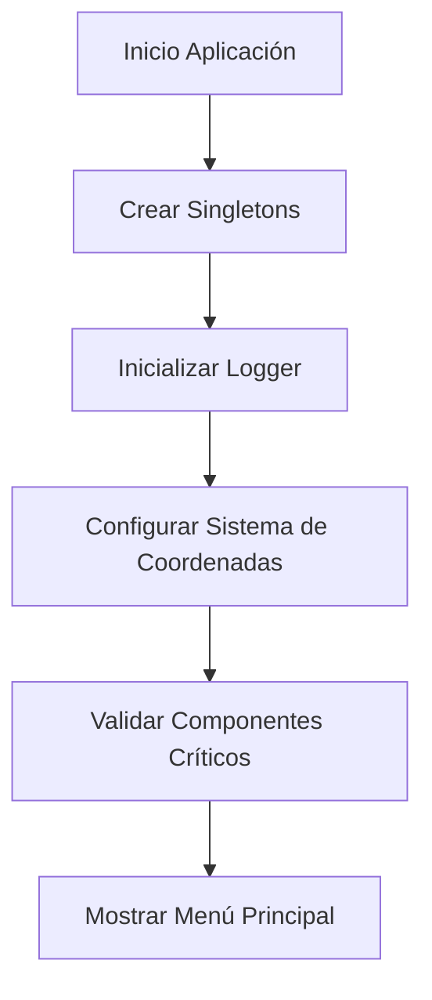
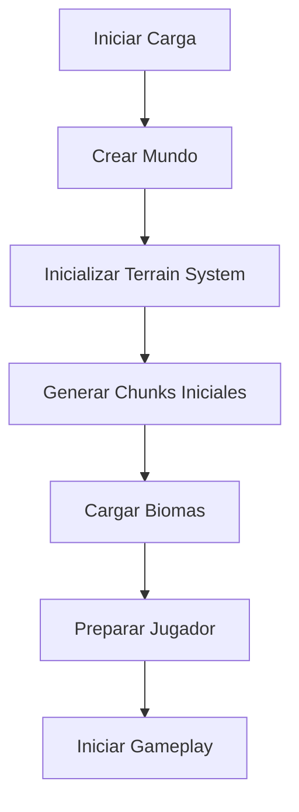
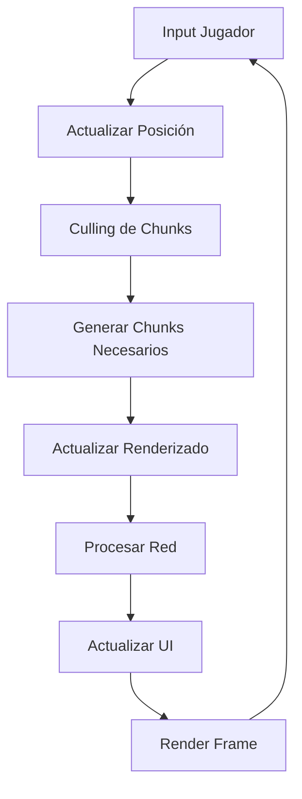
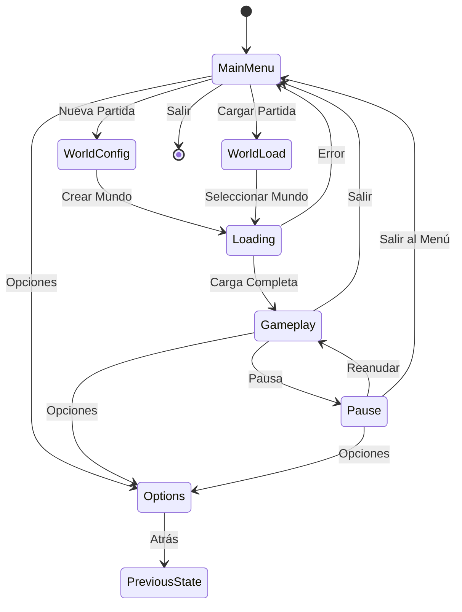

# Nuevo Flujo del Juego - Wild v2.0

## 🎯 Objetivo

Definir el flujo optimizado y bien estructurado del juego Wild v2.0, desde el inicio hasta el gameplay continuo, aplicando todas las lecciones aprendidas y evitando los problemas del proyecto original.

## 🔄 Flujo General del Juego

### 📋 Fases del Flujo

1. **Inicialización del Sistema** - Configuración y validación
2. **Menú Principal** - Interfaz de usuario inicial
3. **Creación/Selección de Mundo** - Configuración del mundo
4. **Carga del Mundo** - Generación asíncrona del terrain
5. **Gameplay Principal** - Bucle de juego optimizado
6. **Gestión de Sesión** - Guardado y carga

---

## 🚀 Fase 1: Inicialización del Sistema

### 📋 Secuencia de Inicialización



### 🔧 Detalles de Inicialización

#### 1.1 Creación de Singletons (Orden Crítico)
```
1. Logger System - Primero para debugging
2. CoordinateSystem - Fundamento para todo
3. BiomaManager - Sistema de biomas
4. MaterialCache - Cache de materiales
5. NetworkManager - Sistema de red
```

#### 1.2 Validación de Componentes
```csharp
// Verificación crítica de inicialización
bool IsSystemReady()
{
    return CoordinateSystem.IsInitialized() &&
           BiomaManager.IsReady() &&
           MaterialCache.HasMaterials();
}
```

#### 1.3 Configuración por Defecto
- **Render Distance:** 500 unidades (50 chunks)
- **Quality Settings:** Medio (ajustable)
- **Network Mode:** Cliente-servidor
- **Logging Level:** INFO

---

## 🏠 Fase 2: Menú Principal

### 📋 Interfaz del Menú

```
┌─────────────────────────────────┐
│           WILD v2.0             │
├─────────────────────────────────┤
│  [Nueva Partida]                │
│  [Cargar Partida]               │
│  [Seleccionar Personaje]        │
│  [Opciones]                     │
│  [Salir]                        │
└─────────────────────────────────┘
```

> [!TIP]
> **Selección Persistente:** El sistema guarda automáticamente el último personaje seleccionado en `characters/selected.dat`, eliminando la necesidad de re-seleccionar en cada inicio si el jugador desea continuar con el mismo personaje.
```

### 🎮 Flujo de Navegación

#### Nueva Partida
```
Menú → Configuración Mundo → Generación → Carga → Gameplay
```

#### Cargar Partida
```
Menú → Selección Mundo → Validación → Carga → Gameplay
```

#### Opciones
```
Menú → Configuración → Guardar → Menú
```

---

## 🌍 Fase 3: Creación/Selección de Mundo

### 📋 Configuración de Mundo

#### Parámetros de Generación
```
Nombre del Mundo: [Texto]
Seed: [Número] o [Aleatorio]
Tamaño del Mundo: [Pequeño/Medio/Grande]
Dificultad: [Fácil/Medio/Difícil]
Tipo de Terreno: [Plano/Montaña/Oceánico]
```

#### Validación de Configuración
```csharp
bool ValidateWorldConfig(WorldConfig config)
{
    // Validar nombre único
    if (WorldExists(config.Name)) return false;
    
    // Validar seed válido
    if (config.Seed == 0) config.Seed = RandomSeed();
    
    // Validar tamaño razonable
    if (config.Size < 1000 || config.Size > 10000) return false;
    
    return true;
}
```

---

## ⚡ Fase 4: Carga del Mundo

### 🔄 Flujo de Carga Asíncrona



### 📋 Detalles de Carga

#### 4.1 Creación del Mundo
```csharp
async Task<World> CreateWorld(WorldConfig config)
{
    var world = new World(config);
    
    // Inicializar sistemas del mundo
    await world.InitializeTerrain();
    await world.InitializeBiomas();
    await world.InitializeNetwork();
    
    return world;
}
```

#### 4.2 Generación de Chunks Iniciales
```csharp
async Task GenerateInitialChunks(Vector3 playerPos)
{
    // Generar chunks en radio 3x3 alrededor del jugador
    var chunksToGenerate = GetChunksInRadius(playerPos, 3);
    
    foreach (var chunkPos in chunksToGenerate)
    {
        await GenerateChunk(chunkPos);
    }
}
```

#### 4.3 Sistema de Carga Progressiva
- **Chunks visibles primero:** 3x3 alrededor del jugador
- **Background loading:** Chunks adicionales en segundo plano
- **Streaming:** Generación continua según movimiento

---

## 🎮 Fase 5: Gameplay Principal

### 🔄 Bucle de Juego Optimizado



### 📋 Sistema de Gameplay

#### 5.1 Gestión de Jugador
```csharp
void UpdatePlayer(float delta)
{
    // Input y movimiento
    HandlePlayerInput();
    
    // Actualizar posición global
    var playerPos = GetPlayerGlobalPosition();
    
    // Ajustar a terreno
    AdjustToTerrain(playerPos);
    
    // Actualizar chunks visibles
    UpdateVisibleChunks(playerPos);
}
```

#### 5.2 Sistema de Chunks Dinámico
```csharp
void UpdateVisibleChunks(Vector3 playerPos)
{
    // Calcular chunks necesarios
    var requiredChunks = GetChunksInRadius(playerPos, renderDistance);
    
    // Generar chunks faltantes
    foreach (var chunkPos in requiredChunks)
    {
        if (!HasChunk(chunkPos))
        {
            GenerateChunkAsync(chunkPos);
        }
    }
    
    // Eliminar chunks lejanos
    CleanupDistantChunks(playerPos);
}
```

#### 5.3 Culling Optimizado
```csharp
void PerformCulling(Vector3 playerPos)
{
    // Frustum culling
    var visibleChunks = GetChunksInFrustum();
    
    // Distance culling
    var chunksInRange = GetChunksInRange(playerPos, renderDistance);
    
    // Combinar y actualizar
    var finalVisible = IntersectChunks(visibleChunks, chunksInRange);
    UpdateChunkVisibility(finalVisible);
}
```

---

## 💾 Fase 6: Gestión de Sesión

### 🔄 Flujo de Guardado/Carga

#### Guardado Automático
```csharp
void AutoSave()
{
    // Cada 5 minutos o en eventos importantes
    var saveData = new SaveData
    {
        PlayerPosition = GetPlayerPosition(),
        WorldState = GetWorldState(),
        Inventory = GetInventory(),
        Timestamp = DateTime.Now
    };
    
    SaveToFile(saveData, GetCurrentWorldName());
}
```

#### Carga de Sesión
```csharp
async Task LoadSession(string worldName)
{
    var saveData = await LoadFromFile(worldName);
    
    // Restaurar estado
    SetPlayerPosition(saveData.PlayerPosition);
    RestoreWorldState(saveData.WorldState);
    RestoreInventory(saveData.Inventory);
    
    // Recrear chunks alrededor del jugador
    await GenerateChunksAroundPlayer(saveData.PlayerPosition);
}
```

---

## 🚨 Manejo de Errores y Recuperación

### 📋 Estrategias de Recuperación

#### Errores de Generación
```csharp
try
{
    await GenerateChunk(chunkPos);
}
catch (GenerationException ex)
{
    Logger.LogError($"Error generando chunk {chunkPos}: {ex.Message}");
    
    // Recuperación: usar chunk por defecto
    GenerateDefaultChunk(chunkPos);
}
```

#### Errores de Red
```csharp
void HandleNetworkError(NetworkError error)
{
    switch (error.Type)
    {
        case NetworkErrorType.Disconnect:
            // Modo offline temporal
            EnableOfflineMode();
            break;
            
        case NetworkErrorType.Timeout:
            // Reintentar conexión
            RetryConnection();
            break;
    }
}
```

#### Errores Críticos
```csharp
void HandleCriticalError(Exception ex)
{
    Logger.LogError($"Error crítico: {ex.Message}");
    
    // Guardar estado actual
    EmergencySave();
    
    // Volver a menú principal
    ReturnToMainMenu();
}
```

---

## 📊 Métricas y Monitoreo

### 📈 Indicadores de Rendimiento

#### Métricas Clave
- **FPS:** Objetivo 60 FPS constante
- **Chunk Generation:** < 10ms por chunk (10x10)
- **Memory Usage:** < 200MB para mundo básico
- **Network Latency:** < 100ms para nearby chunks
- **Load Times:** < 5 segundos para mundo nuevo

#### Sistema de Monitoreo
```csharp
class PerformanceMonitor
{
    void UpdateMetrics()
    {
        var fps = Engine.GetFramesPerSecond();
        var chunkCount = GetLoadedChunkCount();
        var memoryUsage = GetMemoryUsage();
        
        Logger.Log($"Performance: FPS={fps}, Chunks={chunkCount}, Memory={memoryUsage}MB");
        
        // Alertas de rendimiento
        if (fps < 30) TriggerLowFPSAlert();
        if (memoryUsage > 300) TriggerMemoryAlert();
    }
}
```

---

## 🎛️ Configuración y Opciones

### ⚙️ Ajustes de Rendimiento

#### Calidad Gráfica
- **Texture Quality:** Bajo/Medio/Alto
- **Render Distance:** 200/500/1000 unidades
- **Shadow Quality:** Desactivado/Bajo/Medio
- **LOD Distance:** Cercano/Medio/Lejano

#### Sistema
- **V-Sync:** Activado/Desactivado
- **Max FPS:** 30/60/120/Ilimitado
- **Thread Priority:** Bajo/Medio/Alto
- **Cache Size:** Pequeño/Medio/Grande

### 🌐 Configuración de Red

#### Opciones de Multijugador
- **Server Mode:** Dedicado/Peer-to-Peer
- **Max Players:** 2/4/8/16
- **Network Update Rate:** 10/20/30/60 Hz
- **Compression:** Activado/Desactivado

---

## 🔄 Estados del Juego

### 📋 Diagrama de Estados



---

## 🎯 Flujo Optimizado vs Proyecto Original

### ✅ Mejoras Implementadas

#### Inicialización
- **Original:** Desordenada, con dependencias circulares
- **Nuevo:** Ordenada, con validación crítica

#### Generación de Chunks
- **Original:** 100x100, síncrono, con crashes
- **Nuevo:** 10x10, asíncrono, estable

#### Culling
- **Original:** Ineficiente, chunks grandes
- **Nuevo:** Granular, chunks pequeños

#### Manejo de Errores
- **Original:** Excepciones no manejadas
- **Nuevo:** Recuperación robusta

#### Rendimiento
- **Original:** Variable, con caídas de FPS
- **Nuevo:** Estable, 60 FPS objetivo

---

## 📝 Checklist de Implementación

### 🎯 Fase 1: Inicialización
- [ ] Sistema de logging funcional
- [ ] Coordenadas globales implementadas
- [ ] Singletons ordenados y validados
- [ ] Configuración por defecto cargada

### 🎯 Fase 2: Interfaz
- [ ] Menú principal funcional
- [ ] Navegación entre opciones
- [ ] Configuración de mundo
- [ ] Sistema de guardado/carga

### 🎯 Fase 3: Terrain
- [ ] Generación de chunks 10x10
- [ ] Sistema de biomas integrado
- [ ] Culling eficiente
- [ ] Streaming de chunks

### 🎯 Fase 4: Gameplay
- [ ] Movimiento del jugador
- [ ] Ajuste a terreno
- [ ] Sistema de red
- [ ] Bucle de juego optimizado

---

**Este flujo optimizado asegura que Wild v2.0 tenga una experiencia de usuario fluida, estable y eficiente, aprendiendo de todos los problemas del proyecto original.**
