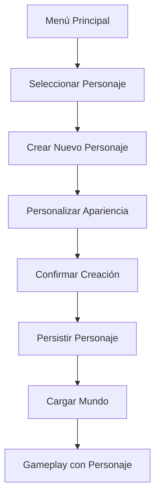

# Sistema de Personajes - Wild v2.0

## 🎯 Objetivo

Definir el sistema completo de gestión de personajes para Wild v2.0, enfocado en el realismo y la supervivencia, eliminando elementos de RPG fantasía para mantener coherencia con el concepto del juego.

## 📋 Arquitectura del Sistema

### 🔄 Flujo de Gestión de Personajes



### 🏗️ Componentes Principales

#### 1. **CharacterManager** - Gestor Central
- Gestión de todos los personajes del jugador
- Persistencia y carga de datos
- Validación de personajes
- Sincronización con servidor

#### 2. **CharacterData** - Datos del Personaje
- Información básica (nombre, apariencia)
- Estadísticas realistas (salud, energía, hambre, sed)
- Inventario y equipamiento
- Sistema de habilidades prácticas

#### 3. **CharacterCustomization** - Personalización
- Selector de apariencia realista
- Sistema de tonos de piel y colores naturales
- Tipos de cuerpo y ropa
- Preview en tiempo real

#### 4. **CharacterPersistence** - Persistencia
- **Rutas de Almacenamiento:**
    - `user://characters/`
        - `├── {personaje_id}.json`          # Datos serializados del personaje
        - `├── selected.dat`                 # ID del personaje seleccionado actualmente
        - `└── backups/`                     # Respaldos automáticos
- Guardado y carga de personajes
- Validación de datos
- Backup automático
- Sincronización con servidor

---

## 👤 Estructura de Datos del Personaje

### 📋 CharacterData Class

#### Datos Actuales (Fase 1 - Simplificada)
```csharp
public class Personaje
{
    public string id { get; set; } = "";                    // GUID generado al crear
    public string apodo { get; set; } = "";                 // Nombre visible del personaje
    public string genero { get; set; } = "hombre";          // hombre / mujer
    public DateTime fecha_creacion { get; set; }            // Automático
    public DateTime ultimo_acceso { get; set; }            // Actualizado al seleccionar/guardar
}
```

> [!NOTE]
> Los sistemas de estadísticas realistas (salud, energía, hambre) y personalización avanzada de apariencia están diseñados para fases de integración con gameplay y modelado 3D (Features futuras).

#### Estadísticas Realistas
```csharp
public class CharacterStats
{
    public float Health { get; set; } = 100.0f;        // Salud (0-100)
    public float Energy { get; set; } = 100.0f;        // Energía (0-100)
    public float Hunger { get; set; } = 100.0f;        // Hambre (0-100)
    public float Thirst { get; set; } = 100.0f;        // Sed (0-100)
    public float Weight { get; set; } = 70.0f;         // Peso corporal (kg)
    public float Height { get; set; } = 1.75f;        // Altura (m)
}
```

#### Apariencia Realista
```csharp
public class CharacterAppearance
{
    public string ModelPath { get; set; } = "res://models/characters/human_base.glb";
    public Vector3 Scale { get; set; } = Vector3.One;
    public Color SkinTone { get; set; } = Colors.White;  // Tono de piel realista
    public Color HairColor { get; set; } = Colors.Brown; // Color de cabello
    public string HairStyle { get; set; } = "short";     // Corto, largo, rizado, etc.
    public string BodyType { get; set; } = "normal";     // Delgado, normal, atlético
    public string Clothing { get; set; } = "casual";     // Ropa casual, trabajo, aventura
}
```

#### Inventario Realista
```csharp
public class CharacterInventory
{
    public List<ItemData> Items { get; set; } = new();
    public Dictionary<EquipmentSlot, ItemData> EquippedItems { get; set; } = new();
    public float MaxWeight { get; set; } = 30.0f;       // 30kg máximo realista
    public int MaxSlots { get; set; } = 20;             // 20 espacios de inventario
}

public enum EquipmentSlot
{
    Head,       // Casco, gorro
    Chest,      // Camiseta, chaqueta
    Legs,       // Pantalón
    Feet,       // Botas, zapatillas
    Hands,      // Guantes
    Tool,       // Herramienta principal
    Backpack    // Mochila
}
```

---

## 🎨 Sistema de Personalización Realista

### 📋 Apariencia Humana

#### Opciones de Personalización
```csharp
public class RealisticAppearanceOptions
{
    // Tonos de piel realistas
    public List<Color> SkinTones = new()
    {
        Colors.White,      // Piel muy clara
        Colors.LightYellow, // Piel clara
        Colors.SandyBrown,  // Piel morena clara
        Colors.Brown,      // Piel morena
        Colors.DarkBrown,  // Piel oscura
        Colors.Black       // Piel muy oscura
    };
    
    // Colores de cabello naturales
    public List<Color> HairColors = new()
    {
        Colors.Black,       // Negro
        Colors.DarkGray,    // Castaño oscuro
        Colors.Brown,       // Castaño
        Colors.LightBrown,  // Rubio
        Colors.Gray,        // Gris
        Colors.White        // Blanco (canoso)
    };
    
    // Tipos de cuerpo realistas
    public List<string> BodyTypes = new()
    {
        "Delgado",   // BMI < 18.5
        "Normal",    // BMI 18.5-24.9
        "Atlético",  // BMI 20-25 con músculo
        "Robusto"    // BMI 25-30
    };
    
    // Estilos de cabello
    public List<string> HairStyles = new()
    {
        "Calvo",     // Sin cabello
        "Corto",     // Cabello corto
        "Medio",     // Cabello medio
        "Largo",     // Cabello largo
        "Rizado",    // Cabello rizado
        "Ondulado"   // Cabello ondulado
    };
    
    // Tipos de ropa realistas
    public List<string> ClothingTypes = new()
    {
        "Casual",    // Ropa diaria
        "Trabajo",   // Ropa de trabajo
        "Aventura",  // Ropa de exploración
        "Formal",    // Ropa formal
        "Deportiva"  // Ropa deportiva
    };
}
```

---

## 🎮 Sistema de Supervivencia Realista

### 📋 Necesidades Básicas

#### Sistema de Supervivencia
```csharp
public class SurvivalSystem
{
    public void UpdateNeeds(CharacterData character, float deltaTime)
    {
        // Hambre: disminuye lentamente (cada 8 horas de juego)
        character.Stats.Hunger -= 0.1f * deltaTime;
        
        // Sed: disminuye más rápido que hambre (cada 4 horas de juego)
        character.Stats.Thirst -= 0.2f * deltaTime;
        
        // Energía: se recupera con descanso, se gasta con actividad
        if (character.IsResting)
            character.Stats.Energy += 0.5f * deltaTime;
        else
            character.Stats.Energy -= 0.05f * deltaTime;
        
        // Salud: afectada por otras necesidades
        if (character.Stats.Hunger < 20 || character.Stats.Thirst < 20)
            character.Stats.Health -= 0.3f * deltaTime;
        
        // Limitar valores
        ClampStats(character.Stats);
        
        // Efectos de necesidades bajas
        ApplyNeedEffects(character);
    }
    
    private void ClampStats(CharacterStats stats)
    {
        stats.Health = Mathf.Clamp(stats.Health, 0, 100);
        stats.Energy = Mathf.Clamp(stats.Energy, 0, 100);
        stats.Hunger = Mathf.Clamp(stats.Hunger, 0, 100);
        stats.Thirst = Mathf.Clamp(stats.Thirst, 0, 100);
    }
    
    private void ApplyNeedEffects(CharacterData character)
    {
        // Efectos de hambre baja
        if (character.Stats.Hunger < 30)
        {
            character.MovementSpeed *= 0.8f; // Movimiento más lento
            Logger.LogWarning($"SURVIVAL: {character.Name} tiene hambre");
        }
        
        // Efectos de sed baja
        if (character.Stats.Thirst < 30)
        {
            character.MovementSpeed *= 0.7f; // Movimiento más lento
            character.VisionRange *= 0.9f;  // Visión reducida
            Logger.LogWarning($"SURVIVAL: {character.Name} tiene sed");
        }
        
        // Efectos de energía baja
        if (character.Stats.Energy < 20)
        {
            character.InteractionSpeed *= 0.5f; // Interacciones más lentas
            Logger.LogWarning($"SURVIVAL: {character.Name} está cansado");
        }
    }
}
```

---

## 🔧 Sistema de Habilidades Realistas

### 📋 Habilidades Prácticas

#### Habilidades de Supervivencia
```csharp
public class RealisticSkill
{
    public string Name { get; set; }
    public string Description { get; set; }
    public float Proficiency { get; set; } = 0.0f;    // 0-100% de habilidad
    public float Experience { get; set; } = 0.0f;     // Experiencia en la habilidad
}

public class SkillSystem
{
    public Dictionary<string, RealisticSkill> Skills { get; set; } = new()
    {
        ["Carpintería"] = new RealisticSkill { Name = "Carpintería", Description = "Construir con madera" },
        ["Minería"] = new RealisticSkill { Name = "Minería", Description = "Extraer minerales" },
        ["Agricultura"] = new RealisticSkill { Name = "Agricultura", Description = "Cultivar plantas" },
        ["Cocina"] = new RealisticSkill { Name = "Cocina", Description = "Preparar alimentos" },
        ["Navegación"] = new RealisticSkill { Name = "Navegación", Description = "Orientarse en el terreno" },
        ["Caza"] = new RealisticSkill { Name = "Caza", Description = "Cazar animales" },
        ["Pesca"] = new RealisticSkill { Name = "Pesca", Description = "Pescar en ríos y lagos" },
        ["Medicina"] = new RealisticSkill { Name = "Medicina", Description = "Tratar heridas y enfermedades" },
        ["Construcción"] = new RealisticSkill { Name = "Construcción", Description = "Construir estructuras" },
        ["Reparación"] = new RealisticSkill { Name = "Reparación", Description = "Reparar herramientas y equipos" }
    };
}
```

#### Progresión por Uso
```csharp
public class SkillProgression
{
    public void ImproveSkill(string skillName, float usageAmount)
    {
        var skill = Skills[skillName];
        
        // Aumentar experiencia
        skill.Experience += usageAmount;
        
        // Calcular nueva proficiencia
        var newProficiency = CalculateProficiency(skill.Experience);
        skill.Proficiency = newProficiency;
        
        Logger.Log($"SKILL: {skillName} mejorada a {newProficiency:F1}%");
    }
    
    private float CalculateProficiency(float experience)
    {
        // Fórmula logarítmica: mejora rápida al principio, más luego
        return Mathf.Min(100.0f, 100.0f * (1.0f - Mathf.Exp(-experience / 100.0f)));
    }
    
    public bool CanPerformAction(string skillName, float difficulty)
    {
        var skill = Skills[skillName];
        return skill.Proficiency >= difficulty;
    }
}
```

---

## 🎮 CharacterManager - Gestor Central

### 📋 Implementación Simplificada

#### Clase CharacterManager
```csharp
public partial class CharacterManager : Node
{
    private Dictionary<string, CharacterData> _characters = new();
    private CharacterData _activeCharacter;
    private string _currentPlayerId;
    
    public override void _Ready()
    {
        Logger.LogWithContext("CHARACTER_MANAGER", "CharacterManager inicializado", "INIT");
        LoadPlayerCharacters();
    }
    
    public async Task<bool> CreateCharacter(CharacterCreationData creationData)
    {
        try
        {
            // Validar datos
            if (!ValidateCharacterData(creationData))
            {
                Logger.LogWarning("CHARACTER_MANAGER: Datos de personaje inválidos");
                return false;
            }
            
            // Crear personaje humano normal
            var character = new CharacterData
            {
                Id = GenerateCharacterId(),
                Name = creationData.Name,
                PlayerId = _currentPlayerId,
                CreatedAt = DateTime.UtcNow,
                LastPlayed = DateTime.UtcNow,
                Stats = new CharacterStats(), // Valores por defecto realistas
                Appearance = creationData.Appearance,
                Inventory = new CharacterInventory(),
                Skills = new SkillSystem()
            };
            
            // Guardar personaje
            await SaveCharacter(character);
            _characters[character.Id] = character;
            
            Logger.Log($"CHARACTER_MANAGER: Personaje {character.Name} creado exitosamente");
            return true;
        }
        catch (Exception ex)
        {
            Logger.LogError($"CHARACTER_MANAGER: Error creando personaje: {ex.Message}");
            return false;
        }
    }
}
```

---

## 💾 Sistema de Persistencia

### 📋 Guardado y Carga

#### Persistencia de Personajes
```csharp
public class CharacterPersistence
{
    private const string CHARACTERS_DIR = "user://characters/";
    private const string SELECTED_CHARACTER_FILE = "user://characters/selected.dat";
    
    public async Task SaveCharacter(CharacterData character)
    {
        try
        {
            var filePath = GetCharacterFilePath(character.Id);
            var json = JsonSerializer.Serialize(character, new JsonSerializerOptions
            {
                WriteIndented = true
            });
            
            using var file = FileAccess.Open(filePath, FileAccess.ModeFlags.Write);
            file.StoreString(json);
            file.Close();
            
            Logger.Log($"CHARACTER_PERSISTENCE: Personaje {character.Name} guardado");
        }
        catch (Exception ex)
        {
            Logger.LogError($"CHARACTER_PERSISTENCE: Error guardando personaje: {ex.Message}");
            throw;
        }
    }
    
    public async Task<CharacterData> LoadCharacter(string characterId)
    {
        try
        {
            var filePath = GetCharacterFilePath(characterId);
            
            if (!FileAccess.FileExists(filePath))
            {
                Logger.LogWarning($"CHARACTER_PERSISTENCE: Archivo no encontrado: {filePath}");
                return null;
            }
            
            using var file = FileAccess.Open(filePath, FileAccess.ModeFlags.Read);
            var json = file.GetAsText();
            file.Close();
            
            var character = JsonSerializer.Deserialize<CharacterData>(json);
            
            Logger.Log($"CHARACTER_PERSISTENCE: Personaje {character.Name} cargado");
            return character;
        }
        catch (Exception ex)
        {
            Logger.LogError($"CHARACTER_PERSISTENCE: Error cargando personaje: {ex.Message}");
            return null;
        }
    }
}
```

---

## 🎨 Sistema de Personalización

### 📋 CharacterCustomization

#### Interfaz de Personalización Realista
```csharp
public partial class RealisticCharacterCreationUI : Control
{
    private CharacterCreationData _creationData;
    private CharacterPreview _preview;
    
    public override void _Ready()
    {
        _creationData = new CharacterCreationData();
        _preview = GetNode<CharacterPreview>("Preview");
        
        SetupUI();
        UpdatePreview();
    }
    
    private void SetupUI()
    {
        // Nombre del personaje (solo texto real)
        var nameInput = GetNode<LineEdit>("NameInput");
        nameInput.PlaceholderText = "Nombre del personaje";
        nameInput.TextChanged += OnNameChanged;
        
        // Apariencia física realista
        SetupAppearanceUI();
        
        // Sin selección de clase ni habilidades mágicas
        // El personaje empieza como un humano normal
        
        var createButton = GetNode<Button>("CreateButton");
        createButton.Pressed += OnCreateCharacterPressed;
    }
    
    private void SetupAppearanceUI()
    {
        // Tono de piel (paleta realista)
        var skinTonePicker = GetNode<ColorPicker>("SkinTone");
        SetupRealisticSkinTones(skinTonePicker);
        
        // Color de cabello (colores naturales)
        var hairColorPicker = GetNode<ColorPicker>("HairColor");
        SetupNaturalHairColors(hairColorPicker);
        
        // Tipo de cuerpo (realista)
        var bodyTypeSelector = GetNode<OptionButton>("BodyType");
        bodyTypeSelector.AddItem("Delgado");
        bodyTypeSelector.AddItem("Normal");
        bodyTypeSelector.AddItem("Atlético");
        bodyTypeSelector.AddItem("Robusto");
        bodyTypeSelector.ItemSelected += OnBodyTypeSelected;
        
        // Estilo de cabello
        var hairStyleSelector = GetNode<OptionButton>("HairStyle");
        hairStyleSelector.AddItem("Calvo");
        hairStyleSelector.AddItem("Corto");
        hairStyleSelector.AddItem("Medio");
        hairStyleSelector.AddItem("Largo");
        hairStyleSelector.AddItem("Rizado");
        hairStyleSelector.ItemSelected += OnHairStyleSelected;
        
        // Tipo de ropa
        var clothingSelector = GetNode<OptionButton>("ClothingType");
        clothingSelector.AddItem("Casual");
        clothingSelector.AddItem("Trabajo");
        clothingSelector.AddItem("Aventura");
        clothingSelector.AddItem("Formal");
        clothingSelector.AddItem("Deportiva");
        clothingSelector.ItemSelected += OnClothingSelected;
    }
    
    private void SetupRealisticSkinTones(ColorPicker picker)
    {
        var skinTones = new RealisticAppearanceOptions().SkinTones;
        foreach (var tone in skinTones)
        {
            picker.AddColor(tone);
        }
    }
    
    private void SetupNaturalHairColors(ColorPicker picker)
    {
        var hairColors = new RealisticAppearanceOptions().HairColors;
        foreach (var color in hairColors)
        {
            picker.AddColor(color);
        }
    }
}
```

---

## 🌐 Integración con Red

### 📋 Sincronización de Personajes

#### Mensajes de Red Simplificados
```csharp
public class CharacterNetworkMessage
{
    public string Type { get; set; }
    public string CharacterId { get; set; }
    public CharacterData CharacterData { get; set; }
    public long Timestamp { get; set; }
}

public class CharacterPositionMessage
{
    public string Type { get; set; }
    public string CharacterId { get; set; }
    public Vector3 Position { get; set; }
    public Vector3 Rotation { get; set; }
    public Vector3 Velocity { get; set; }
    public long Timestamp { get; set; }
}

public class CharacterStatsMessage
{
    public string Type { get; set; }
    public string CharacterId { get; set; }
    public CharacterStats Stats { get; set; }
    public long Timestamp { get; set; }
}
```

---

## 🎯 UI de Gestión de Personajes

### 📋 Menú de Selección Simplificado

#### CharacterSelectionUI
```csharp
public partial class CharacterSelectionUI : Control
{
    private CharacterManager _characterManager;
    private VBoxContainer _characterList;
    
    public override void _Ready()
    {
        _characterManager = CharacterManager.Instance;
        _characterList = GetNode<VBoxContainer>("CharacterList");
        
        SetupUI();
        LoadCharacters();
    }
    
    private void LoadCharacters()
    {
        _characterList.QueueFreeChildren();
        
        foreach (var character in _characterManager.GetAllCharacters())
        {
            var characterCard = CreateRealisticCharacterCard(character);
            _characterList.AddChild(characterCard);
        }
    }
    
    private Control CreateRealisticCharacterCard(CharacterData character)
    {
        var card = new Panel();
        card.CustomMinimumSize = new Vector2(300, 120);
        
        var container = new VBoxContainer();
        card.AddChild(container);
        
        // Nombre y apariencia
        var nameLabel = new Label();
        nameLabel.Text = $"{character.Name}";
        container.AddChild(nameLabel);
        
        // Estadísticas principales
        var statsLabel = new Label();
        statsLabel.Text = $"Salud: {character.Stats.Health:F0}% | Energía: {character.Stats.Energy:F0}%";
        container.AddChild(statsLabel);
        
        // Necesidades
        var needsLabel = new Label();
        needsLabel.Text = $"Hambre: {character.Stats.Hunger:F0}% | Sed: {character.Stats.Thirst:F0}%";
        container.AddChild(needsLabel);
        
        // Última vez jugado
        var lastPlayedLabel = new Label();
        lastPlayedLabel.Text = $"Último juego: {character.LastPlayed:dd/MM/yyyy}";
        container.AddChild(lastPlayedLabel);
        
        return card;
    }
}
```

---

## 📊 Validación y Seguridad

### 📋 Validación de Datos Realistas

#### Validación de Personajes
```csharp
public class RealisticCharacterValidator
{
    public ValidationResult ValidateCharacter(CharacterData character)
    {
        var result = new ValidationResult();
        
        // Validar ID
        if (string.IsNullOrWhiteSpace(character.Id))
            result.AddError("ID del personaje es requerido");
        
        // Validar nombre
        if (string.IsNullOrWhiteSpace(character.Name))
            result.AddError("Nombre del personaje es requerido");
        else if (character.Name.Length < 2 || character.Name.Length > 30)
            result.AddError("Nombre debe tener entre 2 y 30 caracteres");
        else if (!Regex.IsMatch(character.Name, @"^[a-zA-Z\s\-']+$"))
            result.AddError("Nombre solo puede contener letras, espacios, guiones y apóstrofes");
        
        // Validar estadísticas realistas
        if (character.Stats.Weight < 40 || character.Stats.Weight > 150)
            result.AddError("Peso debe estar entre 40kg y 150kg");
        
        if (character.Stats.Height < 1.2f || character.Stats.Height > 2.2f)
            result.AddError("Altura debe estar entre 1.2m y 2.2m");
        
        // Validar BMI realista
        var bmi = character.Stats.Weight / (character.Stats.Height * character.Stats.Height);
        if (bmi < 15 || bmi > 40)
            result.AddError("Índice de masa corporal no es realista");
        
        return result;
    }
}
```

---

## 🎯 Conclusión

Este sistema de personajes realista proporciona:

**✅ Realismo Absoluto:**
- Personajes humanos normales sin clases mágicas
- Sistema de supervivencia con necesidades básicas
- Habilidades prácticas del mundo real
- Progresión natural por uso y experiencia

**🎚️ Simplicidad Coherente:**
- Sin complejos sistemas de RPG fantasía
- Foco en supervivencia y construcción
- Personalización visual realista
- Inventario basado en peso y espacio realistas

**🎮 Gameplay Inmersivo:**
- Sistema de supervivencia con hambre, sed y energía
- Habilidades que mejoran con la práctica
- Interacción realista con el entorno
- Progresión natural y creíble

**💾 Persistencia Robusta:**
- Guardado local y sincronización con servidor
- Validación de datos realistas
- Backup automático y recuperación

El resultado es un sistema de personajes coherente con el concepto de Wild, proporcionando una experiencia de supervivencia realista y satisfactoria sin elementos de fantasía que romperían la inmersión.
