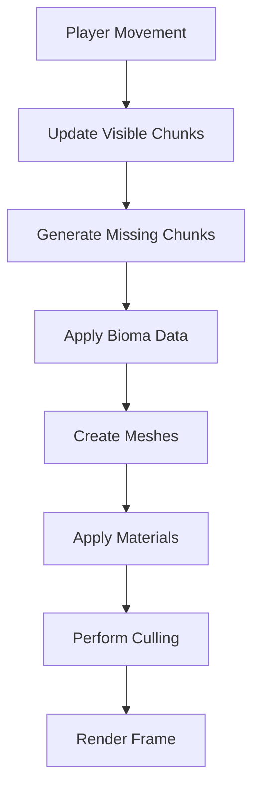

# Sistema de Renderizado - Wild v2.0

## 🎯 Objetivo

Definir el sistema de renderizado optimizado para Wild v2.0, integrando biomas y chunks de 10x10 para lograr un rendimiento excelente y una calidad visual consistente.

## 📋 Arquitectura del Sistema de Renderizado

### 🔄 Flujo de Renderizado



### � Sistema de Juego

#### 1. **TerrainRenderer** - Motor Principal
- Gestiona todo el pipeline de renderizado
- Coordina generación y culling
- Optimiza rendimiento

#### 2. **ChunkGenerator** - Generación de Terreno
- Crea datos de altura para chunks 10x10
- Integra información de biomas
- Generación asíncrona
- **Genera mallas de colisiones** para física

#### 3. **BiomaSystem** - Sistema de Biomas
- Determina tipo de bioma por posición
- Genera transiciones suaves
- Proporciona datos de materiales
- **Solo suelo por ahora** (sin objetos 3D)

#### 4. **MaterialCache** - Cache de Materiales
- Materiales pre-generados por bioma
- Cache optimizado para rendimiento
- Soporta blending de biomas

#### 5. **CullingSystem** - Optimización Visual
- Frustum culling
- Distance culling
- LOD management

#### 6. **PhysicsSystem** - Sistema de Colisiones
- **Genera colisiones para terreno** automáticamente
- **Mantiene jugador sobre superficie** sin ajustes manuales
- **Usa CharacterBody3D** para jugador con física realista

---

## 🌍 Sistema de Chunks 10x10

### 📋 Estructura de Chunks

#### Tamaño y Coordenadas
```
Chunk Size: 10x10 unidades
Vertices: 100 por chunk (11x11 grid)
Triangles: 200 por chunk
World Position: (chunkX * 10, 0, chunkZ * 10)
```

#### Grid de Chunks
```
(-2,-2) (-1,-2) (0,-2) (1,-2) (2,-2)
(-2,-1) (-1,-1) (0,-1) (1,-1) (2,-1)
(-2, 0) (-1, 0) (0, 0) (1, 0) (2, 0)
(-2, 1) (-1, 1) (0, 1) (1, 1) (2, 1)
(-2, 2) (-1, 2) (0, 2) (1, 2) (2, 2)
```

### 🔧 Generación de Chunks

#### Datos de Terreno
```csharp
class ChunkData
{
    public Vector2I Position { get; set; }
    public float[,] Heights { get; set; } // 11x11
    public BiomaType[,] Biomes { get; set; } // 11x11
    public float[,] NoiseValues { get; set; } // 11x11
}
```

#### Proceso de Generación
```csharp
async Task<ChunkData> GenerateChunk(Vector2I position)
{
    var chunkData = new ChunkData(position);
    
    // 1. Generar alturas base
    await GenerateBaseHeights(chunkData);
    
    // 2. Determinar biomas
    await GenerateBiomaMap(chunkData);
    
    // 3. Aplicar modificación de biomas
    await ApplyBiomaModifications(chunkData);
    
    return chunkData;
}

async Task<ChunkNode> GenerateChunkNode(Vector2I position)
{
    var chunkData = await GenerateChunk(position);
    
    // Crear nodo combinado con renderizado y colisiones
    var chunkNode = new Node3D();
    chunkNode.Position = new Vector3(position.X * 10, 0, position.Y * 10);
    
    // 1. Malla visual
    var visualMesh = await CreateVisualMesh(chunkData);
    var visualInstance = new MeshInstance3D();
    visualInstance.Mesh = visualMesh;
    chunkNode.AddChild(visualInstance);
    
    // 2. Cuerpo de colisiones
    var collisionMesh = GenerateCollisionMesh(chunkData);
    var collisionBody = new StaticBody3D();
    var collisionShape = new ConcavePolygonShape3D();
    collisionShape.SetFaces(collisionMesh);
    collisionBody.CollisionShape = collisionShape;
    chunkNode.AddChild(collisionBody);
    
    return chunkNode;
}
```

---

## 🎨 Sistema de Biomas

### 🌿 Tipos de Biomas (Suelo Únicamente)

#### Biomas Principales
```
Pradera    - Verde claro, terreno plano
Bosque     - Verde oscuro, colinas suaves
Desierto   - Amarillo, dunas y arena
Montaña    - Gris, picos rocosos
Océano     - Azul, agua profunda
Tundra     - Blanco, nieve y hielo
Jungla     - Verde intenso, terreno irregular
Cañón      - Rojizo, paredes rocosas
```

#### Características del Suelo
- **Sin objetos 3D:** Por ahora solo terreno base
- **Topografía variada:** Colinas, valles, mesetas según bioma
- **Colisiones naturales:** El terreno es caminable y escalable
- **Base para futuros:** Preparado para añadir objetos 3D más adelante

#### Transiciones de Biomas
```csharp
BiomaBlend CalculateBiomaBlend(Vector2I chunkPos, Vector2 localPos)
{
    // Obtener biomas vecinos
    var biomas = GetNeighborBiomas(chunkPos, localPos);
    
    // Calcular pesos basados en distancia
    var weights = CalculateBiomaWeights(biomas, localPos);
    
    // Crear blend suave
    return new BiomaBlend(biomas, weights);
}
```

### 🎨 Materiales por Bioma

#### Propiedades de Materiales
```csharp
class BiomaMaterial
{
    public Color AlbedoColor { get; set; }
    public float Roughness { get; set; }
    public float Metallic { get; set; }
    public Texture2D AlbedoTexture { get; set; }
    public Texture2D NormalTexture { get; set; }
    public Texture2D RoughnessTexture { get; set; }
}
```

#### Cache de Materiales
```csharp
class MaterialCache
{
    private Dictionary<BiomaType, StandardMaterial3D> _materials;
    
    StandardMaterial3D GetMaterial(BiomaType biomeType)
    {
        if (_materials.ContainsKey(biomeType))
            return _materials[biomeType];
            
        return CreateMaterial(biomeType);
    }
}
```

---

## �️ Generación de Mallas con Colisiones

### 📐 Topología de Mallas

#### Grid de Vértices (11x11)
```
(0,0) (1,0) (2,0) (3,0) (4,0) (5,0) (6,0) (7,0) (8,0) (9,0) (10,0)
(0,1) (1,1) (2,1) (3,1) (4,1) (5,1) (6,1) (7,1) (8,1) (9,1) (10,1)
(0,2) (1,2) (2,2) (3,2) (4,2) (5,2) (6,2) (7,2) (8,2) (9,2) (10,2)
...
(0,10) (1,10) (2,10) (3,10) (4,10) (5,10) (6,10) (7,10) (8,10) (9,10) (10,10)
```

#### Triangulación para Terreno y Colisiones
```csharp
void GenerateTerrainMesh(ChunkData chunkData, Mesh mesh)
{
    var vertices = new Godot.Collections.Array<Vector3>();
    var indices = new Godot.Collections.Array<int>();
    
    // Generar vértices con altura de terreno
    for (int x = 0; x < 11; x++)
    {
        for (int z = 0; z < 11; z++)
        {
            var height = chunkData.Heights[x, z];
            vertices.Add(new Vector3(x, height, z));
        }
    }
    
    // Generar triángulos
    for (int x = 0; x < 10; x++)
    {
        for (int z = 0; z < 10; z++)
        {
            var i = x * 11 + z;
            
            // Triángulo 1
            indices.Add(i);
            indices.Add(i + 1);
            indices.Add(i + 11);
            
            // Triángulo 2
            indices.Add(i + 1);
            indices.Add(i + 12);
            indices.Add(i + 11);
        }
    }
    
    mesh.AddSurfaceFromArrays(Mesh.PrimitiveType.Triangles, 
        new Godot.Collections.Array { vertices, indices });
}

Godot.Collections.Array<Vector3> GenerateCollisionFaces(ChunkData chunkData)
{
    var faces = new Godot.Collections.Array<Vector3>();
    
    // Generar caras para colisiones (misma topología que malla visual)
    for (int x = 0; x < 10; x++)
    {
        for (int z = 0; z < 10; z++)
        {
            var i = x * 11 + z;
            
            // Triángulo 1
            faces.Add(new Vector3(chunkData.Heights[x, z], chunkData.Heights[x, z + 1], chunkData.Heights[x + 1, z]));
            faces.Add(new Vector3(chunkData.Heights[x + 1, z], chunkData.Heights[x + 1, z + 1], chunkData.Heights[x, z + 1]));
            faces.Add(new Vector3(chunkData.Heights[x, z], chunkData.Heights[x + 1, z + 1], chunkData.Heights[x + 1, z]));
            
            // Triángulo 2
            faces.Add(new Vector3(chunkData.Heights[x + 1, z], chunkData.Heights[x + 1, z + 1], chunkData.Heights[x + 1, z], chunkData.Heights[x, z + 1]));
            faces.Add(new Vector3(chunkData.Heights[x + 1, z], chunkData.Heights[x, z], chunkData.Heights[x, z + 1]));
            faces.Add(new Vector3(chunkData.Heights[x, z], chunkData.Heights[x, z + 1], chunkData.Heights[x + 1, z]));
        }
    }
    
    return faces;
}
```

### 🎯 Optimización de Mallas

#### LOD (Level of Detail) System
```csharp
enum LODLevel
{
    High = 0,    // 11x11 vertices
    Medium = 1,  // 6x6 vertices
    Low = 2,     // 3x3 vertices
    VeryLow = 3  // 2x2 vertices
}

LODLevel CalculateLOD(Vector3 chunkPos, Vector3 playerPos)
{
    var distance = (chunkPos - playerPos).Length();
    
    if (distance < 50) return LODLevel.High;
    if (distance < 150) return LODLevel.Medium;
    if (distance < 300) return LODLevel.Low;
    return LODLevel.VeryLow;
}
```

---

## 🎮 Sistema de Física del Jugador

### 🏃️ Configuración del CharacterBody3D

#### Propiedades Físicas
```csharp
class PlayerController : CharacterBody3D
{
    private float _gravity = 9.8f;        // m/s² - gravedadad realista
    private float _jumpForce = 5.0f;      // m/s - fuerza de salto
    private float _moveSpeed = 5.0f;      // m/s - velocidad de movimiento
    private float _friction = 0.5f;        // coeficiente de fricción
    
    public override void _Ready()
    {
        // Configurar forma de colisión (cápsula)
        var capsuleShape = new CapsuleShape3D(0.5f, 2.0f);
        CollisionShape = capsuleShape;
        
        // Configurar material físico
        PhysicsMaterialOverride = new PhysicsMaterial
        {
            Friction = _friction,
            Bounce = 0.1f,
            Absorbent = false
        };
        
        // Configurar gravedad
        Gravity = Vector3.Down * _gravity;
        
        Logger.Log("PlayerController: Física inicializada");
    }
}
```

#### Movimiento Basado en Fuerzas
```csharp
public override void _PhysicsProcess(float delta)
{
    // Movimiento basado en fuerzas físicas
    var inputDirection = GetInputDirection();
    
    if (inputDirection != Vector3.Zero)
    {
        // Aplicar fuerza de movimiento
        var force = inputDirection * _moveSpeed;
        ApplyCentralForce(force);
    }
    
    // Salto
    if (Input.IsActionJustPressed("jump"))
    {
        Jump();
    }
    
    // El motor de física maneja colisiones automáticamente
}

void Jump()
{
    if (IsOnFloor())
    {
        ApplyCentralImpulse(Vector3.Up * _jumpForce);
        Logger.Log("PlayerController: Saltando");
    }
}
```

### 🌍 Interacción con Terreno

#### Detección Automática de Suelo
```csharp
// El motor de física mantiene al jugador sobre el terreno automáticamente
// No se necesita AdjustToTerrain() ni código manual de altura

void OnTerrainCollision(Node body)
{
    // El motor de física resuelve la colisión
    // El jugador se mantiene sobre la superficie automáticamente
    Logger.Log($"PlayerController: Colisión con {body.Name}");
}
```

---

## 🚀 Pipeline de Renderizado con Física

### 🔄 Bucle Principal

#### Update de Chunks Visibles
```csharp
void UpdateVisibleChunks(Vector3 playerPos)
{
    // 1. Calcular chunks en radio visible
    var chunksInRadius = GetChunksInRadius(playerPos, renderDistance);
    
    // 2. Generar chunks faltantes
    foreach (var chunkPos in chunksInRadius)
    {
        if (!HasChunk(chunkPos))
        {
            GenerateChunkAsync(chunkPos);
        }
    }
    
    // 3. Actualizar LOD de chunks existentes
    UpdateChunkLODs(playerPos);
    
    // 4. Eliminar chunks lejanos
    CleanupDistantChunks(playerPos);
}
```

#### Generación Asíncrona
```csharp
async void GenerateChunkAsync(Vector2I chunkPos)
{
    try
    {
        // Generar nodo completo (visual + colisiones)
        var chunkNode = await GenerateChunkNode(chunkPos);
        
        // Añadir a escena
        AddChunkToScene(chunkPos, chunkNode);
        
        Logger.Log($"Chunk {chunkPos} generado con renderizado y colisiones");
    }
    catch (Exception ex)
    {
        Logger.LogError($"Error generando chunk {chunkPos}: {ex.Message}");
    }
}
```

---

## 🎭 Culling y Optimización

### 👁️ Frustum Culling

#### Culling por Visibilidad
```csharp
bool IsChunkVisible(Vector3 chunkPos, Camera3D camera)
{
    // Verificar si está en frustum de cámara
    var chunkBounds = GetChunkBounds(chunkPos);
    return camera.IsPositionInFrustum(chunkBounds);
}
```

### 📏 Distance Culling

#### Culling por Distancia
```csharp
void PerformDistanceCulling(Vector3 playerPos)
{
    var maxDistance = renderDistance;
    
    foreach (var chunk in _loadedChunks)
    {
        var distance = (chunk.Position - playerPos).Length();
        
        if (distance > maxDistance)
        {
            HideChunk(chunk);
        }
        else
        {
            ShowChunk(chunk);
        }
    }
}
```

### 🔄 LOD Management

#### Cambio Dinámico de LOD
```csharp
void UpdateChunkLODs(Vector3 playerPos)
{
    foreach (var chunk in _loadedChunks)
    {
        var newLOD = CalculateLOD(chunk.Position, playerPos);
        
        if (chunk.CurrentLOD != newLOD)
        {
            UpdateChunkLOD(chunk, newLOD);
        }
    }
}
```

---

## 🎨 Sistema de Materiales Avanzado

### 🌈 Texturas y Shaders

#### Sistema de Texturas
```csharp
class BiomaTextures
{
    public Texture2D Albedo { get; set; }
    public Texture2D Normal { get; set; }
    public Texture2D Roughness { get; set; }
    public Texture2D AmbientOcclusion { get; set; }
}
```

#### Shader Personalizado
```glsl
shader_type spatial;

uniform sampler2D albedo_texture;
uniform sampler2D normal_texture;
uniform sampler2D roughness_texture;

void fragment() {
    vec4 albedo = texture(albedo_texture, UV);
    vec3 normal = texture(normal_texture, UV).rgb;
    float roughness = texture(roughness_texture, UV).r;
    
    ALBEDO = albedo.rgb;
    NORMAL = normalize(normal);
    ROUGHNESS = roughness;
}
```

### 🎨 Blending de Biomas

#### Transiciones Suaves
```csharp
StandardMaterial3D CreateBlendedMaterial(BiomaBlend blend)
{
    var material = new StandardMaterial3D();
    
    // Mezclar colores de albedo
    var blendedColor = Vector3.Zero;
    foreach (var biome in blend.Biomas)
    {
        var biomeColor = GetBiomaColor(biome.Type);
        blendedColor += biomeColor * biome.Weight;
    }
    
    material.AlbedoColor = blendedColor;
    return material;
}
```

---

## 📊 Métricas de Rendimiento

### 🎯 Objetivos de Rendimiento
- **Chunk Generation:** < 10ms por chunk (10x10)
- **Mesh Creation:** < 5ms por chunk
- **Collision Generation:** < 3ms por chunk
- **Material Application:** < 2ms por chunk
- **Culling Update:** < 1ms total
- **Total Frame Time:** < 16.67ms (60 FPS)

#### 📈 Sistema de Monitoreo
```csharp
class RenderMetrics
{
    public int ChunksGenerated { get; set; }
    public int ChunksVisible { get; set; }
    public int ChunksCulled { get; set; }
    public float AverageGenerationTime { get; set; }
    public float FrameRenderTime { get; set; }
    public float PhysicsUpdateTime { get; set; }
    
    void LogMetrics()
    {
        Logger.Log($"Render Metrics: Generated={ChunksGenerated}, " +
                   $"Visible={ChunksVisible}, Culled={ChunksCulled}, " +
                   $"AvgGenTime={AverageGenerationTime}ms, " +
                   $"Physics={PhysicsUpdateTime}ms");
    }
}
```

---

## 🔧 Optimizaciones Específicas

### ⚡ Optimizaciones de Memoria

#### Pooling de Objetos
```csharp
class ChunkPool
{
    private Queue<ChunkData> _pool = new Queue<ChunkData>();
    
    ChunkData GetChunk()
    {
        return _pool.Count > 0 ? _pool.Dequeue() : new ChunkData();
    }
    
    void ReturnChunk(ChunkData chunk)
    {
        chunk.Reset();
        _pool.Enqueue(chunk);
    }
}
```

#### Cache Eficiente
```csharp
class ChunkCache
{
    private Dictionary<Vector2I, WeakReference<ChunkData>> _cache;
    private int _maxSize = 1000;
    
    void Cleanup()
    {
        var toRemove = new List<Vector2I>();
        
        foreach (var kvp in _cache)
        {
            if (!kvp.Value.TryGetTarget(out _))
                toRemove.Add(kvp.Key);
        }
        
        foreach (var key in toRemove)
            _cache.Remove(key);
    }
}
```

### 🔄 Optimizaciones de Procesamiento

#### Batch Processing
```csharp
async Task ProcessChunkBatch(List<Vector2I> chunkPositions)
{
    var tasks = new List<Task<ChunkData>>();
    
    foreach (var pos in chunkPositions)
    {
        tasks.Add(GenerateChunk(pos));
    }
    
    var results = await Task.WhenAll(tasks);
    
    foreach (var chunkData in results)
    {
        AddChunkToScene(chunkData);
    }
}
```

---

## 🐛 Debugging y Troubleshooting

### 🔍 Herramientas de Debug

#### Visualización de Chunks
```csharp
void DebugChunkBounds()
{
    foreach (var chunk in _loadedChunks)
    {
        // Dibujar bounds del chunk
        DrawWireCube(chunk.Position, Vector3.One * 10, Color.Yellow);
    }
}
```

#### Logging de Renderizado
```csharp
void LogRenderStats()
{
    Logger.Log($"=== Render Stats ===");
    Logger.Log($"Total Chunks: {_loadedChunks.Count}");
    Logger.Log($"Visible Chunks: {GetVisibleChunkCount()}");
    Logger.Log($"Culled Chunks: {GetCulledChunkCount()}");
    Logger.Log($"Average FPS: {GetAverageFPS()}");
    Logger.Log($"Memory Usage: {GetMemoryUsage()}MB");
}
```

---

## 📝 Mejores Prácticas

### ✅ Reglas de Oro

1. **Siempre asíncrono:** Nunca bloquear el hilo principal
2. **Pool de objetos:** Reutilizar objetos para evitar GC
3. **LOD agresivo:** Reducir detalle con distancia
4. **Culling temprano:** Eliminar antes de procesar
5. **Cache inteligente:** Guardar resultados costosos
6. **Batch processing:** Procesar en grupos cuando sea posible

### ❌ Errores Comunes

1. **Generación síncrona:** Bloquea el juego
2. **Sin LOD:** Rendimiento pobre a distancia
3. **Sin culling:** Procesamiento innecesario
4. **Memory leaks:** No liberar recursos
5. **Excesivo logging:** Impacta rendimiento

---

## 🎯 Conclusión

Este sistema de renderizado optimizado para Wild v2.0 combina:

- **Chunks pequeños (10x10)** para generación rápida
- **Sistema de biomas integrado** para variedad visual
- **Culling inteligente** para rendimiento óptimo
- **LOD dinámico** para escalabilidad
- **Materiales cacheados** para consistencia visual
- **Física integrada** para movimiento natural y sin bugs de altura

El resultado es un sistema de renderizado eficiente, estable y visualmente atractivo que soporta mundos grandes sin comprometer el rendimiento, y lo más importante: **elimina por completo los problemas de AdjustToTerrain() y flotación del jugador**.

### 🚀 Beneficios Clave del Sistema de Colisiones

✅ **Simplificación Masiva:**
- Elimina `AdjustToTerrain()` y cálculos manuales de altura
- El motor de física Godot maneja todo automáticamente
- Sin más bugs de "jugador flotando" o "atascado"

✅ **Gameplay Natural:**
- El jugador sigue la topografía realista
- Puede subir colinas, bajar valles, saltar
- Movimiento basado en fuerzas físicas

✅ **Extensibilidad Futura:**
- Terreno listo para añadir estructuras 3D
- Sistema preparado para objetos interactivos
- Base sólida para mecánicas avanzadas
