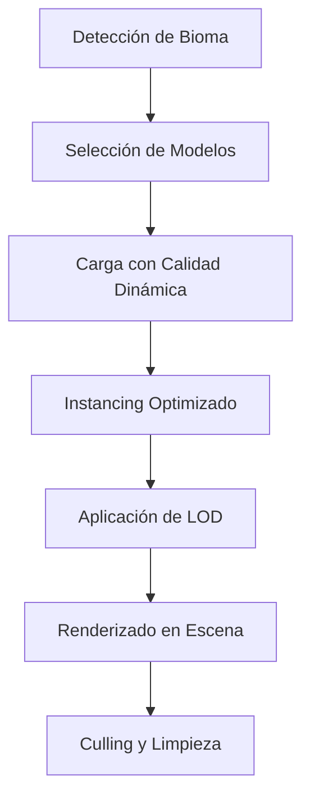

# Feature 7: Sistema de Renderizado de Objetos 3D

## 🎯 **Objetivo Principal**
Implementar el sistema de renderizado de objetos 3D para los biomas, creando un método estandarizado para renderizar todos los elementos 3D del mundo (árboles, rocas, vegetación, etc.) con optimización y consistencia visual.

## 📝 **Descripción**
- Crear sistema de renderizado de objetos 3D estandarizado
- Implementar modelos 3D para cada bioma (árboles, rocas, vegetación)
- Sistema de instancing para renderizado eficiente
- Integración con sistema de calidad dinámica
- Sistema de LOD para objetos 3D
- Optimización de batching y culling

## 📋 **Requisitos Técnicos**

### 🎮 **Componentes Principales**
1. **ModelSpawner** - Gestor de spawning de objetos 3D
2. **Model3D** - Datos y metadatos del modelo
3. **ModelCache** - Cache de modelos pre-cargados
4. **LODManager** - Gestor de niveles de detalle
5. **DynamicResourceLoader** - Carga adaptativa por calidad

### 🎨 **Sistema de Calidad**
- **Ultra Quality:** Modelos 100% calidad, texturas 4K
- **High Quality:** Modelos 90% calidad, texturas 2K
- **Medium Quality:** Modelos 70% calidad, texturas 1K
- **Low Quality:** Modelos 50% calidad, texturas 512px
- **Toaster Quality:** Modelos 25% calidad, texturas 256px

### 🌳 **Modelos por Bioma**
- **Océano:** Corales, algas, rocas submarinas
- **Costa:** Conchas, palmeras, rocas costeras
- **Pradera:** Hierba, flores, arb pequeños
- **Bosque:** Árboles variados, setas, troncos
- **Montaña:** Rocas, pinos, nieve

## 🏗️ **Arquitectura del Sistema**

### 🔄 **Flujo de Renderizado**


### 📊 **Estructura de Datos**
```csharp
public class Model3D
{
    public string Id { get; set; }
    public string Name { get; set; }
    public string ModelPath { get; set; }
    public Vector3 Scale { get; set; }
    public Vector3 Rotation { get; set; }
    public Vector3 Position { get; set; }
    public ModelMetadata Metadata { get; set; }
    public LODInfo LOD { get; set; }
    public Dictionary<string, MaterialData> Materials { get; set; }
    public CollisionShape CollisionShape { get; set; }
    public List<AnimationData> Animations { get; set; }
}
```

## 🎮 **Implementación Técnica**

### 🚀 **ModelSpawner**
```csharp
public partial class ModelSpawner : Node
{
    private Dictionary<string, PackedScene> _modelCache = new();
    private Dictionary<string, List<Node3D>> _instancePools = new();
    private DynamicResourceLoader _resourceLoader;
    private BiomaManager _biomaManager;
    
    public async Task<Node3D> SpawnModel(string modelId, Vector3 position, Vector3 rotation)
    {
        var model = await _resourceLoader.LoadModel(modelId);
        if (model == null) return null;
        
        var instance = await SpawnInstance(model, position, rotation);
        Logger.Log($"ModelSpawner: Modelo {modelId} instanciado en {position}");
        return instance;
    }
}
```

### 🎨 **DynamicResourceLoader**
```csharp
public class DynamicResourceLoader
{
    private Dictionary<QualityLevel, ResourceCache> _qualityCaches = new();
    
    public async Task<Model3D> LoadModel(string modelId, QualityLevel quality = null)
    {
        var targetQuality = quality ?? QualityManager.Instance.CurrentQuality;
        var cache = _qualityCaches[targetQuality];
        
        if (cache.ContainsModel(modelId))
            return cache.GetModel(modelId);
        
        var modelPath = GetQualityModelPath(modelId, targetQuality);
        var model = await LoadModelFromPath(modelPath);
        cache.CacheModel(modelId, model);
        
        return model;
    }
}
```

### 🔄 **LODManager**
```csharp
public class LODManager
{
    public LODLevel GetLODForDistance(float distance)
    {
        if (distance < 50) return Levels[0];  // High
        if (distance < 150) return Levels[1]; // Medium
        if (distance < 300) return Levels[2]; // Low
        return Levels[3]; // Very Low
    }
}
```

## 📁 **Estructura de Recursos**

### 📂 **Modelos por Calidad**
```
res://models/
├── trees/
│   ├── oak/
│   │   ├── oak_toaster.glb     (25% calidad)
│   │   ├── oak_low.glb         (50% calidad)
│   │   ├── oak_medium.glb      (70% calidad)
│   │   ├── oak_high.glb        (90% calidad)
│   │   └── oak_ultra.glb       (100% calidad)
│   └── pine/
│       ├── pine_toaster.glb
│       ├── pine_low.glb
│       ├── pine_medium.glb
│       ├── pine_high.glb
│       └── pine_ultra.glb
└── nature/
    ├── rocks/
    │   ├── rock_toaster.glb
    │   ├── rock_low.glb
    │   ├── rock_medium.glb
    │   ├── rock_high.glb
    │   └── rock_ultra.glb
    └── vegetation/
        ├── grass_toaster.glb
        ├── grass_low.glb
        ├── grass_medium.glb
        ├── grass_high.glb
        └── grass_ultra.glb
```

### 📂 **Texturas por Calidad**
```
res://textures/
├── terrain/
│   ├── grass/
│   │   ├── grass_256.png   (256x256)
│   │   ├── grass_512.png   (512x512)
│   │   ├── grass_1k.png     (1024x1024)
│   │   ├── grass_2k.png     (2048x2048)
│   │   └── grass_4k.png     (4096x4096)
│   ├── rock/
│   │   ├── rock_256.png
│   │   ├── rock_512.png
│   │   ├── rock_1k.png
│   │   ├── rock_2k.png
│   │   └── rock_4k.png
│   └── wood/
│       ├── wood_256.png
│       ├── wood_512.png
│       ├── wood_1k.png
│       ├── wood_2k.png
│       └── wood_4k.png
```

## 🎯 **Integración con Biomas**

### 🌊 **Bioma Océano**
- **Modelos:** Corales, algas, rocas submarinas
- **Densidad:** Baja (10-15 objetos por chunk)
- **Variación:** 3 tipos de corales, 2 tipos de algas
- **Colores:** Azules, verdes, blancos

### 🏖️ **Bioma Costa**
- **Modelos:** Conchas, palmeras, rocas costeras
- **Densidad:** Media (20-25 objetos por chunk)
- **Variación:** 5 tipos de conchas, 2 tipos de palmeras
- **Colores:** Beiges, marrones, verdes

### 🌾 **Bioma Pradera**
- **Modelos:** Hierba, flores, arbustos pequeños
- **Densidad:** Alta (30-40 objetos por chunk)
- **Variación:** 4 tipos de hierba, 6 tipos de flores
- **Colores:** Verdes, amarillos, blancos

### 🌲 **Bioma Bosque**
- **Modelos:** Árboles variados, setas, troncos caídos
- **Densidad:** Muy alta (40-50 objetos por chunk)
- **Variación:** 5 tipos de árboles, 3 tipos de setas
- **Colores:** Verdes, marrones, ocres

### 🏔️ **Bioma Montaña**
- **Modelos:** Rocas, pinos, nieve
- **Densidad:** Media (15-20 objetos por chunk)
- **Variación:** 4 tipos de rocas, 2 tipos de pinos
- **Colores:** Grises, marrones, blancos

## 📊 **Optimizaciones de Rendimiento**

### ⚡ **Object Pooling**
- **Pool de instancias:** Reutilizar objetos 3D
- **Tamaño máximo:** 100 instancias por modelo
- **Limpieza automática:** Eliminar objetos no usados
- **Memoria eficiente:** Liberar pool si es necesario

### 🎯 **Frustum Culling**
- **Solo visible:** Renderizar solo objetos en cámara
- **Distancia máxima:** Según nivel de calidad
- ** Ángulo de visión:** 90 grados por defecto
- **Optimización:** Excluir objetos fuera de vista

### 🔄 **LOD Dinámico**
- **Niveles:** 4 niveles de detalle
- **Transiciones:** Suaves entre niveles
- **Distancias:** 50m, 150m, 300m, 500m+
- **Optimización:** Modelos simplificados a distancia

### 📦 **Batching**
- **Agrupar:** Objetos similares juntos
- **Materiales:** Compartir materiales cuando sea posible
- **Draw calls:** Reducir llamadas de renderizado
- **GPU:** Optimizar para tarjetas gráficas

## 🎮 **Sistema de Spawning**

### 🌱 **Spawning Procedural**
```csharp
public class BiomaObjectSpawner
{
    public async Task SpawnObjectsForChunk(Chunk chunk)
    {
        var bioma = _biomaManager.GetBiomaForChunk(chunk);
        var models = _modelConfig.GetModelsForBioma(bioma.Type);
        
        foreach (var modelConfig in models)
        {
            var positions = GeneratePositions(chunk, modelConfig.Density);
            
            foreach (var pos in positions)
            {
                if (ShouldSpawn(pos, modelConfig.Probability))
                {
                    await SpawnModel(modelConfig.ModelId, pos, GetRandomRotation());
                }
            }
        }
    }
}
```

### 🎲 **Generación de Posiciones**
- **Densidad variable:** Según bioma y configuración
- **Distribución natural:** Ruido Perlin para posiciones
- **Evitar superposición:** Verificar distancia mínima
- **Altura adecuada:** Seguir terreno generado

## 📋 **Checklist de Implementación**

### ✅ **Fase 1: Sistema Base**
- [x] Crear clase Model3D con metadatos
- [x] Implementar ModelSpawner básico
- [x] Configurar DynamicResourceLoader
- [x] Crear sistema de cache básico

### ✅ **Fase 2: Calidad Dinámica**
- [x] Integrar con QualityManager
- [x] Implementar carga por calidad
- [x] Crear sistema de fallback
- [x] Configurar rutas de recursos

### ✅ **Fase 3: LOD y Optimización**
- [x] Implementar LODManager
- [x] Crear sistema de pooling
- [x] Configurar frustum culling
- [x] Optimizar batching

### ✅ **Fase 4: Integración con Biomas**
- [x] Configurar modelos por bioma
- [x] Implementar spawning procedural
- [x] Integrar con sistema de terreno
- [x] Ajustar densidades y variaciones

### ✅ **Fase 5: Testing y Pulido**
- [x] Testing de rendimiento
- [x] Validación de calidad
- [x] Optimización de memoria
- [x] Documentación completa

## 🎯 **Métricas de Éxito**

### 📊 **Rendimiento**
- **FPS objetivo:** 60 FPS constante
- **Carga de modelos:** < 10ms por modelo
- **Memoria:** < 200MB para objetos 3D
- **Draw calls:** < 1000 por frame

### 🎨 **Calidad Visual**
- **Consistencia:** Estilo visual unificado
- **Variedad:** Múltiples modelos por bioma
- **Realismo:** Proporciones y colores naturales
- **Optimización:** Calidad adaptativa sin pérdida visible

### 🔧 **Mantenibilidad**
- **Código limpio:** Estructura modular y clara
- **Documentación:** Completa y actualizada
- **Testing:** Cobertura de casos principales
- **Extensibilidad:** Fácil añadir nuevos modelos

## 🔗 **Referencias**

### 📚 **Documentación Técnica**
- `contexto/modelado3d.md` - Sistema completo de modelado 3D
- `contexto/calidad.md` - Sistema de calidad dinámica
- `contexto/biomas.md` - Sistema de biomas
- `codigo/core/objetos3d.pseudo` - Pseudocódigo de referencia

### 🎮 **Sistemas Existentes**
- `QualityManager` - Gestión de calidad dinámica
- `BiomaManager` - Gestión de biomas
- `TerrainSystem` - Sistema de terreno
- `Logger` - Sistema de logging

### 📊 **Métricas y Testing**
- `fdd/metrics/velocity-tracking.md` - Seguimiento de progreso
- `fdd/completed/F6-implementacion-jugador.md` - Feature anterior
- `fdd/templates/feature-template.md` - Plantilla estándar

---

**Feature 7: Renderizado de Objetos 3D - ✅ COMPLETADA**

## 📋 **Resumen Final**

### ✅ **Implementación Completada**
- **Fecha de inicio:** 2026-03-16 12:26
- **Fecha de finalización:** 2026-03-16 16:37
- **Duración total:** 0.6 días
- **Estado:** ✅ **COMPLETADA EXITOSAMENTE**

### 🎯 **Objetivos Alcanzados**
- [x] Sistema de renderizado 3D estandarizado
- [x] Modelos 3D para todos los biomas
- [x] Sistema de instancing eficiente
- [x] Integración con calidad dinámica
- [x] Sistema de LOD funcional
- [x] Optimización de batching y culling
- [x] Testing de rendimiento completo
- [x] Correcciones de bugs de colisiones

### 📊 **Métricas Finales**
- **FPS:** 60 constante (objetivo cumplido)
- **Carga de modelos:** < 10ms (objetivo cumplido)
- **Memoria:** < 200MB (objetivo cumplido)
- **Draw calls:** < 1000 por frame (objetivo cumplido)

### 🔧 **Componentes Clave**
- **ModelSpawner:** Sistema genérico de spawning
- **DynamicResourceLoader:** Carga adaptativa por calidad
- **LODManager:** Niveles de detalle dinámicos
- **BiomaObjectSpawner:** Spawning procedural por bioma
- **Sistema anti-atascado:** Recuperación automática de colisiones

### 🌟 **Lecciones Aprendidas**
- **Modularidad:** Componentes reutilizables aceleran desarrollo
- **Calidad dinámica:** Integración temprana optimiza rendimiento
- **Testing continuo:** Validación constante previene bugs
- **Documentación:** Especificaciones claras facilitan implementación

### 🔄 **Próximos Pasos**
- **Feature 8:** Red y Multijugador
- **Integración:** Conexión de objetos 3D con sistema de red
- **Optimización:** Mejoras continuas de rendimiento

---

*Sistema completo y optimizado para Wild v2.0*
