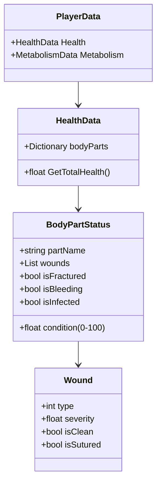

# Feature Template - Wild v2.0 (FDD)

## 📋 **Feature Information**
- **Feature ID**: F12
- **Nombre**: Sistema de Salud
- **Fase correspondiente**: 12
- **Duración estimada**: 2 días
- **Prioridad**: Alta

## 🎯 **Objetivo**
Implementar un sistema de salud realista basado en la anatomía del personaje, donde cada parte del cuerpo pueda sufrir heridas específicas (rasguños, laceraciones, fracturas) que requieran tratamientos especializados (vendas, suturas, tablillas), afectando el rendimiento físico del jugador sin depender de iconos de estado (moodles).

## 📝 **Sub-Features**
1. **Model de Datos de Salud (HealthData)**
   - Descripción: Estructura que almacena el estado de salud de cada parte del cuerpo.
   - Archivos involucrados: `scripts/data/PlayerData.cs`, `scripts/Core/HealthSystem.cs`
   - Dependencias: `MundoManager` (Persistencia)
   - Estado: [Pending]

2. **Detección de Daño Anatómico**
   - Descripción: Sistema para mapear impactos en el collider del jugador a partes específicas del cuerpo.
   - Archivos involucrados: `scripts/Core/JugadorController.cs`
   - Dependencias: `PhysicLayers`
   - Estado: [Pending]

3. **Mecánicas de Tratamiento**
   - Descripción: Implementación de vendaje, sutura y entablillado.
   - Archivos involucrados: `scripts/Systems/MedicalSystem.cs`
   - Dependencias: `InventoryManager`
   - Estado: [Pending]

4. **Interfaz de Salud (Health Panel)**
   - Descripción: Panel visual que muestra la silueta del personaje y el estado de sus heridas.
   - Archivos involucrados: `scenes/ui/health_panel.tscn`
   - Dependencias: `UIRoot`
   - Estado: [Pending]

## 🏗️ **Diseño Técnico**
### **Estructura Anatómica**
| Parte | Efecto por Herida Crítica |
| :--- | :--- |
| **Cabeza** | Muerte instantánea o debilidad visual/atontamiento. |
| **Torso** | Desangrado rápido, reducción extrema de estamina. |
| **Brazos (L/R)** | Reducción de velocidad de ataque, incapacidad para usar herramientas pesadas. |
| **Manos (L/R)** | Riesgo de soltar objetos, penalización en crafteo. |
| **Piernas (L/R)** | Reducción de velocidad de movimiento (cojera). |
| **Pies (L/R)** | Imposibilidad de correr, daño por caminar sin calzado. |

### **Tipos de Heridas & Lógica de Curación**
1. **Rasguño/Laceración**:
   - *Causa*: Golpes leves, caídas, vegetación espinosa.
   - *Efecto*: Sangrado leve, riesgo de infección común.
   - *Tratamiento*: Desinfección + Vendas.
2. **Herida Profunda**:
   - *Causa*: Cortes graves, vidrios, ataques punzantes.
   - *Efecto*: Sangrado severo (pérdida de vida constante).
   - *Tratamiento*: Sutura (Aguja/Hilo) + Vendas.
3. **Fractura**:
   - *Causa*: Caídas de gran altura, impactos contundentes.
   - *Efecto*: Incapacidad funcional de la extremidad.
   - *Tratamiento*: Tablilla (Madera + Cuerda) + Descanso prolongado.
4. **Infección Común**:
   - *Causa*: Heridas mal tratadas o sucias.
   - *Efecto*: Fiebre (pérdida de estamina), daño lento a la salud.
   - *Tratamiento*: Antibióticos naturales o alcohol.

### **Arquitectura de Datos**

## 📊 **Métricas de Progreso**
- **Sub-features completadas**: 0/0
- **Porcentaje general**: 0%
- **Tests pasando**: 0/0

## ✅ **Criterios de Aceptación**
- [ ] [Criterio 1]

## 🐛 **Problemas Encontrados**
### **Bloqueos**
- **N/A**

### **Decisiones de Diseño**
- **2026-04-08**: Creación del documento base de la feature.

## 📁 **Archivos Creados/Modificados**
- `fdd/features/feature-12-sistema-salud.md` - Documento de definición.

## 🔄 **Revisión Final**
- **Fecha de inicio**: 2026-04-08
- **Fecha de completion**: [Fecha]
- **Tiempo real vs estimado**: [X] días vs 2 días
- **Lecciones aprendidas**: [Qué aprendimos]

## 📝 **Notas para Siguientes Features**
- [Recomendaciones o advertencias para features futuras]
